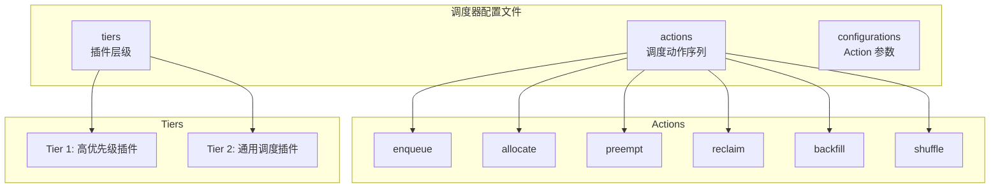
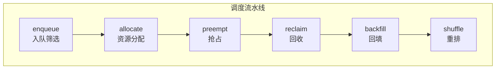
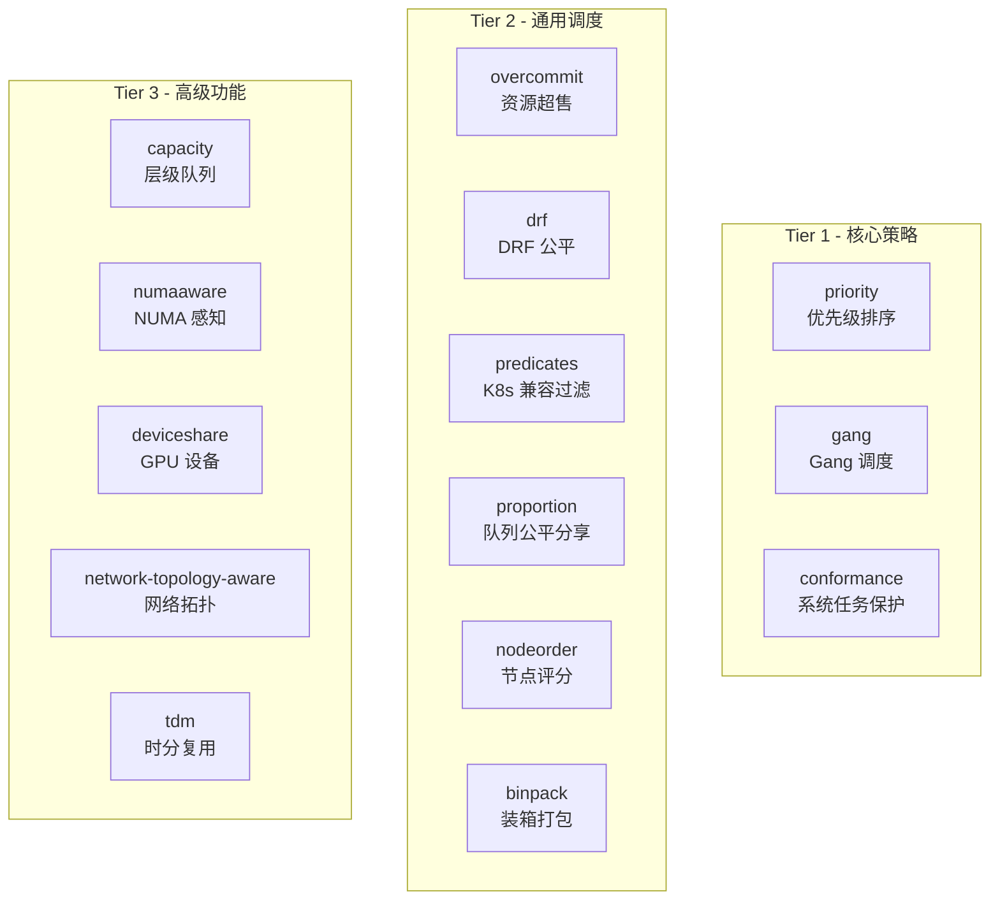

## 概述

Volcano 调度器通过配置文件定义调度行为，核心包括 **Actions**（调度动作序列）和 **Tiers**（插件层级）。本文详细介绍调度器配置的各个方面，帮助用户根据业务场景定制调度策略。

---

## 配置文件结构



### 配置结构定义

配置结构定义在 `pkg/scheduler/conf/scheduler_conf.go`：

```go
type SchedulerConfiguration struct {
    Actions            string            // 逗号分隔的 Action 名称
    Tiers              []Tier            // 插件层级
    Configurations     []Configuration   // Action 参数
    MetricsConfiguration map[string]string // Metrics 配置
}

type Tier struct {
    Plugins []PluginOption
}

type PluginOption struct {
    Name               string
    Arguments          map[string]string  // 插件自定义参数
    EnabledJobOrder    *bool
    EnabledJobReady    *bool
    EnabledTaskOrder   *bool
    EnabledPreemptable *bool
    EnabledReclaimable *bool
    EnabledPredicate   *bool
    EnabledNodeOrder   *bool
    // ... 更多扩展点开关
}
```

---

## 默认配置

Volcano 的默认配置文件位于 `installer/helm/chart/volcano/config/volcano-scheduler.conf`：

```yaml
actions: "enqueue, allocate, backfill"
tiers:
- plugins:
  - name: priority
  - name: gang
    enablePreemptable: false
  - name: conformance
- plugins:
  - name: overcommit
  - name: drf
    enablePreemptable: false
  - name: predicates
  - name: proportion
  - name: nodeorder
  - name: binpack
```

---

## Actions 详解

### 可用 Actions



| Action | 功能 | 使用场景 |
|--------|------|---------|
| `enqueue` | 检查 Job 是否满足入队条件（MinAvailable、Queue 状态等） | **必选**，所有场景 |
| `allocate` | 为 Pending Job 分配资源，Gang 一致性检查 | **必选**，核心分配 |
| `preempt` | 同队列内高优先级 Job 抢占低优先级 | 优先级调度场景 |
| `reclaim` | 跨队列资源回收，将过量使用的队列资源归还 | 多队列公平分享 |
| `backfill` | 为不满足 Gang 要求的小任务填充空闲资源 | 提高资源利用率 |
| `shuffle` | 驱逐低优先级 Pod 释放资源 | 资源紧张场景 |

### Action 执行顺序的影响

Actions 的顺序决定调度优先级：

```yaml
# 场景 1：基础调度（默认）
actions: "enqueue, allocate, backfill"

# 场景 2：启用抢占
actions: "enqueue, allocate, preempt, backfill"

# 场景 3：完整策略
actions: "enqueue, allocate, preempt, reclaim, backfill"

# 场景 4：含 Shuffle
actions: "enqueue, allocate, preempt, reclaim, backfill, shuffle"
```

### Action 参数配置

通过 `configurations` 字段为 Action 传递参数：

```yaml
actions: "enqueue, allocate, preempt, reclaim, backfill"
configurations:
- name: enqueue
  arguments:
    "overcommit-factor": "2.0"    # 超售因子
- name: reclaim
  arguments:
    "reclaim.factor": "0.5"       # 回收比例
```

---

## Plugins 详解

### 内置插件一览



### 核心插件配置

#### priority - 优先级排序

```yaml
- name: priority
  # 按 Job/Task 优先级排序，无额外参数
```

根据 `PriorityClassName` 对 Job 和 Task 进行优先级排序，高优先级 Job 优先调度。

#### gang - Gang 调度

```yaml
- name: gang
  enablePreemptable: false     # 是否允许抢占 Gang 中的 Pod
  enableJobReady: true         # 检查 Job 是否满足 MinAvailable
```

确保 Job 的最少 Pod 数（MinAvailable）同时调度，避免死锁。

#### conformance - 系统保护

```yaml
- name: conformance
  # 保护 kube-system 等系统命名空间的 Pod 不被抢占
```

#### predicates - K8s 兼容过滤

```yaml
- name: predicates
  enablePredicate: true
  arguments:
    predicate.CacheEnable: "true"        # 启用 Predicate 缓存
    predicate.ProportionalEnable: "true"  # 比例资源检查
```

执行标准 Kubernetes 调度过滤（NodeAffinity、PodAffinity、Taints 等）。

#### proportion - 队列公平分享

```yaml
- name: proportion
  # 基于 Queue Weight 计算 Deserved 资源
```

根据 Queue 的 Weight 比例分配集群资源。详见 [队列与公平分享](03-queue-and-fairsharing.md)。

#### nodeorder - 节点评分

```yaml
- name: nodeorder
  arguments:
    nodeaffinity.weight: "2"            # NodeAffinity 权重
    podaffinity.weight: "2"             # PodAffinity 权重
    leastrequested.weight: "1"          # 最少请求权重
    balancedresource.weight: "1"        # 资源均衡权重
    mostrequested.weight: "0"           # 最多请求权重
    tainttoleration.weight: "2"         # Taint 容忍权重
    imagelocality.weight: "1"           # 镜像本地性权重
    selectorspread.weight: "0"          # 选择器分散权重
```

#### binpack - 装箱打包

```yaml
- name: binpack
  arguments:
    binpack.weight: "5"                 # 全局权重
    binpack.cpu: "1"                    # CPU 打包权重
    binpack.memory: "1"                 # 内存打包权重
    binpack.resources: "nvidia.com/gpu" # 自定义资源
    binpack.resources.nvidia.com/gpu: "5"  # GPU 打包权重
```

优先将 Pod 调度到资源使用率高的节点，提高资源利用率。

#### drf - 主导资源公平

```yaml
- name: drf
  enablePreemptable: false             # 是否允许基于 DRF 抢占
  enableJobOrder: true                 # 按 DRF Share 排序 Job
```

基于 Dominant Resource Fairness 算法，确保不同 Job 间的资源公平分配。

#### overcommit - 资源超售

```yaml
- name: overcommit
  arguments:
    overcommit-factor: "1.2"           # 超售因子（默认 1.2）
```

允许集群接受超出实际容量的 Job，提高吞吐量。

---

## 场景配置模板

### 场景一：AI 训练集群

大规模 GPU 训练任务，需要 Gang 调度和 GPU 打包：

```yaml
actions: "enqueue, allocate, backfill"
tiers:
- plugins:
  - name: priority
  - name: gang
    enablePreemptable: false
  - name: conformance
- plugins:
  - name: overcommit
    arguments:
      overcommit-factor: "1.0"         # 不超售 GPU
  - name: predicates
    arguments:
      predicate.CacheEnable: "true"
  - name: proportion
  - name: nodeorder
    arguments:
      leastrequested.weight: "0"
      mostrequested.weight: "0"
  - name: binpack
    arguments:
      binpack.weight: "10"
      binpack.cpu: "1"
      binpack.memory: "1"
      binpack.resources: "nvidia.com/gpu"
      binpack.resources.nvidia.com/gpu: "10"
  - name: deviceshare
    arguments:
      deviceshare.GPUSharingEnable: "true"
      deviceshare.SchedulePolicy: "binpack"
```

### 场景二：多租户公平分享

多团队共享集群，需要队列公平分享和抢占回收：

```yaml
actions: "enqueue, allocate, preempt, reclaim, backfill"
tiers:
- plugins:
  - name: priority
  - name: gang
  - name: conformance
- plugins:
  - name: overcommit
    arguments:
      overcommit-factor: "1.5"
  - name: drf
  - name: predicates
  - name: proportion
  - name: nodeorder
    arguments:
      leastrequested.weight: "1"
      balancedresource.weight: "1"
  - name: binpack
    arguments:
      binpack.weight: "3"
      binpack.cpu: "1"
      binpack.memory: "1"
```

### 场景三：HPC 高性能计算

NUMA 感知 + 网络拓扑感知：

```yaml
actions: "enqueue, allocate, backfill"
tiers:
- plugins:
  - name: priority
  - name: gang
    enablePreemptable: false
  - name: conformance
- plugins:
  - name: predicates
  - name: proportion
  - name: nodeorder
  - name: numaaware
  - name: network-topology-aware
    arguments:
      weight: "10"
      hypernode.binpack.cpu: "2"
      hypernode.binpack.memory: "1"
      hypernode.binpack.resources: "nvidia.com/gpu"
      hypernode.binpack.resources.nvidia.com/gpu: "5"
```

### 场景四：层级队列管理

企业级部门/项目层级资源管理：

```yaml
actions: "enqueue, allocate, preempt, reclaim, backfill"
tiers:
- plugins:
  - name: priority
  - name: gang
  - name: conformance
- plugins:
  - name: overcommit
  - name: predicates
  - name: capacity              # 使用 capacity 替代 proportion
    enableHierarchy: true
    enableJobOrder: true
    enablePreemptable: true
    enableReclaimable: true
  - name: nodeorder
  - name: binpack
```

> **注意**：`capacity` 和 `proportion` 不能同时启用，它们是互斥的队列管理策略。

---

## Plugin 扩展点控制

每个 Plugin 可以精细控制其参与的扩展点：

```yaml
- name: gang
  enableJobOrder: true         # 参与 JobOrder 排序
  enableJobReady: true         # 参与 JobReady 检查
  enableJobPipelined: true     # 参与 Pipeline 检查
  enablePreemptable: false     # 不参与抢占评估
  enableReclaimable: false     # 不参与回收评估
  enablePredicate: false       # 不参与过滤
  enableNodeOrder: false       # 不参与节点评分
  enableTaskOrder: false       # 不参与 Task 排序
```

完整的扩展点列表：

| 扩展点 | 说明 | 典型插件 |
|--------|------|---------|
| `JobOrder` | Job 排序 | priority, drf, gang |
| `TaskOrder` | Task 排序 | priority |
| `JobReady` | Job 就绪检查 | gang |
| `JobPipelined` | Pipeline 检查 | gang |
| `Predicate` | 节点过滤 | predicates, numaaware, deviceshare |
| `NodeOrder` | 节点评分 | nodeorder, binpack, numaaware |
| `Preemptable` | 抢占评估 | gang, drf, conformance |
| `Reclaimable` | 回收评估 | proportion, capacity |
| `QueueOrder` | 队列排序 | proportion, capacity |
| `Allocatable` | 分配检查 | proportion, capacity |
| `JobEnqueued` | 入队通知 | proportion, capacity |
| `Hierarchy` | 层级队列 | capacity |

---

## 运行时切换配置

### ConfigMap 热更新

调度器配置存储在 ConfigMap 中，可以动态更新：

```bash
# 编辑调度器 ConfigMap
kubectl edit configmap volcano-scheduler-configmap -n volcano-system
```

修改后调度器会自动重新加载配置（无需重启）。

### Helm Values 更新

```bash
# 通过 Helm upgrade 更新配置
helm upgrade volcano volcano-sh/volcano \
  --namespace volcano-system \
  --set-string custom.scheduler_config_override="$(cat my-scheduler.conf)"
```

---

## 配置验证

### 检查调度器日志

```bash
# 查看调度器启动日志，确认加载的 Actions 和 Plugins
kubectl logs -n volcano-system -l app=volcano-scheduler | head -50
```

### 关键日志关键词

| 日志关键词 | 含义 |
|-----------|------|
| `Successfully registered action` | Action 注册成功 |
| `Successfully registered plugin` | Plugin 注册成功 |
| `Open session` | 调度周期开始 |
| `Close session` | 调度周期结束 |
| `statement commit` | 调度决策提交 |

---

## 性能调优参数

| 参数 | 默认值 | 说明 | 调优建议 |
|------|--------|------|---------|
| `scheduler_schedule_period` | `1s` | 调度周期 | 大集群可设为 `500ms` |
| `scheduler_kube_api_qps` | `2000` | API QPS | 大集群可增至 `5000` |
| `scheduler_kube_api_burst` | `2000` | API Burst | 与 QPS 保持一致 |
| `scheduler_node_worker_threads` | `20` | Node Worker | 按节点数调整 |
| `predicate.CacheEnable` | `false` | Predicate 缓存 | 大集群建议开启 |

---

## 参考文件

| 文件 | 说明 |
|------|------|
| `pkg/scheduler/conf/scheduler_conf.go` | 配置结构定义 |
| `pkg/scheduler/plugins/factory.go` | 插件注册工厂 |
| `pkg/scheduler/actions/factory.go` | Action 注册工厂 |
| `installer/helm/chart/volcano/config/volcano-scheduler.conf` | 默认配置 |
