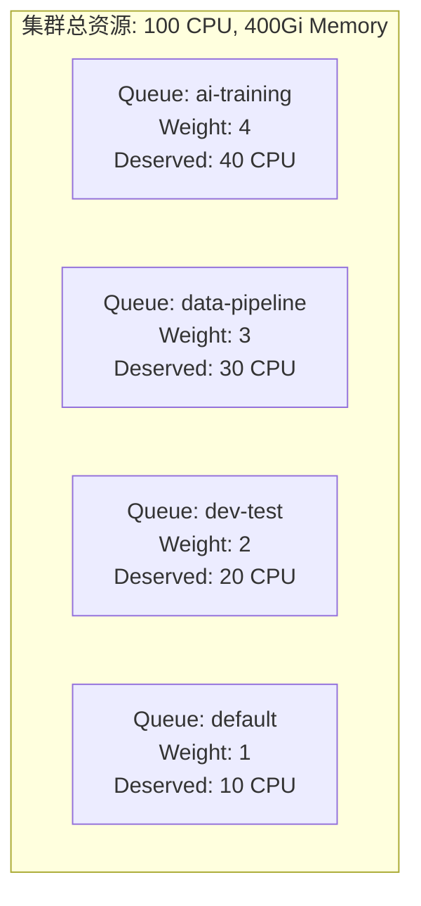
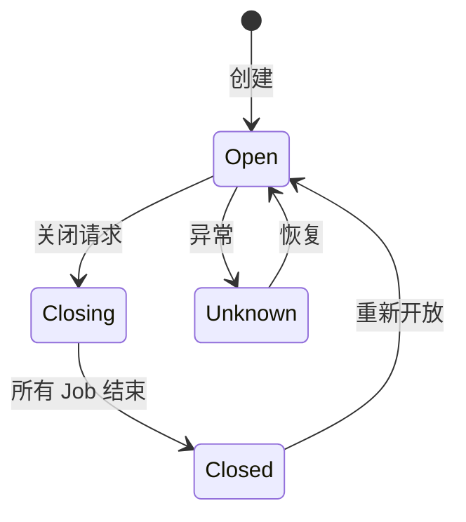
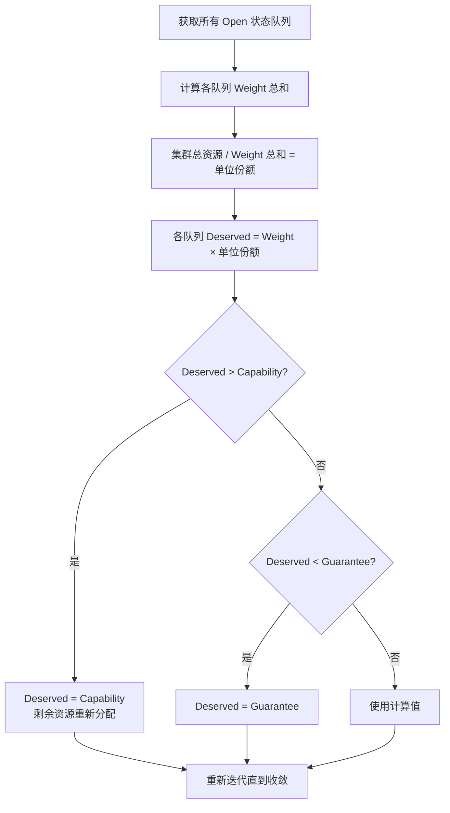
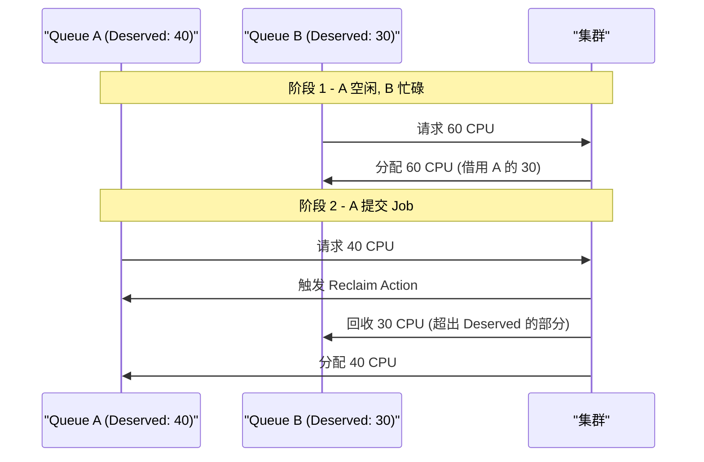
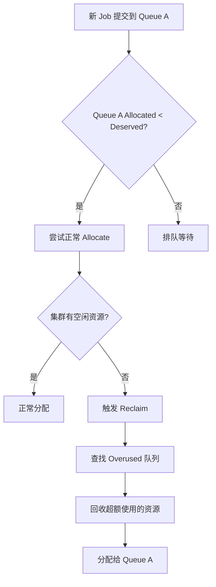
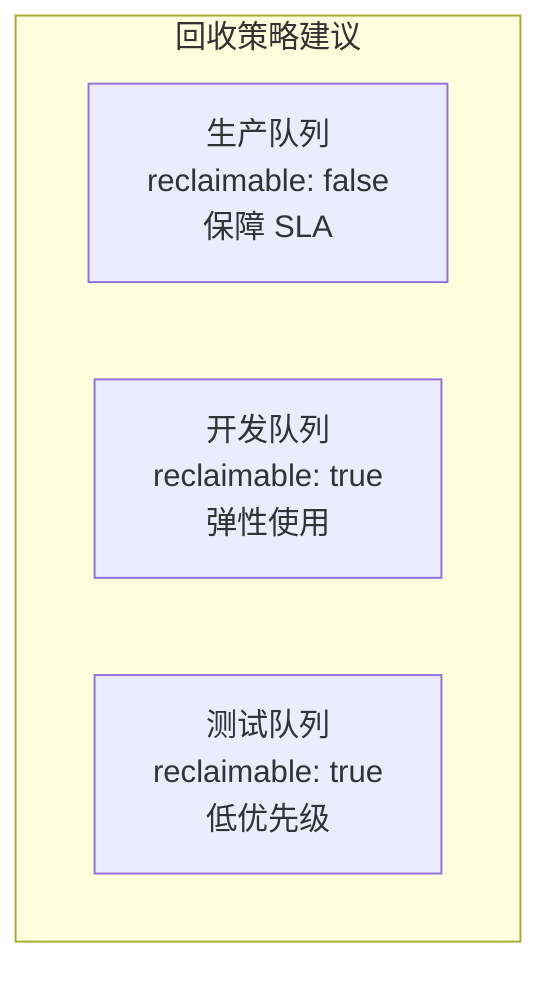
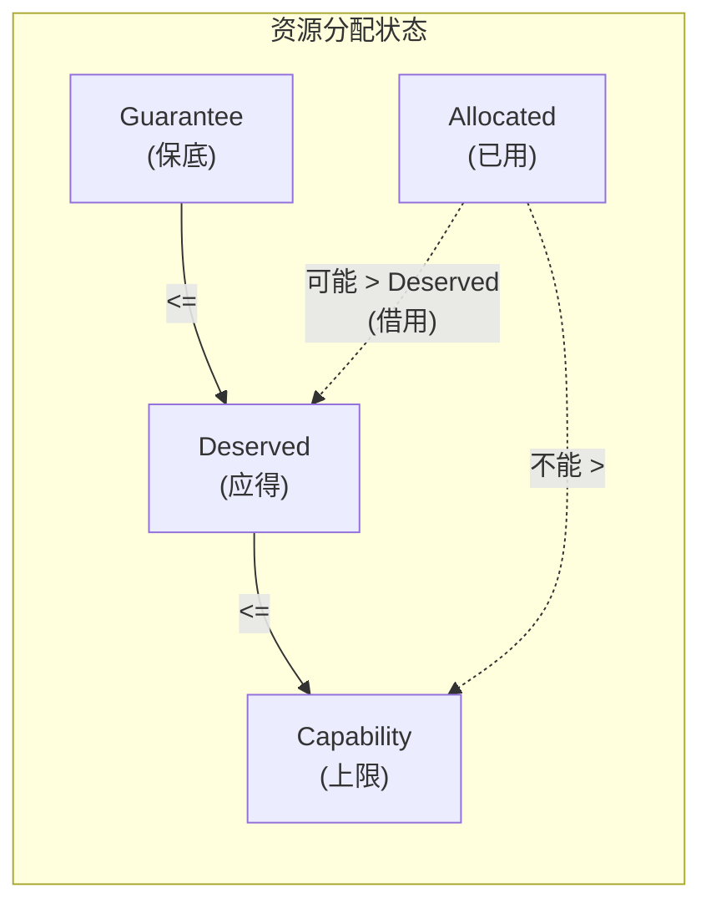

## 概述

Volcano 的队列（Queue）是多租户资源隔离与公平分享的核心机制。通过 Queue 的 Weight、Capability、Guarantee 等配置，结合 `proportion` 插件，实现集群资源在不同团队/项目间的公平分配。本文详细介绍队列的创建、配置和公平分享策略。

---

## 队列模型



### 核心概念

| 概念 | 说明 |
|------|------|
| **Weight** | 队列权重，决定资源分配比例 |
| **Capability** | 队列资源上限，限制最大使用量 |
| **Guarantee** | 队列保底资源，最低保障量 |
| **Deserved** | 按权重计算的应得资源量 |
| **Allocated** | 当前实际分配的资源量 |
| **Reclaimable** | 队列是否允许资源被回收 |

---

## 创建队列

### 基础队列

```yaml
apiVersion: scheduling.volcano.sh/v1beta1
kind: Queue
metadata:
  name: ai-training
spec:
  weight: 4
  reclaimable: true
```

### 带资源限制的队列

```yaml
apiVersion: scheduling.volcano.sh/v1beta1
kind: Queue
metadata:
  name: data-pipeline
spec:
  weight: 3
  reclaimable: true
  # 资源上限
  capability:
    cpu: "50"
    memory: "200Gi"
    nvidia.com/gpu: "8"
  # 保底资源
  guarantee:
    resource:
      cpu: "10"
      memory: "40Gi"
```

### 队列状态



| 状态 | 说明 |
|------|------|
| `Open` | 正常状态，接受新 Job |
| `Closed` | 关闭状态，不接受新 Job |
| `Closing` | 正在关闭，等待现有 Job 完成 |
| `Unknown` | 异常状态 |

---

## Proportion 插件 - 公平分享机制

### Deserved 计算流程



### 计算示例

假设集群有 100 CPU，三个队列：

| 队列 | Weight | Capability | Guarantee | 计算 Deserved |
|------|--------|-----------|-----------|--------------|
| A | 4 | 60 CPU | 10 CPU | min(4/10 × 100, 60) = 40 CPU |
| B | 3 | 无限制 | 5 CPU | 3/10 × 100 = 30 CPU |
| C | 3 | 25 CPU | 5 CPU | min(3/10 × 100, 25) = 25 CPU |

由于 C 被 Capability 截断为 25 CPU，剩余 5 CPU 重新按 A:B 的权重分配：

| 队列 | 最终 Deserved |
|------|--------------|
| A | 40 + 5×(4/7) ≈ 42.86 CPU |
| B | 30 + 5×(3/7) ≈ 32.14 CPU |
| C | 25 CPU |

### 资源借用与回收



---

## 多队列配置实战

### 场景：AI 训练平台

```yaml
# 高优先级训练队列
apiVersion: scheduling.volcano.sh/v1beta1
kind: Queue
metadata:
  name: training-high
spec:
  weight: 5
  reclaimable: false          # 不允许被回收
  capability:
    cpu: "200"
    memory: "800Gi"
    nvidia.com/gpu: "32"
  guarantee:
    resource:
      cpu: "50"
      memory: "200Gi"
      nvidia.com/gpu: "8"
---
# 普通训练队列
apiVersion: scheduling.volcano.sh/v1beta1
kind: Queue
metadata:
  name: training-normal
spec:
  weight: 3
  reclaimable: true
  capability:
    cpu: "100"
    memory: "400Gi"
    nvidia.com/gpu: "16"
---
# 推理服务队列
apiVersion: scheduling.volcano.sh/v1beta1
kind: Queue
metadata:
  name: inference
spec:
  weight: 2
  reclaimable: true
  capability:
    cpu: "80"
    memory: "320Gi"
    nvidia.com/gpu: "8"
```

### 提交 Job 到指定队列

```yaml
apiVersion: batch.volcano.sh/v1alpha1
kind: Job
metadata:
  name: resnet-training
spec:
  schedulerName: volcano
  queue: training-high          # 指定队列
  minAvailable: 4
  tasks:
    - replicas: 4
      name: worker
      template:
        spec:
          containers:
            - name: trainer
              image: training:latest
              resources:
                requests:
                  cpu: "4"
                  memory: "16Gi"
                  nvidia.com/gpu: "1"
                limits:
                  cpu: "4"
                  memory: "16Gi"
                  nvidia.com/gpu: "1"
```

### 普通 Deployment 使用队列

```yaml
apiVersion: apps/v1
kind: Deployment
metadata:
  name: inference-service
spec:
  replicas: 3
  template:
    metadata:
      annotations:
        scheduling.volcano.sh/queue-name: inference    # 通过 annotation 指定队列
    spec:
      schedulerName: volcano
      containers:
        - name: server
          image: inference:latest
          resources:
            requests:
              cpu: "2"
              memory: "8Gi"
```

---

## 队列管理操作

### 查看队列状态

```bash
# 列出所有队列
kubectl get queues

# 查看队列详情
kubectl describe queue training-high

# 查看队列资源使用
kubectl get queues -o wide
```

### 关闭/开放队列

```bash
# 关闭队列（不再接受新 Job）
kubectl patch queue dev-test --type merge -p '{"spec":{"state":"Closed"}}'

# 重新开放队列
kubectl patch queue dev-test --type merge -p '{"spec":{"state":"Open"}}'
```

### 动态调整权重

```bash
# 调整队列权重
kubectl patch queue training-normal --type merge -p '{"spec":{"weight":5}}'
```

---

## 调度器配置

### 启用公平分享与回收

```yaml
actions: "enqueue, allocate, preempt, reclaim, backfill"
tiers:
- plugins:
  - name: priority
  - name: gang
  - name: conformance
- plugins:
  - name: overcommit
  - name: drf
  - name: predicates
  - name: proportion           # 公平分享核心插件
  - name: nodeorder
  - name: binpack
```

### Reclaim 的触发条件



Reclaim 触发条件：
1. 队列 Allocated < Deserved（未达到应得份额）
2. 集群无空闲资源
3. 存在 Overused 的可回收队列（`reclaimable: true`）

---

## Reclaimable 策略

| 配置 | 行为 |
|------|------|
| `reclaimable: true` | 该队列超出 Deserved 的资源可被回收 |
| `reclaimable: false` | 该队列资源不可被回收，即使超出 Deserved |

### 最佳实践



- **生产/关键任务队列**：设置 `reclaimable: false`，保障资源不被回收
- **开发/测试队列**：设置 `reclaimable: true`，允许借用空闲资源，也允许被回收
- **保底资源**：通过 `guarantee` 设置最低保障，即使队列空闲也预留资源

---

## 监控队列资源

### 关键指标

```bash
# 查看各队列资源分配情况
kubectl get queues -o custom-columns=\
NAME:.metadata.name,\
STATE:.status.state,\
WEIGHT:.spec.weight,\
PENDING:.status.pending,\
RUNNING:.status.running
```

### 队列资源分配可视化



---

## 常见问题

| 问题 | 原因 | 解决方案 |
|------|------|---------|
| Job 提交后一直 Pending | 队列 Closed 或资源不足 | 检查队列状态和 Capability |
| 队列间资源不公平 | Weight 配置不合理 | 调整 Weight 比例 |
| 回收不生效 | 未配置 reclaim action | 在 actions 中添加 `reclaim` |
| 资源超出 Capability | Capability 未正确设置 | 检查 Queue spec.capability |
| Guarantee 资源未预留 | proportion 插件未启用 | 确认 proportion 在 tiers 中 |

---

## 参考文件

| 文件 | 说明 |
|------|------|
| `staging/src/volcano.sh/apis/pkg/apis/scheduling/v1beta1/types.go` | Queue API 类型定义 |
| `pkg/scheduler/plugins/proportion/proportion.go` | Proportion 插件实现 |
| `pkg/controllers/queue/` | Queue Controller |
| `example/hierarchical-jobs/queues.yaml` | 队列配置示例 |
