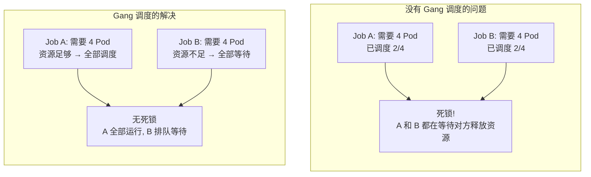
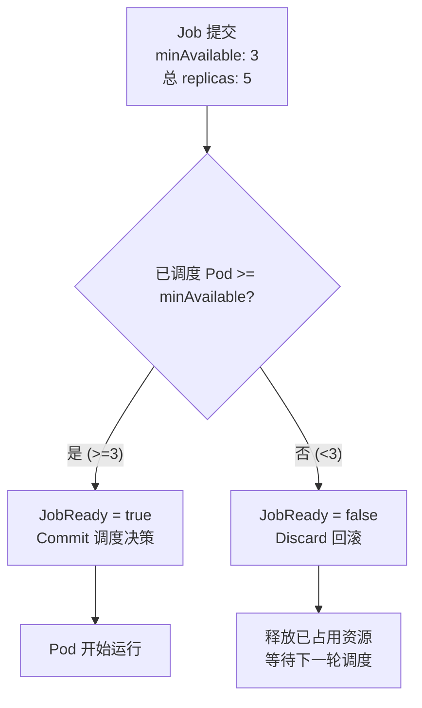
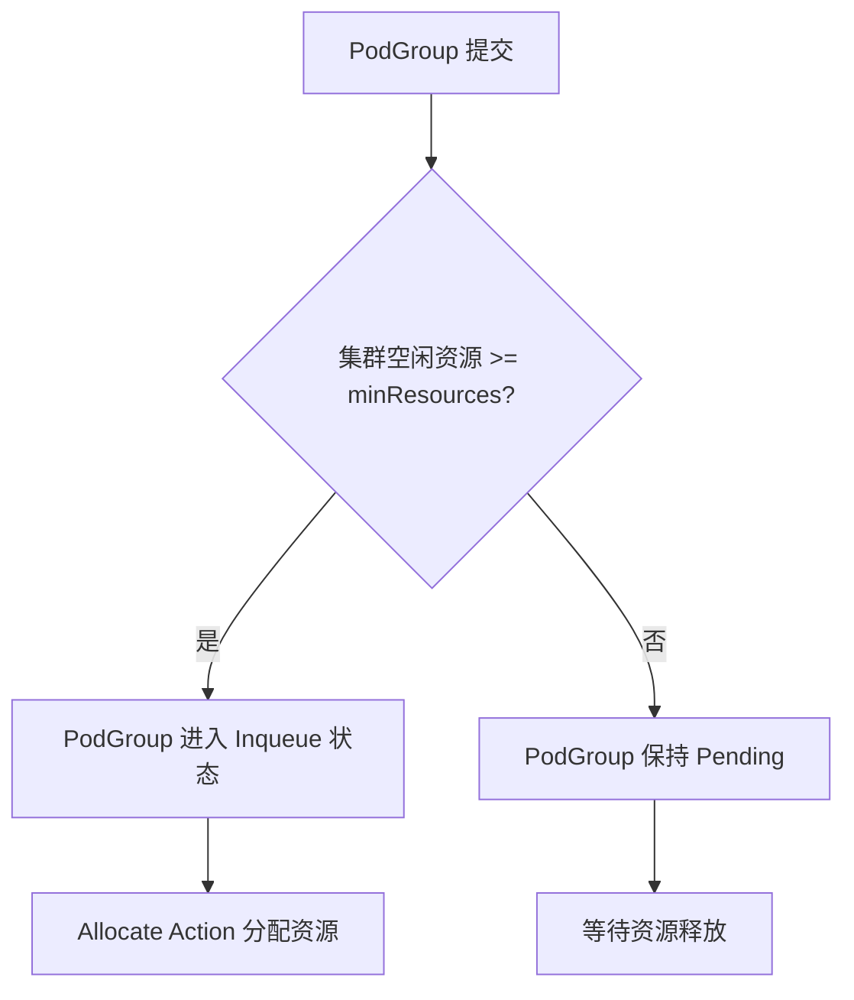
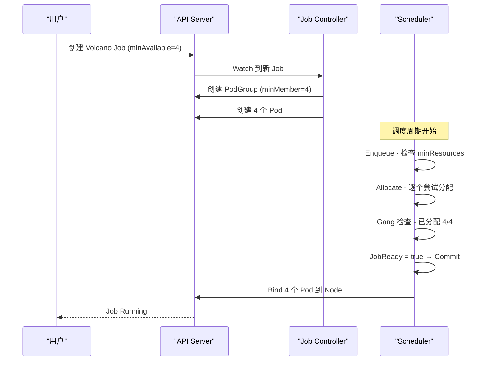
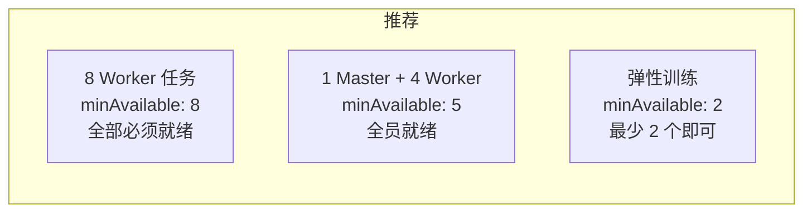

## 概述

Gang 调度是 Volcano 的核心特性之一，确保一组 Pod（通常属于同一个分布式训练任务）要么全部调度成功，要么全部不调度。这避免了"部分调度"导致的资源死锁问题。

---

## 为什么需要 Gang 调度



### 典型场景

| 场景 | 说明 |
|------|------|
| MPI 分布式训练 | 所有 Worker 必须同时启动才能初始化通信 |
| Spark 计算 | Driver + Executor 需同时就绪 |
| TensorFlow PS | Parameter Server + Worker 协同启动 |
| 科学计算 | 多节点并行计算需同步启动 |

---

## 核心概念

### MinAvailable

`minAvailable` 是 Gang 调度的核心参数，定义 Job 启动所需的最小 Pod 数量：



### PodGroup

PodGroup 是 Gang 调度的资源单元，每个 Volcano Job 自动创建对应的 PodGroup：

```yaml
apiVersion: scheduling.volcano.sh/v1beta1
kind: PodGroup
metadata:
  name: my-job-xxxxx
spec:
  minMember: 3                     # 最小成员数
  queue: default                   # 所属队列
  priorityClassName: high-priority  # 优先级
  minResources:                    # 最小资源总量
    cpu: "12"
    memory: "48Gi"
```

---

## 基本使用

### 方式一：通过 Volcano Job（推荐）

```yaml
apiVersion: batch.volcano.sh/v1alpha1
kind: Job
metadata:
  name: distributed-training
spec:
  schedulerName: volcano
  minAvailable: 4                   # Gang 最小数量
  queue: training
  maxRetry: 3
  tasks:
    - replicas: 1
      name: master
      template:
        spec:
          containers:
            - name: master
              image: training:latest
              command: ["python", "train.py", "--role=master"]
              resources:
                requests:
                  cpu: "4"
                  memory: "16Gi"
          restartPolicy: OnFailure
    - replicas: 3
      name: worker
      template:
        spec:
          containers:
            - name: worker
              image: training:latest
              command: ["python", "train.py", "--role=worker"]
              resources:
                requests:
                  cpu: "4"
                  memory: "16Gi"
          restartPolicy: OnFailure
```

此 Job 定义了 1 个 master + 3 个 worker = 4 个 Pod，`minAvailable: 4` 表示必须全部调度成功。

### 方式二：普通 Pod + PodGroup

对于不使用 Volcano Job 的场景（如 Deployment、StatefulSet），可以手动创建 PodGroup：

```yaml
# 1. 创建 PodGroup
apiVersion: scheduling.volcano.sh/v1beta1
kind: PodGroup
metadata:
  name: my-gang-group
spec:
  minMember: 3
  queue: default
---
# 2. Pod 通过 annotation 关联 PodGroup
apiVersion: v1
kind: Pod
metadata:
  name: worker-0
  annotations:
    scheduling.volcano.sh/group-name: my-gang-group   # 关联 PodGroup
spec:
  schedulerName: volcano
  containers:
    - name: worker
      image: training:latest
      resources:
        requests:
          cpu: "2"
          memory: "8Gi"
```

---

## 高级特性

### SubGroup 策略

对于包含多种角色的 Job（如 PS + Worker），可以为不同角色设置不同的 Gang 策略：

```yaml
apiVersion: batch.volcano.sh/v1alpha1
kind: Job
metadata:
  name: tensorflow-job
  annotations:
    # SubGroup 策略: 每种 Task 角色独立评估 MinAvailable
    volcano.sh/task-subgroup-min-available: "ps:2,worker:4"
spec:
  schedulerName: volcano
  minAvailable: 6                   # 总体最小数量
  tasks:
    - replicas: 2
      name: ps
      template:
        spec:
          containers:
            - name: ps
              image: tf-ps:latest
              resources:
                requests:
                  cpu: "2"
                  memory: "8Gi"
    - replicas: 8
      name: worker
      template:
        spec:
          containers:
            - name: worker
              image: tf-worker:latest
              resources:
                requests:
                  cpu: "4"
                  memory: "16Gi"
                  nvidia.com/gpu: "1"
```

### MinResources 配置

通过 `minResources` 为 PodGroup 设置最小资源总量，在入队阶段提前过滤：

```yaml
apiVersion: scheduling.volcano.sh/v1beta1
kind: PodGroup
metadata:
  name: large-training
spec:
  minMember: 8
  queue: training
  minResources:
    cpu: "32"
    memory: "128Gi"
    nvidia.com/gpu: "8"
```



---

## 生命周期策略

Volcano Job 支持基于事件的生命周期策略，控制 Gang 失败时的行为：

```yaml
apiVersion: batch.volcano.sh/v1alpha1
kind: Job
metadata:
  name: robust-training
spec:
  schedulerName: volcano
  minAvailable: 4
  queue: training
  maxRetry: 5
  policies:
    # Pod 被驱逐时重启整个 Job
    - event: PodEvicted
      action: RestartJob
    # Task 失败时终止 Job
    - event: TaskCompleted
      action: CompleteJob
    # 超时未调度则终止
    - event: OutOfSync
      timeout: 600s
      action: AbortJob
  tasks:
    - replicas: 4
      name: worker
      # Task 级别策略
      policies:
        - event: PodFailed
          action: RestartTask
      template:
        spec:
          containers:
            - name: worker
              image: training:latest
          restartPolicy: OnFailure
```

### 可用事件和动作

| 事件 | 说明 |
|------|------|
| `PodEvicted` | Pod 被驱逐 |
| `PodFailed` | Pod 运行失败 |
| `TaskCompleted` | Task 完成 |
| `OutOfSync` | 超时未同步 |
| `JobUnknown` | Job 状态未知 |

| 动作 | 说明 |
|------|------|
| `RestartJob` | 重启整个 Job |
| `RestartTask` | 重启失败的 Task |
| `AbortJob` | 终止 Job |
| `CompleteJob` | 标记 Job 完成 |
| `TerminateJob` | 强制终止 Job |

---

## MPI 训练示例

```yaml
apiVersion: batch.volcano.sh/v1alpha1
kind: Job
metadata:
  name: mpi-training
spec:
  schedulerName: volcano
  minAvailable: 3
  queue: training
  plugins:
    ssh: []                         # 启用 SSH 插件
    svc: []                         # 启用 Service 插件
    env: []                         # 启用环境变量插件
  tasks:
    - replicas: 1
      name: mpimaster
      policies:
        - event: TaskCompleted
          action: CompleteJob
      template:
        spec:
          containers:
            - name: mpimaster
              image: mpi-master:latest
              command:
                - /bin/bash
                - -c
                - |
                  MPI_HOST=`cat /etc/volcano/mpiworker.host | tr "\n" ","`;
                  mpirun --allow-run-as-root -np 2 -host ${MPI_HOST} \
                    python /app/train.py
              resources:
                requests:
                  cpu: "2"
                  memory: "4Gi"
              workingDir: /app
          restartPolicy: OnFailure
    - replicas: 2
      name: mpiworker
      template:
        spec:
          containers:
            - name: mpiworker
              image: mpi-worker:latest
              command: ["/usr/sbin/sshd", "-D"]
              resources:
                requests:
                  cpu: "4"
                  memory: "16Gi"
                  nvidia.com/gpu: "1"
              ports:
                - containerPort: 22
                  name: ssh
          restartPolicy: OnFailure
```

---

## 调度流程可视化



---

## 调度器配置

确保调度器配置中启用 Gang 插件：

```yaml
actions: "enqueue, allocate, backfill"
tiers:
- plugins:
  - name: priority
  - name: gang                      # Gang 调度核心插件
    enablePreemptable: false        # 通常不允许抢占 Gang 中的 Pod
    enableJobReady: true
    enableJobPipelined: true
  - name: conformance
- plugins:
  - name: overcommit
  - name: predicates
  - name: proportion
  - name: nodeorder
  - name: binpack
```

---

## 最佳实践

### 1. 合理设置 MinAvailable



- **固定拓扑任务**（MPI、Ring AllReduce）：`minAvailable = replicas`
- **弹性任务**（Elastic Horovod）：`minAvailable < replicas`
- **有主节点的任务**：确保 `minAvailable` 包含主节点

### 2. 设置合理的 MaxRetry

```yaml
spec:
  maxRetry: 3                       # 最大重试 3 次
```

避免无限重试消耗资源，建议设置 3-5 次。

### 3. 配合优先级使用

```yaml
apiVersion: scheduling.k8s.io/v1
kind: PriorityClass
metadata:
  name: high-priority
value: 1000000
---
apiVersion: batch.volcano.sh/v1alpha1
kind: Job
metadata:
  name: important-training
spec:
  priorityClassName: high-priority
  minAvailable: 4
  # ...
```

---

## 常见问题

| 问题 | 原因 | 解决方案 |
|------|------|---------|
| Job 长时间 Pending | minAvailable 超过集群可用资源 | 降低 minAvailable 或扩容 |
| PodGroup 状态 Inqueue 但不调度 | Predicate 过滤掉所有节点 | 检查 NodeAffinity、Taints |
| Gang 死锁 | 多个 Job 互相等待 | 设置合理的 minAvailable 和优先级 |
| 部分 Pod 被驱逐 | 节点资源不足 | 配置 `PodEvicted → RestartJob` 策略 |
| minResources 检查不通过 | 集群总资源不足 | 检查 Queue Capability 和集群容量 |

---

## 参考文件

| 文件 | 说明 |
|------|------|
| `pkg/scheduler/plugins/gang/gang.go` | Gang 插件实现 |
| `pkg/controllers/job/job_controller_actions.go` | Job Controller PodGroup 创建 |
| `example/job.yaml` | Job 示例 |
| `example/integrations/mpi/mpi-example.yaml` | MPI 示例 |
