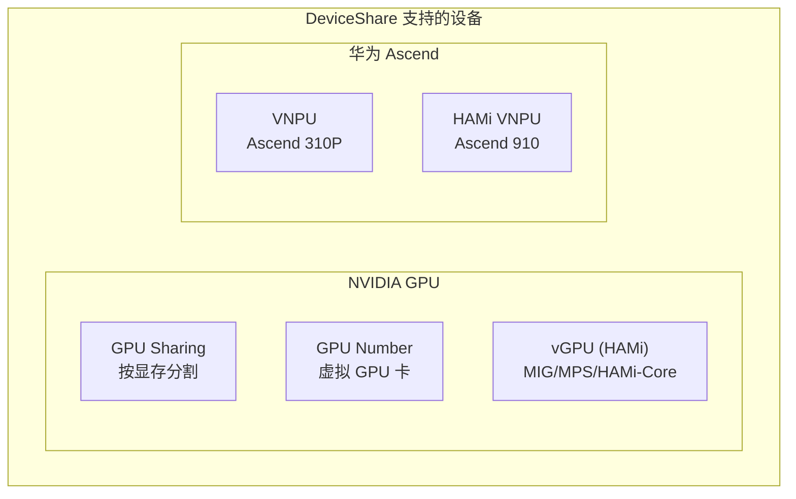
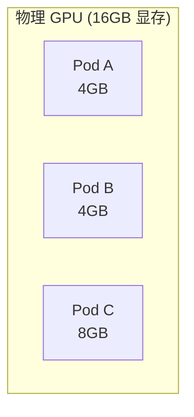
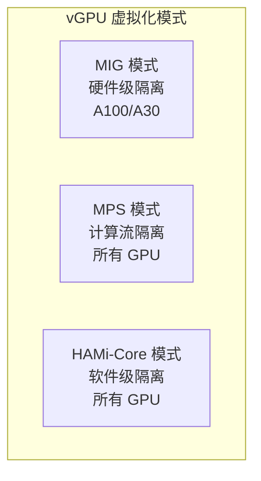
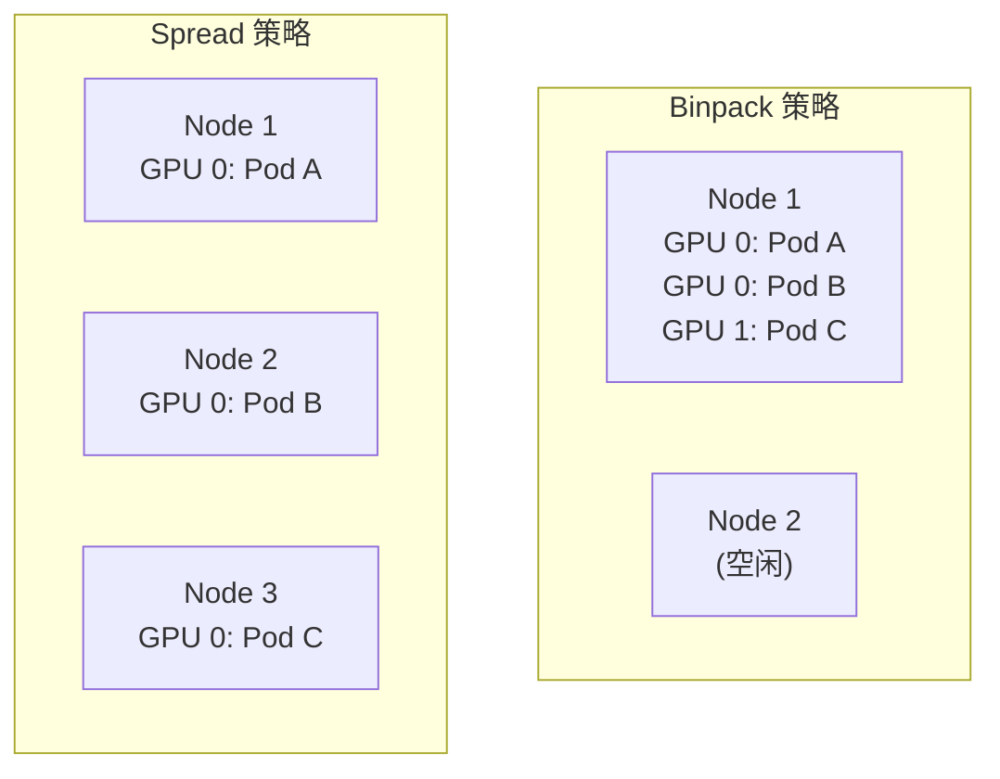

## 概述

Volcano 通过 `deviceshare` 插件支持多种 GPU 共享和异构设备调度模式，包括 NVIDIA GPU 共享（GPU Memory/GPU Number）、vGPU（HAMi）、以及华为 Ascend NPU 等设备的调度。本文详细介绍各模式的配置与使用方法。

---

## 支持的设备类型



| 模式 | 资源类型 | 说明 |
|------|---------|------|
| GPU Sharing | `volcano.sh/gpu-memory` | 按 GPU 显存分割共享 |
| GPU Number | `volcano.sh/gpu-number` | 虚拟 GPU 卡号分配 |
| vGPU (HAMi) | `volcano.sh/vgpu-number` | HAMi 虚拟 GPU（MIG/MPS 模式） |
| Ascend VNPU | `huawei.com/ascend310p-*` | 华为 Ascend 310P 虚拟 NPU |

---

## GPU Sharing 模式

### 原理

GPU Sharing 将单个物理 GPU 的显存划分为多份，允许多个容器共享同一 GPU：



### 调度器配置

```yaml
actions: "enqueue, allocate, backfill"
tiers:
- plugins:
  - name: priority
  - name: gang
  - name: conformance
- plugins:
  - name: predicates
  - name: proportion
  - name: nodeorder
  - name: binpack
  - name: deviceshare
    arguments:
      deviceshare.GPUSharingEnable: "true"
      deviceshare.SchedulePolicy: "binpack"     # binpack 或 spread
      deviceshare.ScheduleWeight: "10"
```

### 使用示例

```yaml
apiVersion: batch.volcano.sh/v1alpha1
kind: Job
metadata:
  name: gpu-sharing-job
spec:
  schedulerName: volcano
  minAvailable: 2
  queue: training
  tasks:
    - replicas: 2
      name: inference
      template:
        spec:
          containers:
            - name: model
              image: inference:latest
              resources:
                requests:
                  cpu: "2"
                  memory: "4Gi"
                  volcano.sh/gpu-memory: "4096"    # 请求 4GB 显存
                limits:
                  cpu: "2"
                  memory: "4Gi"
                  volcano.sh/gpu-memory: "4096"
```

### 调度策略

| 策略 | 说明 | 适用场景 |
|------|------|---------|
| `binpack` | 优先填满一个 GPU | 提高 GPU 利用率 |
| `spread` | 分散到不同 GPU | 减少 GPU 间争用 |

---

## GPU Number 模式

### 原理

GPU Number 模式通过虚拟 GPU 卡号分配，支持将一个物理 GPU 以数量方式分配：

```yaml
# 调度器配置启用 GPU Number
- name: deviceshare
  arguments:
    deviceshare.GPUNumberEnable: "true"
```

### 使用示例

```yaml
apiVersion: v1
kind: Pod
metadata:
  name: gpu-number-pod
spec:
  schedulerName: volcano
  containers:
    - name: training
      image: training:latest
      resources:
        requests:
          volcano.sh/gpu-number: "1"               # 请求 1 个虚拟 GPU
        limits:
          volcano.sh/gpu-number: "1"
```

---

## vGPU 模式（HAMi）

### 原理

vGPU 基于 HAMi（Heterogeneous AI Computing Management Infrastructure）实现，支持三种虚拟化模式：



| 模式 | 隔离级别 | GPU 支持 | 说明 |
|------|---------|---------|------|
| MIG | 硬件隔离 | A100, A30, H100 | 最强隔离，物理切分 GPU |
| MPS | 计算隔离 | 所有 NVIDIA GPU | CUDA 多进程服务 |
| HAMi-Core | 软件隔离 | 所有 NVIDIA GPU | HAMi 用户态拦截 |

### 调度器配置

```yaml
- name: deviceshare
  arguments:
    deviceshare.VGPUEnable: "true"
    deviceshare.SchedulePolicy: "binpack"
```

### 使用示例

```yaml
apiVersion: batch.volcano.sh/v1alpha1
kind: Job
metadata:
  name: vgpu-training
spec:
  schedulerName: volcano
  minAvailable: 1
  queue: training
  tasks:
    - replicas: 1
      name: trainer
      template:
        metadata:
          annotations:
            volcano.sh/vgpu-mode: "hami-core"     # 指定 vGPU 模式
        spec:
          containers:
            - name: trainer
              image: training:latest
              resources:
                requests:
                  volcano.sh/vgpu-number: "1"       # 请求 1 个 vGPU
                  volcano.sh/vgpu-memory: "4096"    # 请求 4GB 显存
                limits:
                  volcano.sh/vgpu-number: "1"
                  volcano.sh/vgpu-memory: "4096"
```

---

## GPU 类型选择

### 指定 GPU 类型

通过注解选择或排除特定 GPU 型号：

```yaml
apiVersion: v1
kind: Pod
metadata:
  name: specific-gpu-pod
  annotations:
    nvidia.com/use-gputype: "A100,V100"       # 只使用 A100 或 V100
spec:
  schedulerName: volcano
  containers:
    - name: training
      image: training:latest
      resources:
        requests:
          nvidia.com/gpu: "1"
```

### 排除 GPU 类型

```yaml
metadata:
  annotations:
    nvidia.com/nouse-gputype: "T4"             # 不使用 T4
```

### 指定 GPU 索引

```yaml
metadata:
  annotations:
    volcano.sh/gpu-index: "0,2"                # 使用 GPU 0 和 GPU 2
```

---

## 多 GPU 训练

### 单节点多 GPU

```yaml
apiVersion: batch.volcano.sh/v1alpha1
kind: Job
metadata:
  name: multi-gpu-training
spec:
  schedulerName: volcano
  minAvailable: 1
  queue: training
  tasks:
    - replicas: 1
      name: trainer
      template:
        spec:
          containers:
            - name: trainer
              image: training:latest
              command: ["python", "-m", "torch.distributed.launch",
                       "--nproc_per_node=4", "train.py"]
              resources:
                requests:
                  cpu: "16"
                  memory: "64Gi"
                  nvidia.com/gpu: "4"          # 4 GPU
                limits:
                  nvidia.com/gpu: "4"
```

### 多节点多 GPU

```yaml
apiVersion: batch.volcano.sh/v1alpha1
kind: Job
metadata:
  name: distributed-gpu-training
spec:
  schedulerName: volcano
  minAvailable: 4
  queue: training
  plugins:
    ssh: []
    svc: []
    env: []
  tasks:
    - replicas: 4
      name: worker
      template:
        spec:
          containers:
            - name: worker
              image: training:latest
              resources:
                requests:
                  cpu: "8"
                  memory: "32Gi"
                  nvidia.com/gpu: "2"          # 每个 Worker 2 GPU
                limits:
                  nvidia.com/gpu: "2"
```

---

## 调度策略配置

### Binpack vs Spread



```yaml
# Binpack - 优先填满一个节点/GPU
- name: deviceshare
  arguments:
    deviceshare.GPUSharingEnable: "true"
    deviceshare.SchedulePolicy: "binpack"
    deviceshare.ScheduleWeight: "10"

# Spread - 分散调度
- name: deviceshare
  arguments:
    deviceshare.GPUSharingEnable: "true"
    deviceshare.SchedulePolicy: "spread"
    deviceshare.ScheduleWeight: "10"
```

### 与 Binpack 插件配合

```yaml
# DeviceShare + Binpack 联合使用
- name: binpack
  arguments:
    binpack.weight: "5"
    binpack.resources: "nvidia.com/gpu"
    binpack.resources.nvidia.com/gpu: "10"     # GPU 打包权重最高
- name: deviceshare
  arguments:
    deviceshare.GPUSharingEnable: "true"
    deviceshare.SchedulePolicy: "binpack"
```

---

## 健康 GPU 管理

### 排除不健康 GPU

```yaml
metadata:
  annotations:
    volcano.sh/gpu-unhealthy-ids: "GPU-xxxx-1234"  # 不健康 GPU ID
```

Volcano 在调度时会自动跳过标记为不健康的 GPU。

---

## 相关注解参考

| 注解 | 说明 | 示例值 |
|------|------|--------|
| `volcano.sh/gpu-memory` | GPU 显存请求（MB） | `4096` |
| `volcano.sh/gpu-number` | 虚拟 GPU 数量 | `1` |
| `volcano.sh/vgpu-mode` | vGPU 模式 | `hami-core`, `mig`, `mps` |
| `volcano.sh/vgpu-number` | vGPU 数量 | `1` |
| `volcano.sh/vgpu-memory` | vGPU 显存 | `4096` |
| `volcano.sh/gpu-index` | GPU 索引 | `0,2` |
| `volcano.sh/gpu-unhealthy-ids` | 不健康 GPU | `GPU-xxxx` |
| `nvidia.com/use-gputype` | 使用的 GPU 类型 | `A100,V100` |
| `nvidia.com/nouse-gputype` | 排除的 GPU 类型 | `T4` |

---

## 常见问题

| 问题 | 原因 | 解决方案 |
|------|------|---------|
| GPU 请求无法调度 | DeviceShare 插件未启用 | 启用 `deviceshare.GPUSharingEnable` |
| vGPU 分配失败 | HAMi 未部署或版本不匹配 | 确认 HAMi 组件已安装 |
| GPU 利用率低 | 使用独占模式 | 切换为 GPU Sharing 模式 |
| 跨节点 GPU 不均衡 | Spread 策略未开启 | 调整 SchedulePolicy |
| GPU 类型选择失败 | 节点无匹配 GPU 类型 | 检查节点 GPU 标签 |

---

## 参考文件

| 文件 | 说明 |
|------|------|
| `pkg/scheduler/plugins/deviceshare/deviceshare.go` | DeviceShare 插件实现 |
| `pkg/scheduler/plugins/deviceshare/gpu_sharing.go` | GPU Sharing 逻辑 |
| `pkg/scheduler/plugins/deviceshare/vgpu.go` | vGPU 分配逻辑 |
| `example/MindSpore-example/mindspore_gpu/` | GPU 训练示例 |
