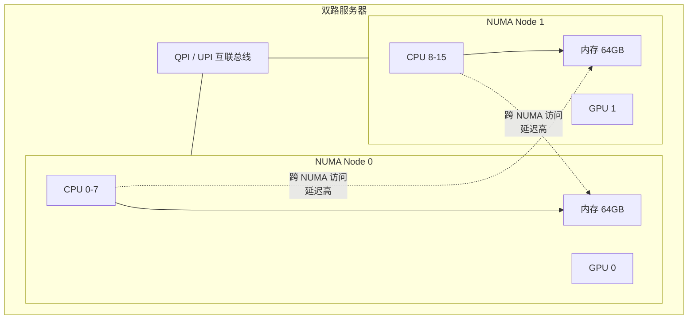
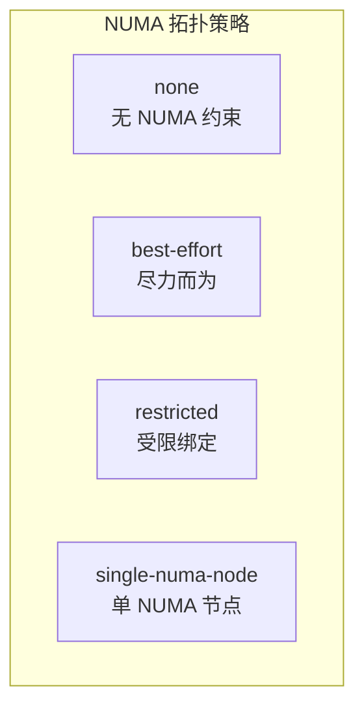
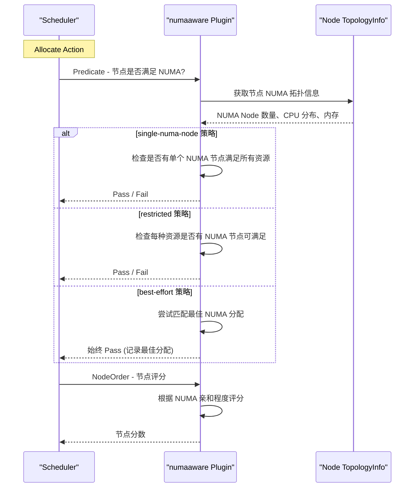
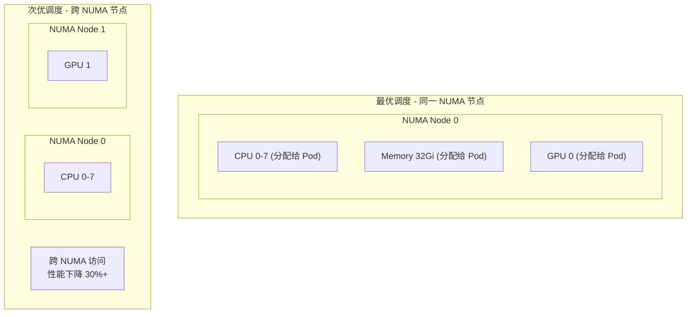
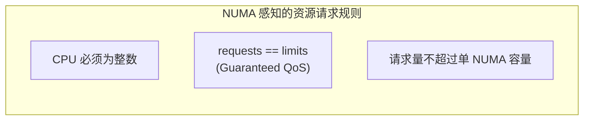

## 概述

NUMA（Non-Uniform Memory Access）感知调度是 Volcano 面向高性能计算和延迟敏感型工作负载的关键特性。通过 `numaaware` 插件，Volcano 可以在调度阶段感知节点的 NUMA 拓扑，将 Pod 调度到满足 NUMA 亲和性要求的节点上，避免跨 NUMA 节点访问内存带来的性能损失。

---

## NUMA 架构基础



### 为什么需要 NUMA 感知

| 访问模式 | 延迟 | 带宽 |
|---------|------|------|
| 本地 NUMA 访问 | ~100ns | 高 |
| 跨 NUMA 访问 | ~300ns | 低 |

对于 HPC、AI 训练等密集计算任务，跨 NUMA 访问可导致 30-50% 的性能下降。

---

## 前置条件

### 节点配置要求

1. **kubelet CPU Manager Policy** 必须为 `static`：

```yaml
# kubelet 配置
cpuManagerPolicy: static
topologyManagerPolicy: single-numa-node  # 或 restricted, best-effort
```

2. **节点标签**（kubelet 自动设置）：

```
kubernetes.io/cpu-manager-policy: static
kubernetes.io/topology-manager-policy: single-numa-node
```

3. **Pod QoS 要求**：必须为 **Guaranteed**（requests == limits）

```yaml
resources:
  requests:
    cpu: "4"
    memory: "16Gi"
  limits:
    cpu: "4"          # 必须与 requests 一致
    memory: "16Gi"     # 必须与 requests 一致
```

---

## NUMA 拓扑策略

Volcano 支持四种 NUMA 拓扑策略：



| 策略 | 说明 | 适用场景 |
|------|------|---------|
| `none` | 不考虑 NUMA 拓扑 | 通用工作负载 |
| `best-effort` | 尽量满足 NUMA 亲和性，不满足也可调度 | 轻度性能敏感 |
| `restricted` | 必须满足 NUMA 亲和性约束 | 高性能计算 |
| `single-numa-node` | 所有资源必须在同一个 NUMA 节点 | 极致性能要求 |

---

## 调度器配置

### 启用 NUMA 感知插件

```yaml
actions: "enqueue, allocate, backfill"
tiers:
- plugins:
  - name: priority
  - name: gang
  - name: conformance
- plugins:
  - name: predicates
  - name: proportion
  - name: nodeorder
  - name: numaaware                # NUMA 感知插件
```

---

## 使用方法

### 通过 Pod 注解指定 NUMA 策略

```yaml
apiVersion: batch.volcano.sh/v1alpha1
kind: Job
metadata:
  name: numa-aware-training
spec:
  schedulerName: volcano
  minAvailable: 2
  queue: training
  tasks:
    - replicas: 2
      name: worker
      template:
        metadata:
          annotations:
            # 指定 NUMA 拓扑策略
            volcano.sh/numa-topology-policy: "single-numa-node"
        spec:
          containers:
            - name: worker
              image: hpc-app:latest
              resources:
                requests:
                  cpu: "8"                # 必须是整数
                  memory: "32Gi"
                limits:
                  cpu: "8"                # Guaranteed QoS
                  memory: "32Gi"
          restartPolicy: OnFailure
```

### 各策略使用示例

#### single-numa-node（最严格）

所有 CPU 和内存必须在同一个 NUMA 节点：

```yaml
metadata:
  annotations:
    volcano.sh/numa-topology-policy: "single-numa-node"
spec:
  containers:
    - resources:
        requests:
          cpu: "8"                        # 单 NUMA 节点需有 8 核空闲
          memory: "32Gi"                  # 同一 NUMA 节点需有 32Gi 空闲
        limits:
          cpu: "8"
          memory: "32Gi"
```

#### restricted（受限）

资源可跨多个 NUMA 节点，但每种资源必须满足 NUMA 亲和性：

```yaml
metadata:
  annotations:
    volcano.sh/numa-topology-policy: "restricted"
spec:
  containers:
    - resources:
        requests:
          cpu: "16"                       # 可分布在多个 NUMA 节点
          memory: "64Gi"
        limits:
          cpu: "16"
          memory: "64Gi"
```

#### best-effort（尽力而为）

尽量满足 NUMA 亲和性，但如果无法满足也允许调度：

```yaml
metadata:
  annotations:
    volcano.sh/numa-topology-policy: "best-effort"
spec:
  containers:
    - resources:
        requests:
          cpu: "4"
          memory: "16Gi"
        limits:
          cpu: "4"
          memory: "16Gi"
```

---

## 调度决策

NUMA 调度完成后，调度决策通过注解记录：

```yaml
metadata:
  annotations:
    # 调度器写入的 NUMA 拓扑决策
    volcano.sh/topology-decision: |
      {
        "cpu": {"NUMANodeAffinity": [0]},
        "memory": {"NUMANodeAffinity": [0]}
      }
```

---

## 调度流程



---

## NUMA + GPU 联合调度

对于需要 GPU 和 CPU 在同一 NUMA 节点的场景：

```yaml
apiVersion: batch.volcano.sh/v1alpha1
kind: Job
metadata:
  name: numa-gpu-training
spec:
  schedulerName: volcano
  minAvailable: 1
  queue: training
  tasks:
    - replicas: 1
      name: trainer
      template:
        metadata:
          annotations:
            volcano.sh/numa-topology-policy: "single-numa-node"
        spec:
          containers:
            - name: trainer
              image: gpu-training:latest
              resources:
                requests:
                  cpu: "8"
                  memory: "32Gi"
                  nvidia.com/gpu: "1"     # GPU 与 CPU 在同一 NUMA 节点
                limits:
                  cpu: "8"
                  memory: "32Gi"
                  nvidia.com/gpu: "1"
```



---

## 验证 NUMA 调度

### 检查节点 NUMA 信息

```bash
# 查看节点 CPU 拓扑
lscpu | grep NUMA

# 查看详细 NUMA 信息
numactl -H

# 示例输出：
# available: 2 nodes (0-1)
# node 0 cpus: 0 1 2 3 4 5 6 7
# node 0 size: 65536 MB
# node 1 cpus: 8 9 10 11 12 13 14 15
# node 1 size: 65536 MB
```

### 检查 Pod 的 NUMA 分配

```bash
# 查看 Pod 注解中的 NUMA 决策
kubectl get pod <pod-name> -o jsonpath='{.metadata.annotations.volcano\.sh/topology-decision}'
```

### 检查调度器日志

```bash
kubectl logs -n volcano-system -l app=volcano-scheduler | grep -i numa
```

---

## 最佳实践

### 1. 资源请求规范



- CPU 请求必须是整数（如 `4`、`8`），不能是小数（如 `0.5`、`1.5`）
- requests 必须等于 limits，确保 Guaranteed QoS 级别
- 单个 Pod 的资源请求不应超过单个 NUMA 节点的容量

### 2. 策略选择指南

| 工作负载 | 推荐策略 | 原因 |
|---------|---------|------|
| 延迟敏感型推理 | `single-numa-node` | 极致性能 |
| 大规模训练 | `restricted` | 可跨 NUMA 但保证亲和性 |
| 通用计算 | `best-effort` | 灵活调度 |
| 弹性服务 | `none` | 无需 NUMA 约束 |

### 3. 集群规划

- 选择 NUMA 节点数少的服务器（2-4 NUMA），简化调度
- 在 NUMA 节点间均衡分配 GPU，避免资源倾斜
- 为 NUMA 敏感任务创建专用队列，设置合理的 Capability

---

## 常见问题

| 问题 | 原因 | 解决方案 |
|------|------|---------|
| NUMA 调度不生效 | Pod 非 Guaranteed QoS | 确保 requests == limits |
| 节点被 NUMA 插件过滤 | kubelet 策略不匹配 | 检查 `kubernetes.io/topology-manager-policy` |
| CPU 未绑定到 NUMA 节点 | CPU Manager 未启用 | 配置 `cpuManagerPolicy: static` |
| 资源请求超出单 NUMA | 请求量大于单 NUMA 容量 | 降低请求量或使用 `restricted` 策略 |
| NUMA 信息不可用 | 节点未上报拓扑信息 | 检查 kubelet 版本和配置 |

---

## 参考文件

| 文件 | 说明 |
|------|------|
| `pkg/scheduler/plugins/numaaware/numaaware.go` | NUMA 感知插件实现 |
| `pkg/scheduler/plugins/numaaware/policy/` | NUMA 策略实现 |
| `staging/src/volcano.sh/apis/pkg/apis/scheduling/v1beta1/labels.go` | NUMA 相关注解定义 |
