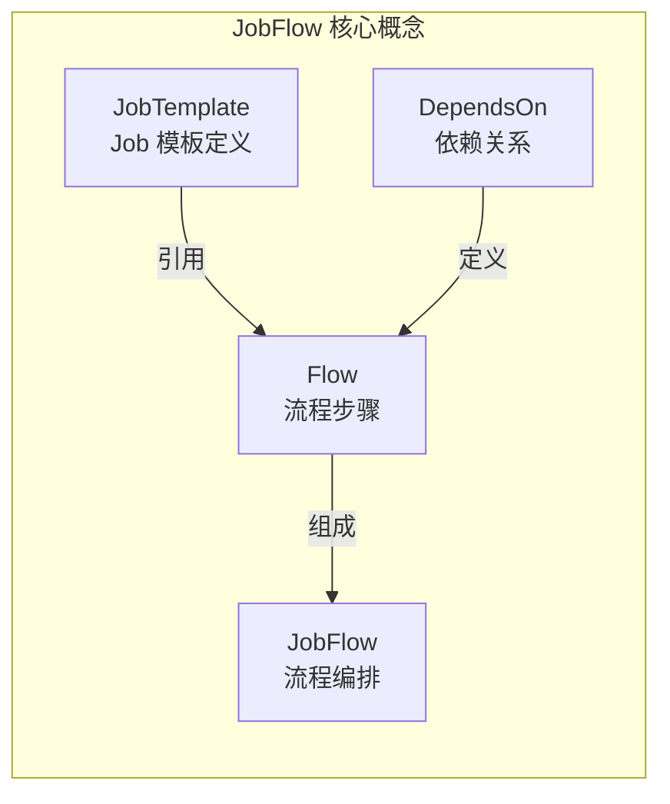
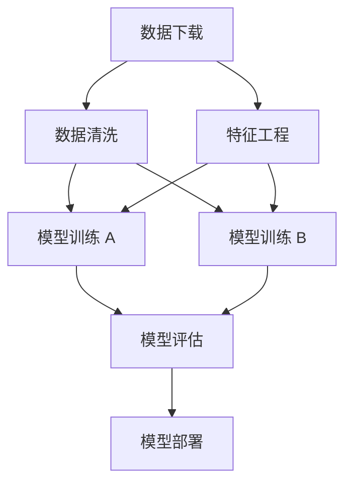
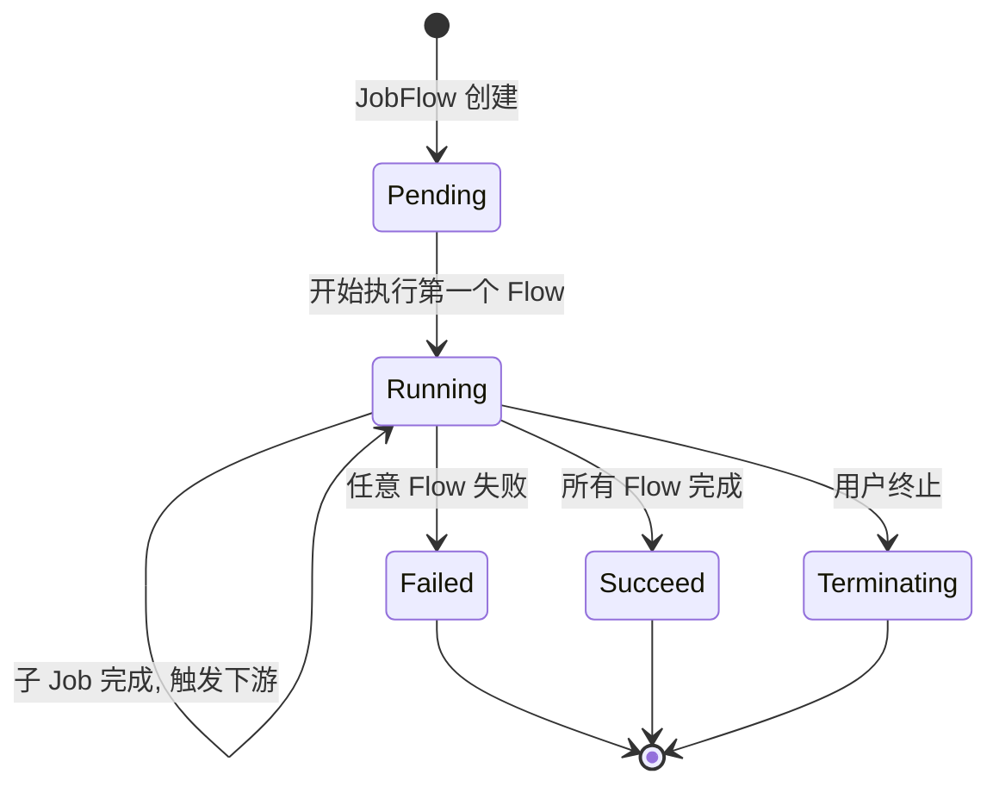
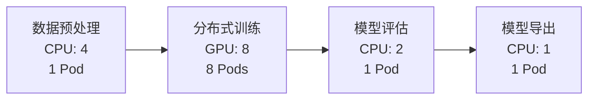
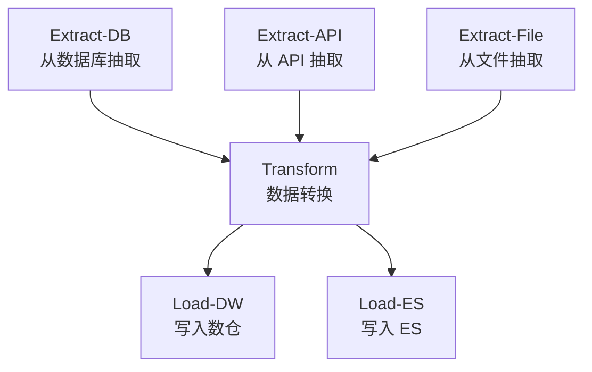

## 概述

JobFlow 是 Volcano 提供的工作流编排 CRD，用于定义多个 Volcano Job 之间的依赖关系，实现 DAG（有向无环图）工作流。配合 JobTemplate，用户可以声明式地编排复杂的数据处理和 AI 训练流水线。

---

## 核心概念



| 概念 | 说明 |
|------|------|
| **JobTemplate** | 可复用的 Job 模板，定义任务的容器、资源等 |
| **JobFlow** | 工作流定义，包含多个 Flow 步骤和依赖关系 |
| **Flow** | 工作流中的单个步骤，引用 JobTemplate |
| **DependsOn** | 步骤间的依赖关系（DAG 边） |
| **Probe** | 依赖就绪探针，支持 HTTP/TCP/Task 状态检查 |

---

## 基本使用

### 1. 创建 JobTemplate

```yaml
apiVersion: flow.volcano.sh/v1alpha1
kind: JobTemplate
metadata:
  name: data-preprocess
  namespace: default
spec:
  minAvailable: 1
  schedulerName: volcano
  queue: default
  tasks:
    - replicas: 1
      name: preprocess
      template:
        spec:
          containers:
            - name: worker
              image: data-pipeline:latest
              command: ["python", "preprocess.py"]
              resources:
                requests:
                  cpu: "4"
                  memory: "8Gi"
          restartPolicy: OnFailure
---
apiVersion: flow.volcano.sh/v1alpha1
kind: JobTemplate
metadata:
  name: model-training
  namespace: default
spec:
  minAvailable: 4
  schedulerName: volcano
  queue: training
  plugins:
    ssh: []
    svc: []
    env: []
  tasks:
    - replicas: 4
      name: worker
      template:
        spec:
          containers:
            - name: trainer
              image: training:latest
              command: ["python", "train.py"]
              resources:
                requests:
                  cpu: "8"
                  memory: "32Gi"
                  nvidia.com/gpu: "1"
          restartPolicy: OnFailure
---
apiVersion: flow.volcano.sh/v1alpha1
kind: JobTemplate
metadata:
  name: model-evaluation
  namespace: default
spec:
  minAvailable: 1
  schedulerName: volcano
  queue: default
  tasks:
    - replicas: 1
      name: eval
      template:
        spec:
          containers:
            - name: evaluator
              image: evaluation:latest
              command: ["python", "evaluate.py"]
              resources:
                requests:
                  cpu: "2"
                  memory: "4Gi"
          restartPolicy: OnFailure
```

### 2. 创建 JobFlow

```yaml
apiVersion: flow.volcano.sh/v1alpha1
kind: JobFlow
metadata:
  name: ml-pipeline
  namespace: default
spec:
  jobRetainPolicy: delete              # 完成后删除子 Job
  flows:
    - name: data-preprocess             # 步骤 1: 数据预处理（无依赖）
    - name: model-training              # 步骤 2: 模型训练
      dependsOn:
        targets: ["data-preprocess"]    # 依赖步骤 1
    - name: model-evaluation            # 步骤 3: 模型评估
      dependsOn:
        targets: ["model-training"]     # 依赖步骤 2
```

---

## DAG 工作流

### 复杂 DAG 示例



```yaml
apiVersion: flow.volcano.sh/v1alpha1
kind: JobFlow
metadata:
  name: complex-pipeline
spec:
  jobRetainPolicy: retain              # 保留子 Job（用于调试）
  flows:
    # 第一层：数据下载（无依赖）
    - name: data-download

    # 第二层：数据清洗和特征工程（并行）
    - name: data-cleaning
      dependsOn:
        targets: ["data-download"]
    - name: feature-engineering
      dependsOn:
        targets: ["data-download"]

    # 第三层：两个模型训练任务（并行，各自依赖上游）
    - name: model-training-a
      dependsOn:
        targets: ["data-cleaning", "feature-engineering"]
    - name: model-training-b
      dependsOn:
        targets: ["data-cleaning", "feature-engineering"]

    # 第四层：模型评估
    - name: model-evaluation
      dependsOn:
        targets: ["model-training-a", "model-training-b"]

    # 第五层：模型部署
    - name: model-deployment
      dependsOn:
        targets: ["model-evaluation"]
```

---

## 依赖探针

JobFlow 支持在依赖检查中使用探针（Probe），确认上游任务不仅完成，而且满足特定条件：

### HTTP 探针

```yaml
flows:
  - name: model-serving
    dependsOn:
      targets: ["model-training"]
      probe:
        httpGet:
          host: "model-service.default.svc"
          port: 8080
          path: "/health"
          httpHeader:
            - name: "Content-Type"
              value: "application/json"
```

### TCP 探针

```yaml
flows:
  - name: data-processing
    dependsOn:
      targets: ["database-setup"]
      probe:
        tcpSocket:
          host: "database.default.svc"
          port: 5432
```

### Task Status 探针

```yaml
flows:
  - name: post-training
    dependsOn:
      targets: ["training"]
      probe:
        taskStatusCount:
          taskName: "worker"
          count: 4
          status: "Completed"          # 确认 4 个 worker 都完成
```

---

## Job 参数覆盖（Patch）

Flow 步骤可以通过 `patch` 字段覆盖 JobTemplate 中的参数：

```yaml
apiVersion: flow.volcano.sh/v1alpha1
kind: JobFlow
metadata:
  name: parameterized-pipeline
spec:
  jobRetainPolicy: delete
  flows:
    - name: training-small
      patch:
        spec:
          minAvailable: 2
          tasks:
            - replicas: 2               # 覆盖 JobTemplate 中的 replicas
              name: worker

    - name: training-large
      dependsOn:
        targets: ["training-small"]
      patch:
        spec:
          minAvailable: 8
          tasks:
            - replicas: 8               # 大规模训练
              name: worker
```

---

## JobRetainPolicy

| 策略 | 说明 | 适用场景 |
|------|------|---------|
| `delete` | JobFlow 完成后删除所有子 Job | 生产环境，减少资源占用 |
| `retain` | 保留所有子 Job | 开发调试，查看中间结果 |

---

## 生命周期



### 状态字段

```yaml
status:
  state:
    phase: Running                     # Pending / Running / Succeed / Failed / Terminating
  pendingJobs:
    - model-evaluation
  runningJobs:
    - model-training
  completedJobs:
    - data-preprocess
  failedJobs: []
  terminatedJobs: []
```

---

## 管理操作

### 查看 JobFlow

```bash
# 列出所有 JobFlow
kubectl get jobflow

# 查看详情
kubectl describe jobflow ml-pipeline

# 查看 JSON 状态
kubectl get jobflow ml-pipeline -o jsonpath='{.status}'
```

### 查看子 Job

```bash
# 查看 JobFlow 创建的子 Job
kubectl get vcjob -l jobflow.volcano.sh/name=ml-pipeline
```

### 终止 JobFlow

```bash
kubectl delete jobflow ml-pipeline
```

---

## 实战案例

### 案例一：AI 模型训练流水线



```yaml
apiVersion: flow.volcano.sh/v1alpha1
kind: JobFlow
metadata:
  name: ai-pipeline
spec:
  jobRetainPolicy: delete
  flows:
    - name: preprocess
    - name: training
      dependsOn:
        targets: ["preprocess"]
    - name: evaluation
      dependsOn:
        targets: ["training"]
    - name: export
      dependsOn:
        targets: ["evaluation"]
```

### 案例二：ETL 数据处理



```yaml
apiVersion: flow.volcano.sh/v1alpha1
kind: JobFlow
metadata:
  name: etl-pipeline
spec:
  jobRetainPolicy: delete
  flows:
    # Extract 阶段（三个并行）
    - name: extract-db
    - name: extract-api
    - name: extract-file

    # Transform 阶段（依赖所有 Extract）
    - name: transform
      dependsOn:
        targets: ["extract-db", "extract-api", "extract-file"]

    # Load 阶段（两个并行）
    - name: load-dw
      dependsOn:
        targets: ["transform"]
    - name: load-es
      dependsOn:
        targets: ["transform"]
```

---

## 与 CronJob 结合

通过 Volcano CronJob 定时触发 JobFlow：

```yaml
apiVersion: batch.volcano.sh/v1alpha1
kind: CronJob
metadata:
  name: daily-training-pipeline
spec:
  schedule: "0 2 * * *"               # 每天凌晨 2 点
  concurrencyPolicy: Forbid
  jobTemplate:
    spec:
      schedulerName: volcano
      minAvailable: 1
      tasks:
        - replicas: 1
          name: trigger
          template:
            spec:
              containers:
                - name: trigger
                  image: kubectl:latest
                  command: ["kubectl", "apply", "-f", "/workflows/ml-pipeline.yaml"]
              restartPolicy: OnFailure
```

---

## 常见问题

| 问题 | 原因 | 解决方案 |
|------|------|---------|
| JobFlow 一直 Pending | 第一个 Flow 的 JobTemplate 不存在 | 确认 JobTemplate 已创建且同命名空间 |
| 子 Job 未创建 | 上游依赖未完成 | 检查上游 Job 状态 |
| 循环依赖检测失败 | DAG 中存在环 | 检查 `dependsOn` 配置 |
| Probe 检查失败 | 服务未就绪 | 检查 Probe 配置和目标服务 |
| 子 Job 未清理 | `jobRetainPolicy: retain` | 改为 `delete` 或手动清理 |

---

## 参考文件

| 文件 | 说明 |
|------|------|
| `staging/src/volcano.sh/apis/pkg/apis/flow/v1alpha1/jobflow_types.go` | JobFlow API 类型 |
| `staging/src/volcano.sh/apis/pkg/apis/flow/v1alpha1/jobtemplate_types.go` | JobTemplate API 类型 |
| `pkg/controllers/jobflow/` | JobFlow Controller |
| `example/jobflow/` | JobFlow 示例 |
