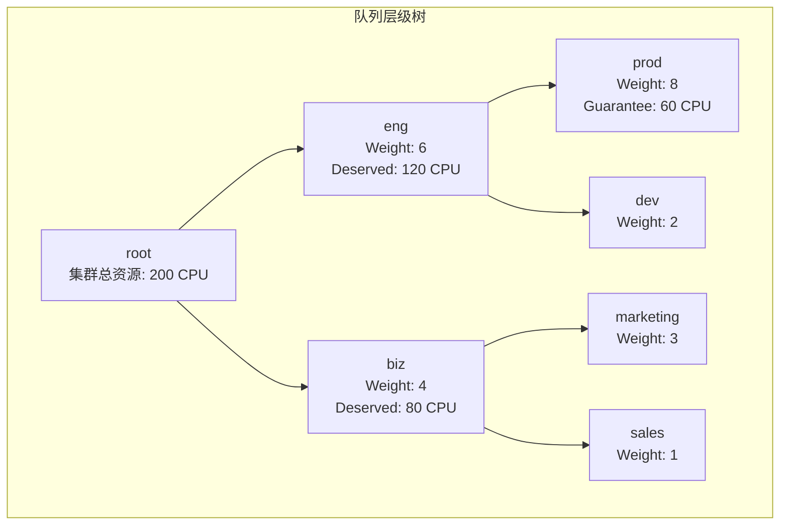
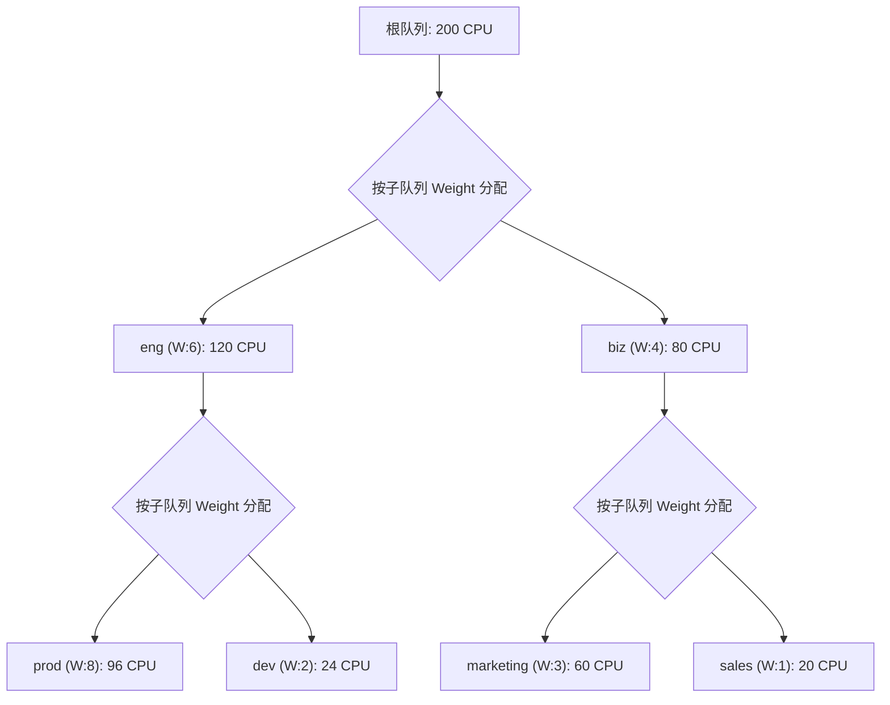
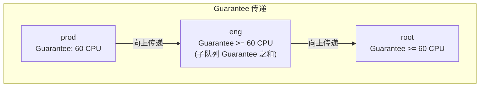
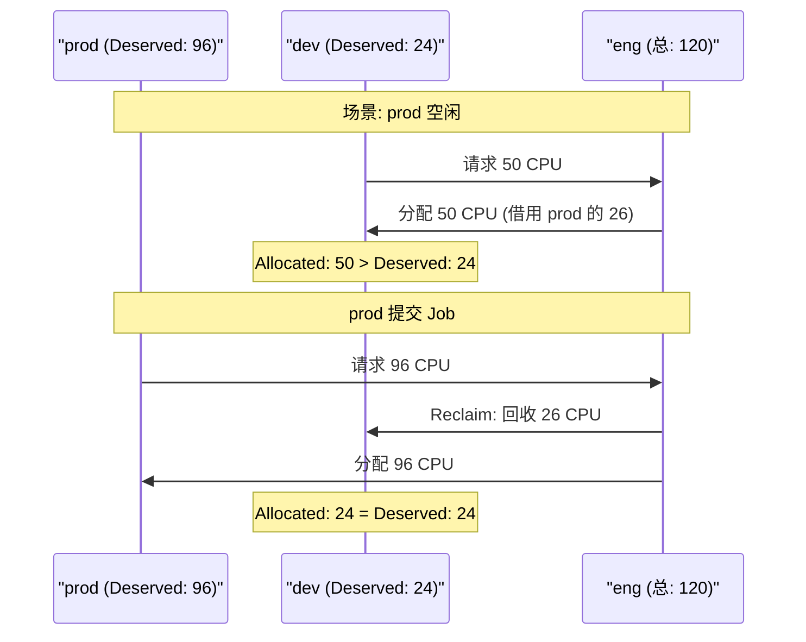
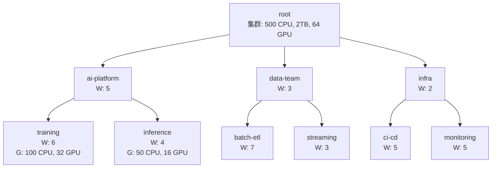

## 概述

层级队列（Hierarchical Queue）是 Volcano 面向大型企业的多租户资源管理特性。通过 `capacity` 插件，用户可以按组织架构建立树形队列层级，实现部门级别的资源隔离、保障和弹性共享。

---

## 层级队列模型



### 核心规则

| 规则 | 说明 |
|------|------|
| **叶子队列** | 只有叶子队列可以提交 Job |
| **资源继承** | 子队列的资源之和不超过父队列 |
| **权重分配** | 同级子队列按 Weight 比例分配父队列资源 |
| **Guarantee 向上传递** | 子队列的 Guarantee 会计入父队列的 Guarantee |
| **Capability 约束** | 子队列的 Capability 受父队列 Capability 限制 |

---

## 配置方式

### 方式一：注解方式（推荐）

通过 `volcano.sh/hierarchy` 和 `volcano.sh/hierarchy-weights` 注解定义：

```yaml
# 根队列（自动创建）无需手动定义

# 一级队列: eng
apiVersion: scheduling.volcano.sh/v1beta1
kind: Queue
metadata:
  name: root-eng
  annotations:
    "volcano.sh/hierarchy": "root/eng"
    "volcano.sh/hierarchy-weights": "1/6"
spec:
  weight: 1
---
# 一级队列: biz
apiVersion: scheduling.volcano.sh/v1beta1
kind: Queue
metadata:
  name: root-biz
  annotations:
    "volcano.sh/hierarchy": "root/biz"
    "volcano.sh/hierarchy-weights": "1/4"
spec:
  weight: 1
---
# 二级队列: eng/prod（叶子队列）
apiVersion: scheduling.volcano.sh/v1beta1
kind: Queue
metadata:
  name: root-eng-prod
  annotations:
    "volcano.sh/hierarchy": "root/eng/prod"
    "volcano.sh/hierarchy-weights": "1/6/8"
spec:
  weight: 1
  reclaimable: false
  capability:
    cpu: "100"
    memory: "400Gi"
  guarantee:
    resource:
      cpu: "60"
      memory: "240Gi"
---
# 二级队列: eng/dev（叶子队列）
apiVersion: scheduling.volcano.sh/v1beta1
kind: Queue
metadata:
  name: root-eng-dev
  annotations:
    "volcano.sh/hierarchy": "root/eng/dev"
    "volcano.sh/hierarchy-weights": "1/6/2"
spec:
  weight: 1
  reclaimable: true
---
# 二级队列: biz/marketing（叶子队列）
apiVersion: scheduling.volcano.sh/v1beta1
kind: Queue
metadata:
  name: root-biz-marketing
  annotations:
    "volcano.sh/hierarchy": "root/biz/marketing"
    "volcano.sh/hierarchy-weights": "1/4/3"
spec:
  weight: 1
  reclaimable: true
---
# 二级队列: biz/sales（叶子队列）
apiVersion: scheduling.volcano.sh/v1beta1
kind: Queue
metadata:
  name: root-biz-sales
  annotations:
    "volcano.sh/hierarchy": "root/biz/sales"
    "volcano.sh/hierarchy-weights": "1/4/1"
spec:
  weight: 1
  reclaimable: true
```

### 注解格式说明

```
volcano.sh/hierarchy: "root/level1/level2/..."
volcano.sh/hierarchy-weights: "w0/w1/w2/..."
```

- 路径必须从 `root` 开始
- 权重数量必须与路径层级数一致
- 同级队列的权重决定该级别资源分配比例

---

## 调度器配置

使用层级队列时，需要用 `capacity` 插件替代 `proportion`：

```yaml
actions: "enqueue, allocate, preempt, reclaim, backfill"
tiers:
- plugins:
  - name: priority
  - name: gang
  - name: conformance
- plugins:
  - name: overcommit
  - name: predicates
  - name: capacity                # 层级队列插件（替代 proportion）
    enableHierarchy: true
    enableJobOrder: true
    enablePreemptable: true
    enableReclaimable: true
    enableQueueOrder: true
  - name: nodeorder
  - name: binpack
```

> **注意**：`capacity` 和 `proportion` 互斥，不能同时启用。

---

## 资源分配算法

### Deserved 计算



计算步骤：
1. root 总资源 200 CPU
2. eng Deserved = 200 × 6/(6+4) = 120 CPU
3. biz Deserved = 200 × 4/(6+4) = 80 CPU
4. prod Deserved = 120 × 8/(8+2) = 96 CPU（受 Capability 100 约束 → 96）
5. dev Deserved = 120 × 2/(8+2) = 24 CPU
6. marketing Deserved = 80 × 3/(3+1) = 60 CPU
7. sales Deserved = 80 × 1/(3+1) = 20 CPU

### Guarantee 约束



---

## 资源借用与回收

### 借用规则



### 借用范围

- **同父队列内**：优先在兄弟队列间借用
- **跨父队列**：如果同级无法满足，向上传递借用请求
- **Guarantee 保护**：已设置 Guarantee 的队列，保底资源不可被回收

---

## 实战场景

### 场景一：企业 AI 平台



```yaml
# AI 平台 - 训练队列
apiVersion: scheduling.volcano.sh/v1beta1
kind: Queue
metadata:
  name: ai-training
  annotations:
    "volcano.sh/hierarchy": "root/ai-platform/training"
    "volcano.sh/hierarchy-weights": "1/5/6"
spec:
  weight: 1
  reclaimable: false
  guarantee:
    resource:
      cpu: "100"
      memory: "400Gi"
      nvidia.com/gpu: "32"
  capability:
    cpu: "300"
    memory: "1200Gi"
    nvidia.com/gpu: "48"
---
# AI 平台 - 推理队列
apiVersion: scheduling.volcano.sh/v1beta1
kind: Queue
metadata:
  name: ai-inference
  annotations:
    "volcano.sh/hierarchy": "root/ai-platform/inference"
    "volcano.sh/hierarchy-weights": "1/5/4"
spec:
  weight: 1
  reclaimable: true
  guarantee:
    resource:
      cpu: "50"
      memory: "200Gi"
      nvidia.com/gpu: "16"
```

### 场景二：多部门共享集群

```yaml
# 研发部门
---
apiVersion: scheduling.volcano.sh/v1beta1
kind: Queue
metadata:
  name: rd-prod
  annotations:
    "volcano.sh/hierarchy": "root/rd/prod"
    "volcano.sh/hierarchy-weights": "1/5/8"
spec:
  weight: 1
  reclaimable: false
  guarantee:
    resource:
      cpu: "40"
      memory: "160Gi"
---
apiVersion: scheduling.volcano.sh/v1beta1
kind: Queue
metadata:
  name: rd-staging
  annotations:
    "volcano.sh/hierarchy": "root/rd/staging"
    "volcano.sh/hierarchy-weights": "1/5/2"
spec:
  weight: 1
  reclaimable: true
---
# 测试部门
apiVersion: scheduling.volcano.sh/v1beta1
kind: Queue
metadata:
  name: qa-func
  annotations:
    "volcano.sh/hierarchy": "root/qa/functional"
    "volcano.sh/hierarchy-weights": "1/3/5"
spec:
  weight: 1
  reclaimable: true
---
apiVersion: scheduling.volcano.sh/v1beta1
kind: Queue
metadata:
  name: qa-perf
  annotations:
    "volcano.sh/hierarchy": "root/qa/performance"
    "volcano.sh/hierarchy-weights": "1/3/5"
spec:
  weight: 1
  reclaimable: true
```

---

## 提交 Job 到层级队列

Job 只能提交到**叶子队列**：

```yaml
apiVersion: batch.volcano.sh/v1alpha1
kind: Job
metadata:
  name: training-job-001
spec:
  schedulerName: volcano
  queue: ai-training                   # 叶子队列名称
  minAvailable: 4
  tasks:
    - replicas: 4
      name: worker
      template:
        spec:
          containers:
            - name: worker
              image: training:latest
              resources:
                requests:
                  cpu: "8"
                  memory: "32Gi"
                  nvidia.com/gpu: "1"
```

---

## 监控与管理

### 查看队列层级

```bash
# 查看所有队列及其层级注解
kubectl get queues -o custom-columns=\
NAME:.metadata.name,\
HIERARCHY:.metadata.annotations.volcano\.sh/hierarchy,\
WEIGHTS:.metadata.annotations.volcano\.sh/hierarchy-weights,\
STATE:.status.state

# 示例输出
# NAME              HIERARCHY                    WEIGHTS    STATE
# ai-training       root/ai-platform/training    1/5/6      Open
# ai-inference      root/ai-platform/inference   1/5/4      Open
# rd-prod           root/rd/prod                 1/5/8      Open
# rd-staging        root/rd/staging              1/5/2      Open
```

### 调整层级权重

```bash
# 动态调整队列权重
kubectl annotate queue ai-training \
  volcano.sh/hierarchy-weights="1/6/8" --overwrite
```

---

## 与 Proportion 的对比

| 特性 | proportion | capacity |
|------|-----------|----------|
| 队列结构 | 扁平 | 树形层级 |
| 权重分配 | 全局 Weight 比例 | 同级子队列 Weight 比例 |
| Guarantee | 支持 | 支持（带向上传递） |
| Capability | 支持 | 支持（受父队列约束） |
| 资源借用 | 全局借用 | 层级内借用 |
| 适用规模 | 中小集群 | 大型企业集群 |
| 管理复杂度 | 低 | 中高 |

---

## 常见问题

| 问题 | 原因 | 解决方案 |
|------|------|---------|
| Job 无法提交到非叶子队列 | Capacity 限制只有叶子队列接收 Job | 将 Job 提交到叶子队列 |
| 子队列资源超过父队列 | Weight 配置或 Capability 不合理 | 检查层级权重和 Capability |
| 回收不触发 | 队列 reclaimable=false | 检查队列回收策略 |
| Capacity 和 Proportion 冲突 | 同时启用两个插件 | 只能启用其中一个 |
| 层级路径格式错误 | 注解格式不正确 | 确认以 `root/` 开头，权重数与层级一致 |

---

## 参考文件

| 文件 | 说明 |
|------|------|
| `pkg/scheduler/plugins/capacity/capacity.go` | Capacity 插件实现 |
| `pkg/scheduler/plugins/capacity/capacity_helper.go` | Deserved 计算辅助 |
| `example/hierarchical-jobs/queues.yaml` | 层级队列示例 |
| `staging/src/volcano.sh/apis/pkg/apis/scheduling/v1beta1/labels.go` | 层级注解定义 |
