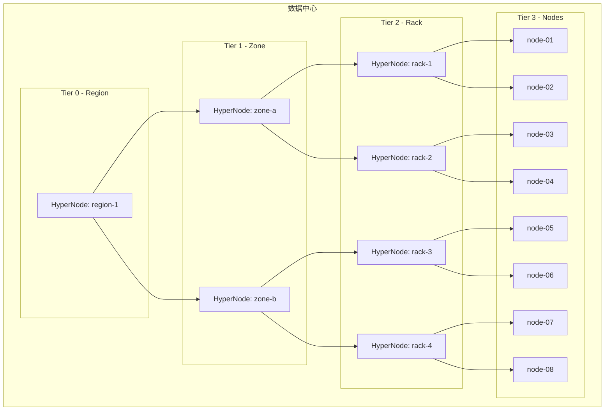
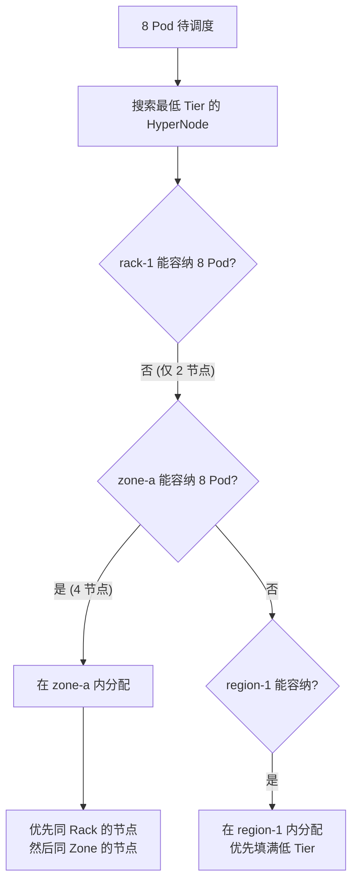
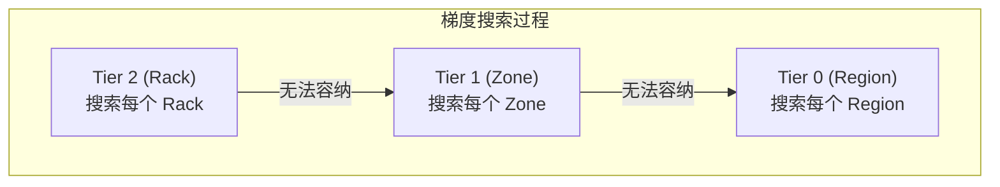
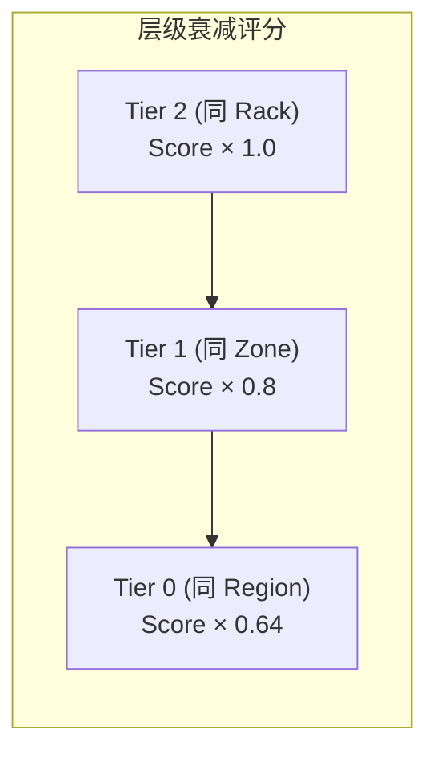

## 概述

网络拓扑感知调度是 Volcano 面向大规模分布式训练（特别是 LLM 训练）的关键特性。通过 HyperNode CRD 建模数据中心的网络拓扑结构（机架、交换机、区域），配合 `network-topology-aware` 插件，将分布式任务的 Pod 尽量调度到网络距离最近的节点上，减少通信延迟，提升训练效率。

---

## 网络拓扑模型



### 核心概念

| 概念 | 说明 |
|------|------|
| **HyperNode** | 网络拓扑节点 CRD，代表一组物理节点或子 HyperNode |
| **Tier** | 层级编号，0 = 顶层（Region），数字越大越底层（节点越近） |
| **TierName** | 层级名称（如 region、zone、rack） |
| **Members** | HyperNode 的成员（Node 或子 HyperNode） |

---

## HyperNode 配置

### 基本 HyperNode

```yaml
# Tier 2: 机架级 HyperNode
apiVersion: topology.volcano.sh/v1alpha1
kind: HyperNode
metadata:
  name: rack-1
spec:
  tier: 2
  tierName: rack
  members:
    - type: Node
      selector:
        exactMatch:
          - node-01
          - node-02
---
apiVersion: topology.volcano.sh/v1alpha1
kind: HyperNode
metadata:
  name: rack-2
spec:
  tier: 2
  tierName: rack
  members:
    - type: Node
      selector:
        exactMatch:
          - node-03
          - node-04
---
# Tier 1: 区域级 HyperNode
apiVersion: topology.volcano.sh/v1alpha1
kind: HyperNode
metadata:
  name: zone-a
spec:
  tier: 1
  tierName: zone
  members:
    - type: HyperNode
      selector:
        exactMatch:
          - rack-1
          - rack-2
---
# Tier 0: 地域级 HyperNode
apiVersion: topology.volcano.sh/v1alpha1
kind: HyperNode
metadata:
  name: region-1
spec:
  tier: 0
  tierName: region
  members:
    - type: HyperNode
      selector:
        exactMatch:
          - zone-a
          - zone-b
```

### 成员选择器

HyperNode 支持三种成员选择方式：

#### 精确匹配

```yaml
members:
  - type: Node
    selector:
      exactMatch:
        - node-01
        - node-02
        - node-03
```

#### 正则匹配

```yaml
members:
  - type: Node
    selector:
      regexMatch:
        - "gpu-node-rack1-.*"        # 匹配所有 rack1 的 GPU 节点
```

#### 标签匹配

```yaml
members:
  - type: Node
    selector:
      labelMatch:
        topology.kubernetes.io/zone: "zone-a"
        node.kubernetes.io/rack: "rack-1"
```

---

## 调度器配置

### 启用网络拓扑感知插件

```yaml
actions: "enqueue, allocate, backfill"
tiers:
- plugins:
  - name: priority
  - name: gang
  - name: conformance
- plugins:
  - name: predicates
  - name: proportion
  - name: nodeorder
  - name: binpack
  - name: network-topology-aware
    arguments:
      weight: "10"                                    # 全局权重
      hypernode.binpack.cpu: "1"                      # CPU 打包权重
      hypernode.binpack.memory: "1"                   # 内存打包权重
      hypernode.binpack.resources: "nvidia.com/gpu"   # 自定义资源
      hypernode.binpack.resources.nvidia.com/gpu: "5" # GPU 打包权重
```

### 插件参数详解

| 参数 | 默认值 | 说明 |
|------|--------|------|
| `weight` | `1` | 全局权重乘数 |
| `hypernode.binpack.cpu` | `1` | CPU 装箱打包权重 |
| `hypernode.binpack.memory` | `1` | 内存装箱打包权重 |
| `hypernode.binpack.resources` | ` ` | 自定义资源列表（逗号分隔） |
| `hypernode.binpack.resources.<name>` | `1` | 指定资源的打包权重 |
| `hypernode.binpack.normal-pod.enable` | `true` | 普通 Pod 是否也使用拓扑打包 |
| `hypernode.binpack.normal-pod.fading` | `0.8` | 普通 Pod 的层级衰减因子 |

---

## 使用方法

### 为 Job 启用拓扑感知调度

只要集群配置了 HyperNode 并启用了 `network-topology-aware` 插件，所有 `schedulerName: volcano` 的 Job 都会自动享受拓扑感知调度。

```yaml
apiVersion: batch.volcano.sh/v1alpha1
kind: Job
metadata:
  name: distributed-llm-training
spec:
  schedulerName: volcano
  minAvailable: 8
  queue: training
  plugins:
    ssh: []
    svc: []
    env: []
  tasks:
    - replicas: 8
      name: worker
      template:
        spec:
          containers:
            - name: worker
              image: llm-training:latest
              command: ["torchrun", "--nproc_per_node=8", "train.py"]
              resources:
                requests:
                  cpu: "32"
                  memory: "256Gi"
                  nvidia.com/gpu: "8"
                limits:
                  nvidia.com/gpu: "8"
```

### 调度行为



---

## 梯度搜索算法

`network-topology-aware` 插件使用梯度搜索算法，从最低 Tier（最近距离）向上搜索能容纳所有 Pod 的 HyperNode：



### 节点评分

在选定 HyperNode 后，插件对节点进行评分：

```
Score = weight × Σ(resourceWeight × binpackScore) / Σ(resourceWeight)
```

其中：
- `binpackScore` = 节点资源利用率（已用/容量）
- `resourceWeight` = 各资源的打包权重
- 同一 HyperNode 内的节点得分更高

---

## 层级衰减（普通 Pod）

对于没有 Gang 需求的普通 Pod，拓扑插件使用衰减因子：

```yaml
hypernode.binpack.normal-pod.enable: "true"
hypernode.binpack.normal-pod.fading: "0.8"    # 衰减因子
```



越远的层级，评分衰减越多，引导普通 Pod 也倾向于就近调度。

---

## 拓扑发现

### 自动发现方式

Volcano Controller Manager 支持从多种来源自动发现网络拓扑：

#### 基于节点标签

```yaml
# controller-manager 配置
networkTopologyDiscovery:
  - source: label
    enabled: true
    config:
      networkTopologyTypes:
        topologyA2:                     # 两层拓扑
          - nodeLabel: "volcano.sh/tor"           # ToR 交换机标签
          - nodeLabel: "kubernetes.io/hostname"    # 节点名
        topologyA3:                     # 三层拓扑
          - nodeLabel: "volcano.sh/spine"
          - nodeLabel: "volcano.sh/tor"
          - nodeLabel: "kubernetes.io/hostname"
```

#### 基于 UFM（NVIDIA Unified Fabric Manager）

```yaml
networkTopologyDiscovery:
  - source: ufm
    enabled: true
    interval: 10m
    credentials:
      secretRef:
        name: ufm-credentials
        namespace: volcano-system
    config:
      endpoint: https://ufm-server:8080
      insecureSkipVerify: true
```

### 手动配置

对于无法自动发现的环境，手动创建 HyperNode：

```bash
# 标记节点所属机架
kubectl label node node-01 volcano.sh/rack=rack-1
kubectl label node node-02 volcano.sh/rack=rack-1
kubectl label node node-03 volcano.sh/rack=rack-2

# 创建 HyperNode
kubectl apply -f hypernodes.yaml
```

---

## 实战案例

### 案例：大规模 LLM 训练

64 GPU 的 LLM 训练任务，需要 8 个节点（每节点 8 GPU）：

```yaml
apiVersion: batch.volcano.sh/v1alpha1
kind: Job
metadata:
  name: llm-70b-training
spec:
  schedulerName: volcano
  minAvailable: 8
  queue: training
  plugins:
    ssh: []
    svc: []
    env: []
  tasks:
    - replicas: 8
      name: worker
      template:
        spec:
          containers:
            - name: worker
              image: megatron-lm:latest
              command:
                - torchrun
                - --nproc_per_node=8
                - --nnodes=8
                - pretrain_gpt.py
              env:
                - name: NCCL_IB_DISABLE
                  value: "0"
                - name: NCCL_SOCKET_IFNAME
                  value: "eth0"
              resources:
                requests:
                  cpu: "64"
                  memory: "512Gi"
                  nvidia.com/gpu: "8"
                  rdma/hca: "1"        # RDMA 网卡
                limits:
                  nvidia.com/gpu: "8"
                  rdma/hca: "1"
```

调度器配置：

```yaml
actions: "enqueue, allocate, backfill"
tiers:
- plugins:
  - name: priority
  - name: gang
    enablePreemptable: false
  - name: conformance
- plugins:
  - name: predicates
  - name: proportion
  - name: nodeorder
  - name: binpack
    arguments:
      binpack.weight: "5"
      binpack.resources: "nvidia.com/gpu"
      binpack.resources.nvidia.com/gpu: "10"
  - name: network-topology-aware
    arguments:
      weight: "20"                                     # 高权重确保拓扑优先
      hypernode.binpack.cpu: "1"
      hypernode.binpack.memory: "1"
      hypernode.binpack.resources: "nvidia.com/gpu"
      hypernode.binpack.resources.nvidia.com/gpu: "10"  # GPU 打包权重最高
```

---

## 验证拓扑调度

### 检查 HyperNode 状态

```bash
# 查看所有 HyperNode
kubectl get hypernodes

# 查看 HyperNode 详情
kubectl describe hypernode zone-a

# 查看 HyperNode 的成员节点
kubectl get hypernode rack-1 -o jsonpath='{.spec.members}'
```

### 检查 Pod 调度结果

```bash
# 查看 Job 的所有 Pod 分布在哪些节点
kubectl get pods -l volcano.sh/job-name=llm-70b-training \
  -o custom-columns=NAME:.metadata.name,NODE:.spec.nodeName

# 验证 Pod 是否在同一 HyperNode 内
# 预期: 所有 Pod 应在 zone-a 或 zone-b 内
```

### 检查调度器日志

```bash
kubectl logs -n volcano-system -l app=volcano-scheduler | grep -i "topology\|hypernode"
```

---

## 常见问题

| 问题 | 原因 | 解决方案 |
|------|------|---------|
| Pod 分散在不同机架 | 插件权重太低 | 增大 `weight` 参数 |
| HyperNode 为空 | 成员选择器未匹配节点 | 检查 selector 和节点名/标签 |
| 拓扑感知不生效 | 插件未启用 | 确认调度器配置中包含 `network-topology-aware` |
| 大 Job 无法调度 | 没有足够大的 HyperNode | 检查 HyperNode 层级和节点容量 |
| 自动发现不工作 | Controller 配置错误 | 检查 networkTopologyDiscovery 配置 |

---

## 参考文件

| 文件 | 说明 |
|------|------|
| `pkg/scheduler/plugins/network-topology-aware/network_topology_aware.go` | 拓扑感知插件 |
| `staging/src/volcano.sh/apis/pkg/apis/topology/v1alpha1/hypernode_types.go` | HyperNode API |
| `pkg/controllers/hypernode/` | HyperNode Controller |
| `installer/helm/chart/volcano/values.yaml` | 拓扑发现配置 |
