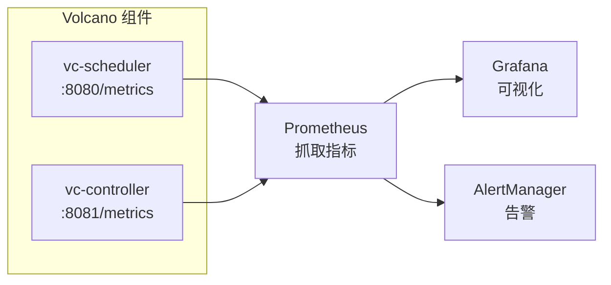
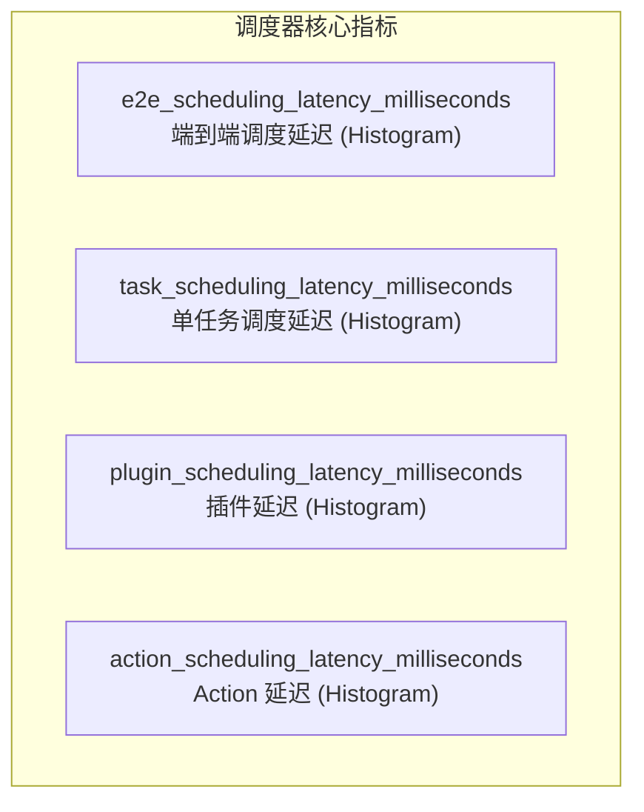
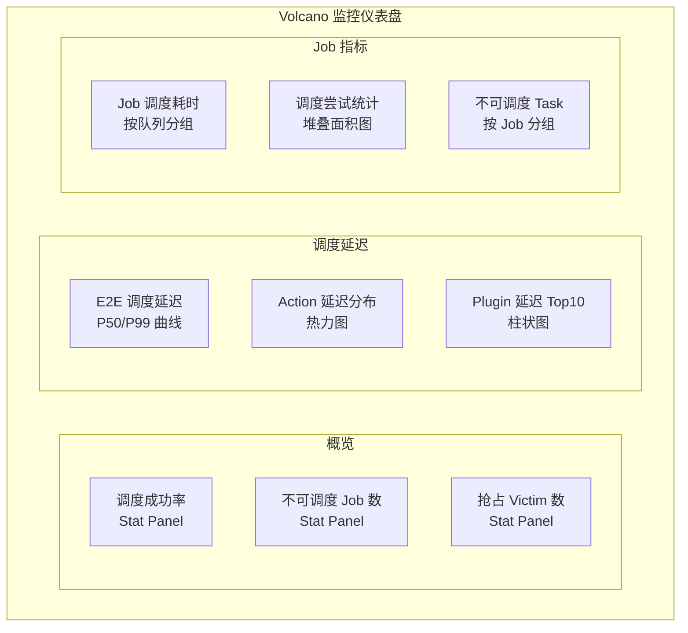

## 概述

Volcano 内置了丰富的 Prometheus 指标，覆盖调度器性能、作业生命周期、队列状态和抢占统计等关键维度。本文介绍如何启用监控、核心指标含义以及 Grafana 仪表盘配置。

---

## 监控架构



---

## 启用 Metrics

### Helm 配置

```yaml
custom:
  metrics_enable: true                  # 全局 Metrics 开关
  scheduler_metrics_enable: true        # 调度器 Metrics
  controller_metrics_enable: true       # 控制器 Metrics
```

### 安装时启用

```bash
helm install volcano volcano-sh/volcano \
  --namespace volcano-system \
  --create-namespace \
  --set custom.metrics_enable=true \
  --set custom.scheduler_metrics_enable=true \
  --set custom.controller_metrics_enable=true
```

### 验证 Metrics 端点

```bash
# 调度器 Metrics
kubectl port-forward -n volcano-system svc/volcano-scheduler 8080:8080
curl http://localhost:8080/metrics

# 控制器 Metrics
kubectl port-forward -n volcano-system svc/volcano-controllers 8081:8081
curl http://localhost:8081/metrics
```

---

## 核心指标详解

### 调度性能指标

所有调度器指标的 subsystem 为 `volcano`。



| 指标名称 | 类型 | 标签 | 说明 |
|---------|------|------|------|
| `volcano_e2e_scheduling_latency_milliseconds` | Histogram | - | 端到端调度延迟（调度算法 + 绑定） |
| `volcano_task_scheduling_latency_milliseconds` | Histogram | - | 单个 Task 的调度延迟 |
| `volcano_plugin_scheduling_latency_milliseconds` | Histogram | `plugin`, `OnSession` | 每个插件的处理耗时 |
| `volcano_action_scheduling_latency_milliseconds` | Histogram | `action` | 每个 Action 的执行耗时 |

**Histogram Buckets**：指数增长，5ms 起步，2 倍因子，15 个桶（5ms ~ 163.8s）。

### 作业调度指标

| 指标名称 | 类型 | 标签 | 说明 |
|---------|------|------|------|
| `volcano_e2e_job_scheduling_latency_milliseconds` | Histogram | - | Job 级别的端到端调度延迟 |
| `volcano_e2e_job_scheduling_duration` | Gauge | `job_name`, `queue`, `job_namespace` | 特定 Job 的调度耗时 |
| `volcano_e2e_job_scheduling_start_time` | Gauge | `job_name`, `queue`, `job_namespace` | Job 调度开始时间（Unix） |
| `volcano_e2e_job_scheduling_last_time` | Gauge | `job_name`, `queue`, `job_namespace` | Job 最后调度时间（Unix） |

### 调度结果指标

| 指标名称 | 类型 | 标签 | 说明 |
|---------|------|------|------|
| `volcano_schedule_attempts_total` | Counter | `result` | 调度尝试总数（Success/Error/Unschedulable） |
| `volcano_unschedule_task_count` | Gauge | `job_id` | 不可调度的 Task 数量 |
| `volcano_unschedule_job_count` | Gauge | - | 不可调度的 Job 数量 |

### 抢占指标

| 指标名称 | 类型 | 标签 | 说明 |
|---------|------|------|------|
| `volcano_pod_preemption_victims` | Gauge | - | 当前被选中的抢占 Victim 数量 |
| `volcano_total_preemption_attempts` | Counter | - | 抢占尝试总次数 |

---

## Prometheus 配置

### ServiceMonitor（推荐）

如果集群使用 Prometheus Operator：

```yaml
apiVersion: monitoring.coreos.com/v1
kind: ServiceMonitor
metadata:
  name: volcano-scheduler
  namespace: volcano-system
  labels:
    app: volcano
spec:
  selector:
    matchLabels:
      app: volcano-scheduler
  endpoints:
    - port: metrics
      interval: 15s
      path: /metrics
---
apiVersion: monitoring.coreos.com/v1
kind: ServiceMonitor
metadata:
  name: volcano-controller
  namespace: volcano-system
  labels:
    app: volcano
spec:
  selector:
    matchLabels:
      app: volcano-controller-manager
  endpoints:
    - port: metrics
      interval: 15s
      path: /metrics
```

### 直接配置 Prometheus

```yaml
# prometheus.yml
scrape_configs:
  - job_name: 'volcano-scheduler'
    kubernetes_sd_configs:
      - role: pod
    relabel_configs:
      - source_labels: [__meta_kubernetes_namespace]
        regex: volcano-system
        action: keep
      - source_labels: [__meta_kubernetes_pod_label_app]
        regex: volcano-scheduler
        action: keep
    scrape_interval: 15s

  - job_name: 'volcano-controller'
    kubernetes_sd_configs:
      - role: pod
    relabel_configs:
      - source_labels: [__meta_kubernetes_namespace]
        regex: volcano-system
        action: keep
      - source_labels: [__meta_kubernetes_pod_label_app]
        regex: volcano-controller-manager
        action: keep
    scrape_interval: 15s
```

---

## 关键 PromQL 查询

### 调度延迟分析

```promql
# P99 端到端调度延迟
histogram_quantile(0.99,
  sum(rate(volcano_e2e_scheduling_latency_milliseconds_bucket[5m])) by (le)
)

# P50 调度延迟
histogram_quantile(0.50,
  sum(rate(volcano_e2e_scheduling_latency_milliseconds_bucket[5m])) by (le)
)

# 平均调度延迟
sum(rate(volcano_e2e_scheduling_latency_milliseconds_sum[5m]))
/
sum(rate(volcano_e2e_scheduling_latency_milliseconds_count[5m]))
```

### Action 性能分析

```promql
# 每个 Action 的 P99 延迟
histogram_quantile(0.99,
  sum(rate(volcano_action_scheduling_latency_milliseconds_bucket[5m])) by (le, action)
)

# Action 执行频率（每秒次数）
sum(rate(volcano_action_scheduling_latency_milliseconds_count[5m])) by (action)
```

### Plugin 性能分析

```promql
# 各 Plugin 的 P99 延迟
histogram_quantile(0.99,
  sum(rate(volcano_plugin_scheduling_latency_milliseconds_bucket[5m])) by (le, plugin)
)

# OnSessionOpen 阶段各 Plugin 耗时
histogram_quantile(0.99,
  sum(rate(volcano_plugin_scheduling_latency_milliseconds_bucket{OnSession="OnSessionOpen"}[5m])) by (le, plugin)
)
```

### 调度成功率

```promql
# 调度成功率
sum(rate(volcano_schedule_attempts_total{result="Success"}[5m]))
/
sum(rate(volcano_schedule_attempts_total[5m]))

# 调度失败率
sum(rate(volcano_schedule_attempts_total{result="Error"}[5m]))
/
sum(rate(volcano_schedule_attempts_total[5m]))
```

### 不可调度任务

```promql
# 不可调度 Job 数量
volcano_unschedule_job_count

# 不可调度 Task 数量（按 Job）
sum(volcano_unschedule_task_count) by (job_id)
```

### 抢占监控

```promql
# 抢占 Victim 数量
volcano_pod_preemption_victims

# 抢占尝试速率
rate(volcano_total_preemption_attempts[5m])
```

---

## Grafana 仪表盘

### 仪表盘面板建议



### 示例面板 JSON

#### 调度延迟面板

```json
{
  "title": "E2E Scheduling Latency (P99)",
  "type": "timeseries",
  "targets": [
    {
      "expr": "histogram_quantile(0.99, sum(rate(volcano_e2e_scheduling_latency_milliseconds_bucket[5m])) by (le))",
      "legendFormat": "P99"
    },
    {
      "expr": "histogram_quantile(0.50, sum(rate(volcano_e2e_scheduling_latency_milliseconds_bucket[5m])) by (le))",
      "legendFormat": "P50"
    }
  ],
  "fieldConfig": {
    "defaults": {
      "unit": "ms"
    }
  }
}
```

#### 调度成功率面板

```json
{
  "title": "Scheduling Success Rate",
  "type": "stat",
  "targets": [
    {
      "expr": "sum(rate(volcano_schedule_attempts_total{result='Success'}[5m])) / sum(rate(volcano_schedule_attempts_total[5m])) * 100",
      "legendFormat": "Success Rate"
    }
  ],
  "fieldConfig": {
    "defaults": {
      "unit": "percent",
      "thresholds": {
        "steps": [
          {"color": "red", "value": 80},
          {"color": "yellow", "value": 95},
          {"color": "green", "value": 99}
        ]
      }
    }
  }
}
```

---

## 告警规则

### PrometheusRule 示例

```yaml
apiVersion: monitoring.coreos.com/v1
kind: PrometheusRule
metadata:
  name: volcano-alerts
  namespace: volcano-system
spec:
  groups:
    - name: volcano.scheduler
      rules:
        # 调度延迟过高
        - alert: VolcanoSchedulingLatencyHigh
          expr: |
            histogram_quantile(0.99,
              sum(rate(volcano_e2e_scheduling_latency_milliseconds_bucket[5m])) by (le)
            ) > 5000
          for: 5m
          labels:
            severity: warning
          annotations:
            summary: "Volcano P99 调度延迟超过 5 秒"
            description: "当前 P99 延迟: {{ $value }}ms"

        # 大量不可调度 Job
        - alert: VolcanoUnschedulableJobsHigh
          expr: volcano_unschedule_job_count > 50
          for: 10m
          labels:
            severity: warning
          annotations:
            summary: "不可调度 Job 数量过多"
            description: "当前不可调度 Job: {{ $value }}"

        # 调度成功率过低
        - alert: VolcanoSchedulingSuccessRateLow
          expr: |
            sum(rate(volcano_schedule_attempts_total{result="Success"}[5m]))
            /
            sum(rate(volcano_schedule_attempts_total[5m]))
            < 0.9
          for: 5m
          labels:
            severity: critical
          annotations:
            summary: "Volcano 调度成功率低于 90%"

        # 抢占频繁
        - alert: VolcanoPreemptionFrequent
          expr: rate(volcano_total_preemption_attempts[5m]) > 10
          for: 5m
          labels:
            severity: warning
          annotations:
            summary: "Volcano 抢占频率过高"
            description: "每秒抢占尝试: {{ $value }}"

    - name: volcano.component
      rules:
        # 调度器 Pod 重启
        - alert: VolcanoSchedulerRestart
          expr: |
            changes(kube_pod_container_status_restarts_total{
              namespace="volcano-system",
              container="volcano-scheduler"
            }[1h]) > 2
          labels:
            severity: critical
          annotations:
            summary: "Volcano Scheduler 频繁重启"
```

---

## 日志监控

除了 Metrics，调度器日志也是重要的监控维度：

### 日志级别调整

```bash
# 通过启动参数设置 klog 日志级别
# -v=3: 基础调度信息
# -v=4: 详细调度过程
# -v=5: Debug 级别
```

### 关键日志模式

| 日志模式 | 含义 | 监控建议 |
|---------|------|---------|
| `"Open session"` | 调度周期开始 | 统计频率 |
| `"Close session"` | 调度周期结束 | 统计频率 |
| `"bindTask"` | Task 绑定成功 | 统计成功数 |
| `"bindErr"` | 绑定失败 | 告警 |
| `"Bindable job is not ready"` | Gang 检查失败 | 分析原因 |
| `"Discard operations"` | 调度回滚 | 统计频率 |
| `"victims"` | 抢占 Victim 选择 | 监控抢占行为 |

---

## 性能基准

### 典型指标范围

| 指标 | 小集群 (<100 节点) | 中集群 (100-1000) | 大集群 (>1000) |
|------|-------------------|-------------------|----------------|
| E2E P99 延迟 | < 100ms | < 500ms | < 2000ms |
| Action 耗时 | < 50ms | < 200ms | < 1000ms |
| 每秒调度 Pod | > 100 | > 50 | > 20 |
| 调度成功率 | > 99% | > 95% | > 90% |

---

## 常见问题

| 问题 | 原因 | 解决方案 |
|------|------|---------|
| Metrics 端点无数据 | metrics_enable 未开启 | 设置 `custom.metrics_enable: true` |
| Prometheus 无法抓取 | Service 未暴露 | 检查 Service 和 Port 配置 |
| 延迟指标为 0 | 无调度活动 | 提交测试 Job 验证 |
| Plugin 指标缺失 | 插件未启用 | 检查调度器配置 |

---

## 参考文件

| 文件 | 说明 |
|------|------|
| `pkg/scheduler/metrics/metrics.go` | 调度器 Metrics 定义 |
| `pkg/scheduler/metrics/source/` | Metrics 源适配器 |
| `installer/helm/chart/volcano/values.yaml` | Metrics 开关配置 |
