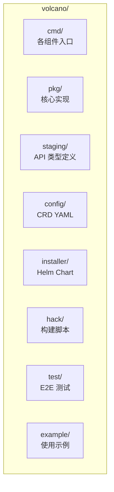
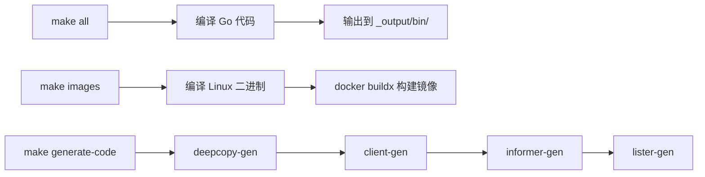
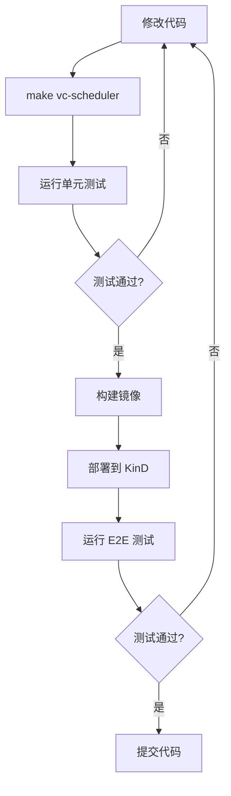
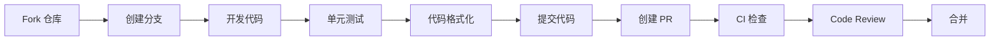

## 概述

本文档指导开发者搭建 Volcano 本地开发环境，包括 Go 环境配置、代码结构理解、构建系统使用以及基于 KinD 的本地测试集群搭建。

---

## 环境要求

| 工具 | 版本要求 | 说明 |
|------|---------|------|
| Go | 1.24+ | 主开发语言 |
| Docker | 20.10+ | 镜像构建和 KinD 运行 |
| kubectl | 1.24+ | Kubernetes 客户端 |
| KinD | 0.20+ | 本地 Kubernetes 集群 |
| Helm | 3.0+ | 部署 Volcano |
| Make | GNU Make | 构建系统 |
| Git | 2.0+ | 版本控制 |

---

## 获取代码

```bash
# 克隆仓库
git clone https://github.com/volcano-sh/volcano.git
cd volcano

# 查看代码结构
ls -la
```

---

## 项目目录结构



### 核心目录详解

```
volcano/
├── cmd/                              # 二进制入口
│   ├── scheduler/                    # 调度器主程序
│   ├── controller-manager/           # 控制器主程序
│   ├── webhook-manager/              # Webhook 主程序
│   ├── agent/                        # 节点 Agent
│   └── cli/                          # CLI 工具
├── pkg/                              # 核心代码
│   ├── scheduler/                    # 调度器
│   │   ├── framework/                # 框架接口、Session、Plugin/Action 管理
│   │   ├── plugins/                  # ~25 个调度插件
│   │   ├── actions/                  # 6 个调度动作
│   │   ├── cache/                    # 集群状态缓存
│   │   ├── api/                      # 内部 API 类型
│   │   ├── conf/                     # 配置结构
│   │   └── metrics/                  # Prometheus 指标
│   ├── controllers/                  # 控制器
│   │   ├── framework/                # 控制器框架接口
│   │   ├── job/                      # Job Controller
│   │   ├── queue/                    # Queue Controller
│   │   ├── podgroup/                 # PodGroup Controller
│   │   ├── jobflow/                  # JobFlow Controller
│   │   ├── hypernode/                # HyperNode Controller
│   │   └── garbagecollector/         # GC Controller
│   └── webhooks/                     # Admission Webhook
│       └── router/                   # Webhook 路由注册
├── staging/src/volcano.sh/apis/      # CRD API 定义
│   └── pkg/apis/
│       ├── batch/v1alpha1/           # Job, CronJob
│       ├── scheduling/v1beta1/       # Queue, PodGroup
│       ├── topology/v1alpha1/        # HyperNode
│       └── flow/v1alpha1/            # JobFlow, JobTemplate
├── config/crd/                       # CRD YAML
├── installer/helm/chart/volcano/     # Helm Chart
├── hack/                             # 构建/验证脚本
├── test/e2e/                         # E2E 测试
├── Makefile                          # 主 Makefile
└── Makefile.def                      # 构建变量定义
```

---

## 构建系统

### 常用构建命令

```bash
# 构建所有二进制到 _output/bin/
make all

# 构建单个组件
make vc-scheduler
make vc-controller-manager
make vc-webhook-manager
make vcctl                             # CLI 工具

# 构建支持动态插件的调度器（需要 CGO）
SUPPORT_PLUGINS=yes make vc-scheduler

# 构建 Docker 镜像
make images

# 清理构建产物
make clean
```

### 构建流程



### 代码生成

修改 API 类型后需要重新生成代码：

```bash
# 重新生成 deepcopy、client、informer、lister
make generate-code

# 重新生成 CRD YAML
make manifests

# 重新生成部署 YAML
make generate-yaml

# 验证生成的代码是否最新
make verify
```

### 代码格式化

```bash
# 自动格式化
hack/update-gofmt.sh

# 检查格式
hack/verify-gofmt.sh

# Lint 检查
make lint
```

---

## 本地开发流程

### 快速迭代流程



### 单元测试

```bash
# 运行所有单元测试
make unit-test

# 运行特定包的测试
go test ./pkg/scheduler/plugins/gang/...
go test ./pkg/scheduler/actions/allocate/...

# 运行特定测试函数
go test -run TestSpecificFunc ./pkg/scheduler/plugins/gang/...

# 带覆盖率
go test -cover ./pkg/scheduler/plugins/gang/...

# 带 Race 检测（Linux）
go test -race ./pkg/scheduler/plugins/gang/...
```

### 本地 KinD 集群

```bash
# 创建 KinD 集群（E2E 测试自动完成）
make e2e

# 手动创建 KinD 集群
kind create cluster --name volcano-test

# 构建镜像并加载到 KinD
make images
kind load docker-image volcanosh/vc-scheduler:latest --name volcano-test
kind load docker-image volcanosh/vc-controller-manager:latest --name volcano-test
kind load docker-image volcanosh/vc-webhook-manager:latest --name volcano-test

# 通过 Helm 部署
helm install volcano installer/helm/chart/volcano \
  --namespace volcano-system \
  --create-namespace \
  --set basic.image_pull_policy=IfNotPresent \
  --set basic.image_tag_version=latest
```

### E2E 测试

```bash
# 运行全部 E2E 测试
make e2e

# 运行特定 E2E 子集
make e2e-test-schedulingbase     # 基础调度
make e2e-test-schedulingaction   # 调度 Action
make e2e-test-jobp               # Job 模式
make e2e-test-vcctl              # CLI 工具
make e2e-test-hypernode          # HyperNode
make e2e-test-admission-webhook  # Webhook
```

---

## IDE 配置

### GoLand / VS Code

```json
// .vscode/settings.json
{
  "go.buildTags": "",
  "go.testFlags": ["-v"],
  "go.lintTool": "golangci-lint",
  "go.toolsManagement.autoUpdate": true
}
```

### Go Module Replace

Volcano 使用 `replace` 指令引用 staging 目录中的 API：

```go
// go.mod
replace volcano.sh/apis => ./staging/src/volcano.sh/apis
```

这意味着 `staging/src/volcano.sh/apis/` 下的代码修改不需要额外发布，直接引用本地路径。

---

## 调试技巧

### 本地运行调度器

```bash
# 构建调度器
make vc-scheduler

# 本地运行（连接已有集群）
./_output/bin/vc-scheduler \
  --kubeconfig=$HOME/.kube/config \
  --scheduler-conf=installer/helm/chart/volcano/config/volcano-scheduler.conf \
  --logtostderr \
  -v=4
```

### 本地运行控制器

```bash
make vc-controller-manager

./_output/bin/vc-controller-manager \
  --kubeconfig=$HOME/.kube/config \
  --logtostderr \
  -v=4
```

### 日志级别

| 级别 | 说明 |
|------|------|
| `-v=0` | 仅错误和警告 |
| `-v=2` | 基础信息 |
| `-v=3` | 调度摘要信息 |
| `-v=4` | 详细调度过程 |
| `-v=5` | Debug 级别 |

---

## 贡献流程



### 提交规范

```
<subsystem>: <what changed>

<body explaining why>
```

- Subject 不超过 70 字符
- subsystem 例如：`scheduler`, `controller`, `webhook`, `api`, `docs`
- body 解释为什么做这个变更

---

## 参考文件

| 文件 | 说明 |
|------|------|
| `Makefile` | 主构建文件 |
| `Makefile.def` | 构建变量定义 |
| `hack/update-gencode.sh` | 代码生成脚本 |
| `hack/run-e2e-kind.sh` | KinD E2E 测试脚本 |
| `go.mod` | Go 模块定义 |
