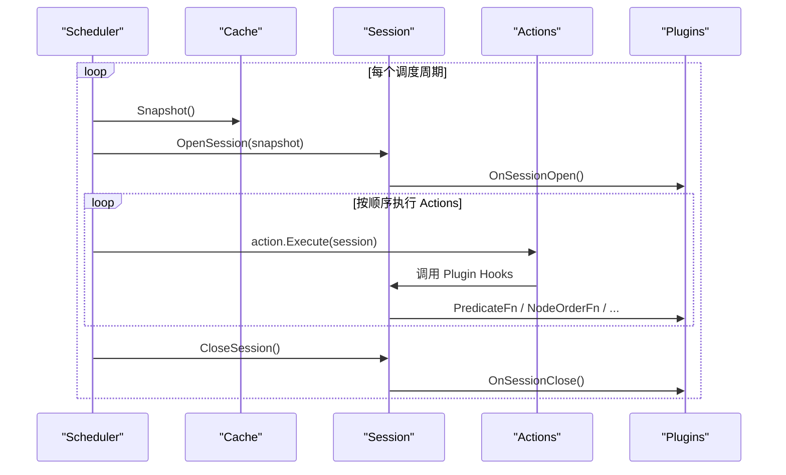
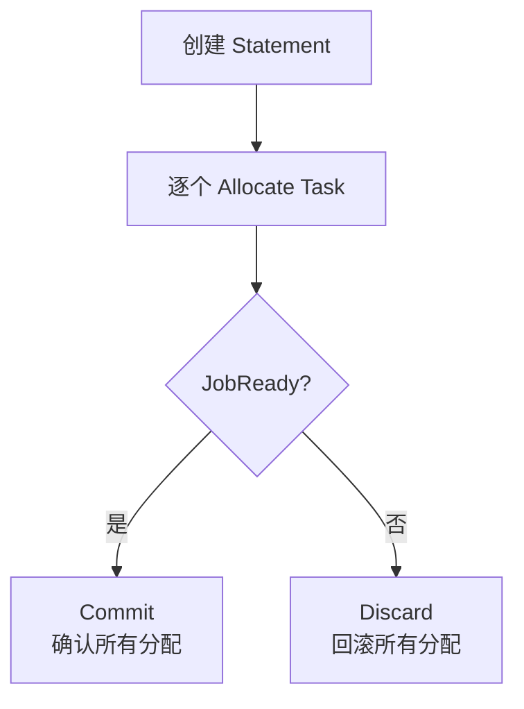

## 概述

Action 是 Volcano 调度流水线的执行单元。每个调度周期中，Actions 按配置顺序依次执行，完成入队、分配、抢占、回收等调度决策。本文介绍如何开发自定义 Action，包括接口实现、注册流程和完整示例。

---

## Action 接口

Action 接口定义在 `pkg/scheduler/framework/interface.go`：

```go
type Action interface {
    // Name 返回 Action 唯一名称
    Name() string

    // Initialize 初始化（调度器启动时调用一次）
    Initialize()

    // Execute 执行调度逻辑（每个调度周期调用）
    Execute(ssn *Session)

    // UnInitialize 清理资源
    UnInitialize()
}
```

### Action 在调度周期中的位置



---

## 内置 Actions

| Action | 功能 | 源码路径 |
|--------|------|---------|
| `enqueue` | 检查 Job 入队条件 | `pkg/scheduler/actions/enqueue/` |
| `allocate` | 核心资源分配 | `pkg/scheduler/actions/allocate/` |
| `preempt` | 同队列优先级抢占 | `pkg/scheduler/actions/preempt/` |
| `reclaim` | 跨队列资源回收 | `pkg/scheduler/actions/reclaim/` |
| `backfill` | 空闲资源回填 | `pkg/scheduler/actions/backfill/` |
| `shuffle` | 低优先级 Pod 重排 | `pkg/scheduler/actions/shuffle/` |

---

## 开发自定义 Action

### 步骤一：创建 Action 代码

在 `pkg/scheduler/actions/` 下创建新目录：

```
pkg/scheduler/actions/
├── myaction/
│   ├── myaction.go          # Action 实现
│   └── myaction_test.go     # 单元测试
```

### 步骤二：实现 Action 接口

```go
// pkg/scheduler/actions/myaction/myaction.go
package myaction

import (
    "volcano.sh/volcano/pkg/scheduler/api"
    "volcano.sh/volcano/pkg/scheduler/framework"
)

const ActionName = "myaction"

type myAction struct{}

// New 创建 Action 实例
func New() *myAction {
    return &myAction{}
}

func (ma *myAction) Name() string {
    return ActionName
}

func (ma *myAction) Initialize() {
    // 初始化逻辑（可选）
}

func (ma *myAction) Execute(ssn *framework.Session) {
    // 核心调度逻辑
    klog.V(3).Infof("Enter %s action.", ActionName)
    defer klog.V(3).Infof("Leaving %s action.", ActionName)

    // 1. 遍历队列（按 QueueOrderFn 排序）
    queues := util.NewPriorityQueue(ssn.QueueOrderFn)
    for _, queue := range ssn.Queues {
        queues.Push(queue)
    }

    for !queues.Empty() {
        queue := queues.Pop().(*api.QueueInfo)

        // 2. 获取该队列的 Jobs（按 JobOrderFn 排序）
        for _, job := range ssn.Jobs {
            if job.Queue != queue.UID {
                continue
            }

            // 3. 处理 Job 的 pending tasks
            for _, task := range job.TaskStatusIndex[api.Pending] {
                // 4. 过滤和评分节点
                nodes := ssn.PredicateNodes(task)
                if len(nodes) == 0 {
                    continue
                }

                bestNode := ssn.BestNodeFn(task, nodes)
                if bestNode == nil {
                    continue
                }

                // 5. 执行分配
                if err := ssn.Allocate(task, bestNode); err != nil {
                    klog.Errorf("Failed to allocate task %s: %v",
                        task.Name, err)
                }
            }
        }
    }
}

func (ma *myAction) UnInitialize() {
    // 清理逻辑（可选）
}
```

### 步骤三：注册 Action

在 `pkg/scheduler/actions/factory.go` 中注册：

```go
// pkg/scheduler/actions/factory.go
package actions

import (
    // 已有 import
    "volcano.sh/volcano/pkg/scheduler/actions/myaction"
    "volcano.sh/volcano/pkg/scheduler/framework"
)

func init() {
    // 已有注册
    framework.RegisterAction(enqueue.New())
    framework.RegisterAction(allocate.New())
    framework.RegisterAction(preempt.New())
    framework.RegisterAction(reclaim.New())
    framework.RegisterAction(backfill.New())
    framework.RegisterAction(shuffle.New())

    // 注册自定义 Action
    framework.RegisterAction(myaction.New())
}
```

### 步骤四：配置使用

在调度器配置中添加自定义 Action：

```yaml
actions: "enqueue, allocate, myaction, backfill"
```

---

## Session API 参考

Action 通过 `Session` 对象与调度框架交互：

### 资源查询

```go
// 获取所有 Job
ssn.Jobs map[api.JobID]*api.JobInfo

// 获取所有节点
ssn.Nodes map[string]*api.NodeInfo

// 获取所有队列
ssn.Queues map[api.QueueID]*api.QueueInfo

// 集群总资源
ssn.TotalResource *api.Resource
```

### 排序函数

```go
// 队列排序
ssn.QueueOrderFn(l, r interface{}) bool

// Job 排序
ssn.JobOrderFn(l, r interface{}) bool

// Task 排序
ssn.TaskOrderFn(l, r interface{}) bool
```

### 过滤和评分

```go
// 节点 Predicate 过滤
ssn.PredicateFn(task *api.TaskInfo, node *api.NodeInfo) error

// 节点评分
ssn.NodeOrderFn(task *api.TaskInfo, node *api.NodeInfo) (float64, error)

// 最佳节点选择
ssn.BestNodeFn(task *api.TaskInfo, nodes []*api.NodeInfo) *api.NodeInfo
```

### 调度操作

```go
// 分配 Task 到 Node
ssn.Allocate(task *api.TaskInfo, node *api.NodeInfo) error

// Pipeline（预占用）
ssn.Pipeline(task *api.TaskInfo, hostname string) error

// 驱逐 Task
ssn.Evict(task *api.TaskInfo, reason string) error
```

### Job 状态检查

```go
// 检查 Job 是否满足 Gang 要求
ssn.JobReady(job *api.JobInfo) bool

// 检查 Job 是否可 Pipeline
ssn.JobPipelined(job *api.JobInfo) bool

// 检查 Job 是否合法
ssn.JobValid(job *api.JobInfo) bool
```

---

## Statement 模式

分配操作通过 Statement 事务模式管理，支持提交或回滚：

```go
func (ma *myAction) Execute(ssn *framework.Session) {
    for _, job := range ssn.Jobs {
        // 创建 Statement
        stmt := ssn.Statement()

        for _, task := range job.PendingTasks() {
            node := selectBestNode(ssn, task)
            if node != nil {
                // 记录分配（未真正执行）
                if err := stmt.Allocate(task, node); err != nil {
                    break
                }
            }
        }

        // 检查 Job 是否满足 Gang 要求
        if ssn.JobReady(job) {
            // 提交所有分配
            stmt.Commit()
        } else {
            // 回滚所有分配
            stmt.Discard()
        }
    }
}
```



---

## 完整示例：优先级回填 Action

```go
package prioritybackfill

import (
    "k8s.io/klog/v2"
    "volcano.sh/volcano/pkg/scheduler/api"
    "volcano.sh/volcano/pkg/scheduler/framework"
    "volcano.sh/volcano/pkg/scheduler/util"
)

const ActionName = "priority-backfill"

type priorityBackfillAction struct{}

func New() *priorityBackfillAction {
    return &priorityBackfillAction{}
}

func (pba *priorityBackfillAction) Name() string {
    return ActionName
}

func (pba *priorityBackfillAction) Initialize() {}

func (pba *priorityBackfillAction) Execute(ssn *framework.Session) {
    klog.V(3).Infof("Enter %s action.", ActionName)
    defer klog.V(3).Infof("Leaving %s action.", ActionName)

    // 按优先级排序所有 Job
    jobs := util.NewPriorityQueue(ssn.JobOrderFn)
    for _, job := range ssn.Jobs {
        if job.IsPending() {
            jobs.Push(job)
        }
    }

    for !jobs.Empty() {
        job := jobs.Pop().(*api.JobInfo)
        stmt := ssn.Statement()

        // 尝试为每个 pending task 找节点
        allocated := 0
        for _, task := range job.TaskStatusIndex[api.Pending] {
            // 只回填单个 Task（不要求 Gang）
            for _, node := range ssn.Nodes {
                if err := ssn.PredicateFn(task, node); err != nil {
                    continue
                }

                if err := stmt.Allocate(task, node); err == nil {
                    allocated++
                    break
                }
            }
        }

        if allocated > 0 {
            stmt.Commit()
            klog.V(3).Infof("Priority backfill: allocated %d tasks for job %s",
                allocated, job.Name)
        } else {
            stmt.Discard()
        }
    }
}

func (pba *priorityBackfillAction) UnInitialize() {}
```

---

## 单元测试

```go
// pkg/scheduler/actions/myaction/myaction_test.go
package myaction

import (
    "testing"

    "volcano.sh/volcano/pkg/scheduler/api"
    "volcano.sh/volcano/pkg/scheduler/cache"
    "volcano.sh/volcano/pkg/scheduler/conf"
    "volcano.sh/volcano/pkg/scheduler/framework"
    "volcano.sh/volcano/pkg/scheduler/uthelper"
)

func TestMyAction(t *testing.T) {
    // 使用 uthelper 构建测试场景
    tests := []uthelper.TestCommonStruct{
        {
            Name: "basic allocation",
            Plugins: map[string]framework.PluginBuilder{
                "gang":       gang.New,
                "predicates": predicates.New,
            },
            // 定义测试 Job、Node、Queue 等
        },
    }

    for _, test := range tests {
        t.Run(test.Name, func(t *testing.T) {
            // 构建调度 Session 并执行 Action
            // 验证调度结果
        })
    }
}
```

---

## 最佳实践

1. **遵循 Statement 模式**：所有分配操作都通过 Statement，确保 Gang 一致性
2. **使用 Session Hook**：通过 `ssn.PredicateFn`、`ssn.NodeOrderFn` 调用插件逻辑，不要绕过
3. **日志规范**：使用 `klog.V(3)` 记录关键决策，`klog.V(5)` 记录详细过程
4. **性能考虑**：避免在 Action 中执行重量级计算，保持调度周期短
5. **错误处理**：分配失败不应导致整个调度周期崩溃

---

## 参考文件

| 文件 | 说明 |
|------|------|
| `pkg/scheduler/framework/interface.go` | Action 接口定义 |
| `pkg/scheduler/actions/factory.go` | Action 注册工厂 |
| `pkg/scheduler/actions/allocate/allocate.go` | Allocate 实现参考 |
| `pkg/scheduler/actions/backfill/backfill.go` | Backfill 实现参考 |
| `pkg/scheduler/framework/session.go` | Session API |
