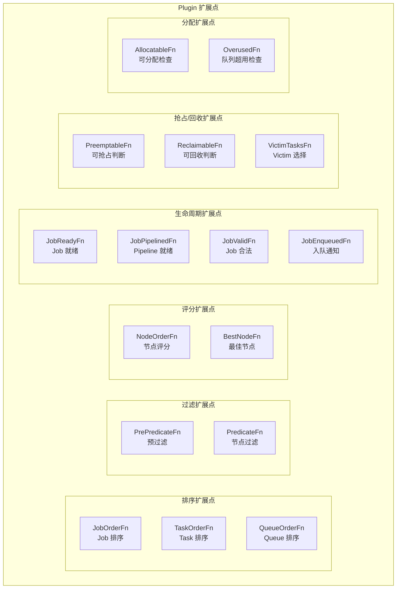

## 概述

Plugin 是 Volcano 调度器的扩展机制核心。每个 Plugin 通过注册回调函数到 Session 的扩展点（Extension Points），参与调度决策的各个阶段。本文介绍如何开发自定义 Plugin，包括接口实现、扩展点注册和完整示例。

---

## Plugin 接口

Plugin 接口定义在 `pkg/scheduler/framework/interface.go`：

```go
type Plugin interface {
    // Name 返回 Plugin 唯一名称
    Name() string

    // OnSessionOpen 在调度会话开始时调用，注册回调函数
    OnSessionOpen(ssn *Session)

    // OnSessionClose 在调度会话结束时调用，执行清理
    OnSessionClose(ssn *Session)
}
```

### Plugin Builder

Plugin 通过 Builder 函数创建：

```go
// PluginBuilder 签名
type PluginBuilder func(Arguments) Plugin

// Arguments 是插件参数 map
type Arguments map[string]string
```

---

## 扩展点体系



### 扩展点详细说明

| 扩展点 | 方法签名 | 调用时机 | 典型实现 |
|--------|---------|---------|---------|
| `JobOrderFn` | `(l, r *JobInfo) int` | Action 迭代 Job 时排序 | priority, drf |
| `TaskOrderFn` | `(l, r *TaskInfo) int` | Action 迭代 Task 时排序 | priority |
| `QueueOrderFn` | `(l, r *QueueInfo) int` | Action 迭代 Queue 时排序 | proportion |
| `PrePredicateFn` | `(task *TaskInfo) error` | 节点过滤前的任务级检查 | predicates |
| `PredicateFn` | `(task *TaskInfo, node *NodeInfo) error` | 检查节点是否适合任务 | predicates, numaaware |
| `NodeOrderFn` | `(task *TaskInfo, node *NodeInfo) (float64, error)` | 对候选节点评分 | nodeorder, binpack |
| `BestNodeFn` | `(task *TaskInfo, scores map[string]float64) *NodeInfo` | 从评分中选最佳节点 | nodeorder |
| `JobReadyFn` | `(job *JobInfo) bool` | 检查 Job 是否满足调度条件 | gang |
| `JobPipelinedFn` | `(job *JobInfo) bool` | 检查 Job 是否可 Pipeline | gang |
| `PreemptableFn` | `(preemptor, preemptees *TaskInfo) []*TaskInfo` | 选择可被抢占的 Tasks | gang, conformance |
| `ReclaimableFn` | `(reclaimer *TaskInfo, reclaimees []*TaskInfo) []*TaskInfo` | 选择可被回收的 Tasks | proportion |
| `AllocatableFn` | `(queue *QueueInfo, candidate *TaskInfo) bool` | 队列是否允许分配 | proportion, capacity |
| `OverusedFn` | `(queue *QueueInfo) bool` | 队列是否超用 | proportion, capacity |
| `JobEnqueuedFn` | `(job *JobInfo)` | Job 入队后通知 | proportion |

---

## 开发自定义 Plugin

### 步骤一：创建 Plugin 代码

在 `pkg/scheduler/plugins/` 下创建新目录：

```
pkg/scheduler/plugins/
├── myplugin/
│   ├── myplugin.go          # Plugin 实现
│   └── myplugin_test.go     # 单元测试
```

### 步骤二：实现 Plugin 接口

```go
// pkg/scheduler/plugins/myplugin/myplugin.go
package myplugin

import (
    "k8s.io/klog/v2"
    "volcano.sh/volcano/pkg/scheduler/api"
    "volcano.sh/volcano/pkg/scheduler/framework"
)

const PluginName = "myplugin"

type myPlugin struct {
    pluginArguments framework.Arguments
    // 自定义字段
    weight int
}

// New 创建 Plugin 实例（PluginBuilder 签名）
func New(arguments framework.Arguments) framework.Plugin {
    mp := &myPlugin{
        pluginArguments: arguments,
        weight:          1,
    }

    // 解析参数
    if w, ok := arguments["weight"]; ok {
        mp.weight = parseInt(w)
    }

    return mp
}

func (mp *myPlugin) Name() string {
    return PluginName
}

func (mp *myPlugin) OnSessionOpen(ssn *framework.Session) {
    klog.V(4).Infof("Plugin %s: OnSessionOpen", PluginName)

    // 注册各扩展点的回调函数
    mp.registerJobOrder(ssn)
    mp.registerPredicate(ssn)
    mp.registerNodeOrder(ssn)
}

func (mp *myPlugin) OnSessionClose(ssn *framework.Session) {
    klog.V(4).Infof("Plugin %s: OnSessionClose", PluginName)
    // 清理资源
}
```

### 步骤三：注册扩展点

```go
func (mp *myPlugin) registerJobOrder(ssn *framework.Session) {
    ssn.AddJobOrderFn(PluginName, func(l, r interface{}) int {
        lJob := l.(*api.JobInfo)
        rJob := r.(*api.JobInfo)

        // 自定义排序逻辑
        // 返回 -1: l 优先，1: r 优先，0: 相等
        if lJob.Priority > rJob.Priority {
            return -1
        }
        if lJob.Priority < rJob.Priority {
            return 1
        }
        return 0
    })
}

func (mp *myPlugin) registerPredicate(ssn *framework.Session) {
    ssn.AddPredicateFn(PluginName, func(task *api.TaskInfo, node *api.NodeInfo) error {
        // 自定义过滤逻辑
        // 返回 nil 表示节点通过过滤
        // 返回 error 表示节点被过滤掉

        // 示例：检查节点是否有特定标签
        if _, ok := node.Node.Labels["my-label"]; !ok {
            return fmt.Errorf("node %s missing required label", node.Name)
        }
        return nil
    })
}

func (mp *myPlugin) registerNodeOrder(ssn *framework.Session) {
    ssn.AddNodeOrderFn(PluginName, func(task *api.TaskInfo, node *api.NodeInfo) (float64, error) {
        // 自定义评分逻辑
        // 返回 0.0 ~ 100.0 的分数

        // 示例：基于资源利用率评分
        used := node.Used
        total := node.Allocatable
        cpuUsage := float64(used.MilliCPU) / float64(total.MilliCPU)

        score := cpuUsage * 100.0 * float64(mp.weight)
        return score, nil
    })
}
```

### 步骤四：注册 Plugin

在 `pkg/scheduler/plugins/factory.go` 中注册：

```go
// pkg/scheduler/plugins/factory.go
import (
    "volcano.sh/volcano/pkg/scheduler/plugins/myplugin"
)

func init() {
    // 已有注册...

    // 注册自定义 Plugin
    framework.RegisterPluginBuilder(myplugin.PluginName, myplugin.New)
}
```

### 步骤五：配置使用

```yaml
actions: "enqueue, allocate, backfill"
tiers:
- plugins:
  - name: priority
  - name: gang
  - name: conformance
- plugins:
  - name: predicates
  - name: proportion
  - name: myplugin                     # 自定义 Plugin
    arguments:
      weight: "5"                      # 传递参数
```

---

## 完整示例：资源亲和性 Plugin

实现一个根据自定义标签将 Job 调度到特定节点组的 Plugin：

```go
package resourceaffinity

import (
    "fmt"

    "k8s.io/klog/v2"
    "volcano.sh/volcano/pkg/scheduler/api"
    "volcano.sh/volcano/pkg/scheduler/framework"
)

const PluginName = "resource-affinity"

const (
    // 用户在 Job annotation 中指定节点组
    NodeGroupAnnotation = "volcano.sh/preferred-node-group"
    // 节点标签
    NodeGroupLabel = "volcano.sh/node-group"
)

type resourceAffinityPlugin struct {
    pluginArguments framework.Arguments
    preferWeight    float64
    requireMatch    bool
}

func New(arguments framework.Arguments) framework.Plugin {
    rap := &resourceAffinityPlugin{
        pluginArguments: arguments,
        preferWeight:    10.0,
        requireMatch:    false,
    }

    if w, ok := arguments["prefer-weight"]; ok {
        rap.preferWeight = parseFloat(w)
    }
    if r, ok := arguments["require-match"]; ok {
        rap.requireMatch = r == "true"
    }

    return rap
}

func (rap *resourceAffinityPlugin) Name() string {
    return PluginName
}

func (rap *resourceAffinityPlugin) OnSessionOpen(ssn *framework.Session) {
    klog.V(4).Infof("Opening session for %s plugin", PluginName)

    // 注册 Predicate（节点过滤）
    ssn.AddPredicateFn(PluginName, func(task *api.TaskInfo, node *api.NodeInfo) error {
        // 获取 Job 期望的节点组
        preferredGroup := getPreferredNodeGroup(task, ssn)
        if preferredGroup == "" {
            return nil // 无亲和性要求，通过
        }

        // 检查节点是否属于期望的组
        nodeGroup := node.Node.Labels[NodeGroupLabel]
        if rap.requireMatch && nodeGroup != preferredGroup {
            return fmt.Errorf("node %s group %s != preferred %s",
                node.Name, nodeGroup, preferredGroup)
        }

        return nil
    })

    // 注册 NodeOrder（节点评分）
    ssn.AddNodeOrderFn(PluginName, func(task *api.TaskInfo, node *api.NodeInfo) (float64, error) {
        preferredGroup := getPreferredNodeGroup(task, ssn)
        if preferredGroup == "" {
            return 0, nil
        }

        nodeGroup := node.Node.Labels[NodeGroupLabel]
        if nodeGroup == preferredGroup {
            // 匹配的节点给高分
            return rap.preferWeight * 10.0, nil
        }

        return 0, nil
    })
}

func (rap *resourceAffinityPlugin) OnSessionClose(ssn *framework.Session) {
    klog.V(4).Infof("Closing session for %s plugin", PluginName)
}

// getPreferredNodeGroup 从 Job annotation 获取期望的节点组
func getPreferredNodeGroup(task *api.TaskInfo, ssn *framework.Session) string {
    job, ok := ssn.Jobs[task.Job]
    if !ok {
        return ""
    }
    if job.Job == nil {
        return ""
    }
    return job.Job.Annotations[NodeGroupAnnotation]
}
```

配置使用：

```yaml
- name: resource-affinity
  enablePredicate: true
  enableNodeOrder: true
  arguments:
    prefer-weight: "10"
    require-match: "false"
```

Job 使用：

```yaml
apiVersion: batch.volcano.sh/v1alpha1
kind: Job
metadata:
  name: gpu-training
  annotations:
    volcano.sh/preferred-node-group: "gpu-a100"   # 期望的节点组
spec:
  schedulerName: volcano
  minAvailable: 2
  tasks:
    - replicas: 2
      name: worker
      template:
        spec:
          containers:
            - name: worker
              image: training:latest
```

---

## 动态加载 Plugin（.so）

Volcano 支持通过 CGO 动态加载外部 Plugin：

### 构建支持动态插件的调度器

```bash
SUPPORT_PLUGINS=yes make vc-scheduler
```

### 编写外部 Plugin

```go
// external_plugin.go
package main

import (
    "volcano.sh/volcano/pkg/scheduler/framework"
)

// New 必须导出，签名为 PluginBuilder
func New(arguments framework.Arguments) framework.Plugin {
    return &myExternalPlugin{args: arguments}
}

type myExternalPlugin struct {
    args framework.Arguments
}

func (p *myExternalPlugin) Name() string {
    return "external-plugin"
}

func (p *myExternalPlugin) OnSessionOpen(ssn *framework.Session) {
    // 注册扩展点
}

func (p *myExternalPlugin) OnSessionClose(ssn *framework.Session) {}
```

### 编译为 .so

```bash
go build -buildmode=plugin -o external-plugin.so external_plugin.go
```

### 配置加载

```yaml
# Helm values.yaml
custom:
  scheduler_plugins_dir: "/plugins"    # .so 文件目录
```

---

## Plugin 扩展点控制

在调度器配置中可以精细控制 Plugin 参与的扩展点：

```yaml
- name: myplugin
  enableJobOrder: true         # 参与 Job 排序
  enableTaskOrder: false       # 不参与 Task 排序
  enablePredicate: true        # 参与节点过滤
  enableNodeOrder: true        # 参与节点评分
  enablePreemptable: false     # 不参与抢占评估
  enableReclaimable: false     # 不参与回收评估
```

---

## 单元测试

```go
func TestMyPlugin_Predicate(t *testing.T) {
    plugin := New(framework.Arguments{"weight": "5"})

    // 构造测试 Session
    ssn := &framework.Session{
        Jobs:  map[api.JobID]*api.JobInfo{...},
        Nodes: map[string]*api.NodeInfo{...},
    }

    plugin.OnSessionOpen(ssn)

    // 验证 Predicate 结果
    task := &api.TaskInfo{...}
    node := &api.NodeInfo{...}

    err := ssn.PredicateFn(task, node)
    if err != nil {
        t.Errorf("unexpected predicate failure: %v", err)
    }
}
```

---

## 最佳实践

1. **轻量 OnSessionOpen**：避免在 Open 阶段做重量级计算，只注册回调
2. **高效回调**：Predicate/NodeOrder 会被大量调用，保持 O(1) 或 O(log n)
3. **合理使用缓存**：在 OnSessionOpen 中预计算，回调中直接查表
4. **避免副作用**：Plugin 回调不应修改全局状态，只读 Session 数据
5. **参数可配**：通过 Arguments 传递配置，支持运行时调整

---

## 参考文件

| 文件 | 说明 |
|------|------|
| `pkg/scheduler/framework/interface.go` | Plugin 接口定义 |
| `pkg/scheduler/framework/session.go` | Session 和扩展点注册 |
| `pkg/scheduler/plugins/factory.go` | Plugin 注册工厂 |
| `pkg/scheduler/plugins/gang/gang.go` | Gang Plugin 参考 |
| `pkg/scheduler/plugins/binpack/binpack.go` | Binpack Plugin 参考 |
| `pkg/scheduler/plugins/nodeorder/nodeorder.go` | NodeOrder Plugin 参考 |
