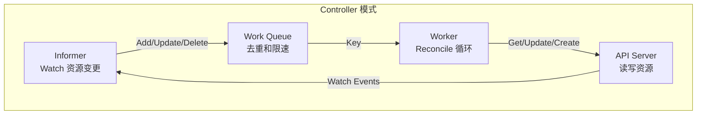
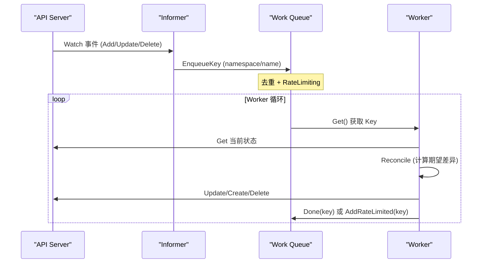

## 概述

Volcano 的 Controller Manager 遵循 Kubernetes Controller 模式，通过 Informer Watch 资源变更、Work Queue 串行处理、Reconcile 达到期望状态。本文介绍如何基于 Volcano Controller 框架开发自定义 Controller。

---

## Controller 接口

Controller 接口定义在 `pkg/controllers/framework/interface.go`：

```go
type Controller interface {
    // Name 返回 Controller 唯一名称
    Name() string

    // Initialize 初始化 Controller（传入客户端和配置）
    Initialize(opt *ControllerOption) error

    // Run 启动 Controller（阻塞，直到 stopCh 关闭）
    Run(stopCh <-chan struct{})
}
```

### ControllerOption

```go
type ControllerOption struct {
    KubeClient              kubernetes.Interface
    VolcanoClient           vcclientset.Interface
    SharedInformerFactory   informers.SharedInformerFactory
    VCSharedInformerFactory vcinformer.SharedInformerFactory
    SchedulerNames          []string
    WorkerNum               uint32
    MaxRequeueNum           int
    Config                  *rest.Config
    // ... 更多配置字段
}
```

---

## Controller 模式



### 核心流程



---

## 开发自定义 Controller

### 步骤一：定义 Controller 结构

```go
// pkg/controllers/mycontroller/mycontroller.go
package mycontroller

import (
    "fmt"
    "time"

    "k8s.io/apimachinery/pkg/util/wait"
    "k8s.io/client-go/kubernetes"
    "k8s.io/client-go/tools/cache"
    "k8s.io/client-go/util/workqueue"
    "k8s.io/klog/v2"

    vcclientset "volcano.sh/apis/client/clientset/versioned"
    vcinformer "volcano.sh/apis/client/informers/externalversions"

    controllerframework "volcano.sh/volcano/pkg/controllers/framework"
)

const ControllerName = "mycontroller"

type myController struct {
    kubeClient    kubernetes.Interface
    vcClient      vcclientset.Interface
    informer      cache.SharedIndexInformer
    queue         workqueue.RateLimitingInterface
    workerNum     uint32
    maxRequeueNum int
}

// 确保实现接口
var _ controllerframework.Controller = &myController{}
```

### 步骤二：实现接口方法

```go
func (mc *myController) Name() string {
    return ControllerName
}

func (mc *myController) Initialize(opt *controllerframework.ControllerOption) error {
    mc.kubeClient = opt.KubeClient
    mc.vcClient = opt.VolcanoClient
    mc.workerNum = opt.WorkerNum
    mc.maxRequeueNum = opt.MaxRequeueNum

    // 创建 Work Queue
    mc.queue = workqueue.NewRateLimitingQueue(
        workqueue.DefaultControllerRateLimiter(),
    )

    // 设置 Informer 和事件处理
    mc.informer = opt.VCSharedInformerFactory.
        Batch().V1alpha1().Jobs().Informer()

    mc.informer.AddEventHandler(cache.ResourceEventHandlerFuncs{
        AddFunc:    mc.addResource,
        UpdateFunc: mc.updateResource,
        DeleteFunc: mc.deleteResource,
    })

    return nil
}

func (mc *myController) Run(stopCh <-chan struct{}) {
    defer mc.queue.ShutDown()

    klog.Infof("Starting %s controller", ControllerName)
    defer klog.Infof("Shutting down %s controller", ControllerName)

    // 等待 Informer 缓存同步
    if !cache.WaitForCacheSync(stopCh, mc.informer.HasSynced) {
        klog.Errorf("Failed to sync informer cache for %s", ControllerName)
        return
    }

    // 启动多个 Worker
    for i := uint32(0); i < mc.workerNum; i++ {
        go wait.Until(mc.worker, time.Second, stopCh)
    }

    <-stopCh
}
```

### 步骤三：实现事件处理

```go
func (mc *myController) addResource(obj interface{}) {
    key, err := cache.MetaNamespaceKeyFunc(obj)
    if err != nil {
        klog.Errorf("Failed to get key for object: %v", err)
        return
    }
    klog.V(4).Infof("%s controller: add %s", ControllerName, key)
    mc.queue.Add(key)
}

func (mc *myController) updateResource(old, new interface{}) {
    key, err := cache.MetaNamespaceKeyFunc(new)
    if err != nil {
        klog.Errorf("Failed to get key for object: %v", err)
        return
    }
    klog.V(4).Infof("%s controller: update %s", ControllerName, key)
    mc.queue.Add(key)
}

func (mc *myController) deleteResource(obj interface{}) {
    key, err := cache.DeletionHandlingMetaNamespaceKeyFunc(obj)
    if err != nil {
        klog.Errorf("Failed to get key for object: %v", err)
        return
    }
    klog.V(4).Infof("%s controller: delete %s", ControllerName, key)
    mc.queue.Add(key)
}
```

### 步骤四：实现 Worker 和 Reconcile

```go
func (mc *myController) worker() {
    for mc.processNextWorkItem() {
    }
}

func (mc *myController) processNextWorkItem() bool {
    key, quit := mc.queue.Get()
    if quit {
        return false
    }
    defer mc.queue.Done(key)

    err := mc.reconcile(key.(string))
    if err == nil {
        // 处理成功，清除限速
        mc.queue.Forget(key)
        return true
    }

    // 处理失败，重新入队
    if mc.queue.NumRequeues(key) < mc.maxRequeueNum {
        klog.Errorf("Error syncing %s: %v, requeuing", key, err)
        mc.queue.AddRateLimited(key)
    } else {
        klog.Errorf("Dropping %s after max retries: %v", key, err)
        mc.queue.Forget(key)
    }

    return true
}

func (mc *myController) reconcile(key string) error {
    namespace, name, err := cache.SplitMetaNamespaceKey(key)
    if err != nil {
        return fmt.Errorf("invalid key: %s", key)
    }

    klog.V(4).Infof("Reconciling %s/%s", namespace, name)

    // 1. 获取当前资源状态
    // 2. 计算期望状态
    // 3. 执行变更达到期望状态

    return nil
}
```

### 步骤五：注册 Controller

在 `pkg/controllers/framework/factory.go` 中注册：

```go
// 在 controller-manager 启动代码中注册
import (
    "volcano.sh/volcano/pkg/controllers/mycontroller"
    controllerframework "volcano.sh/volcano/pkg/controllers/framework"
)

func init() {
    controllerframework.RegisterController(&mycontroller.MyController{})
}
```

---

## 完整示例：资源配额 Controller

```go
package quotacontroller

import (
    "context"
    "fmt"
    "time"

    corev1 "k8s.io/api/core/v1"
    metav1 "k8s.io/apimachinery/pkg/apis/meta/v1"
    "k8s.io/apimachinery/pkg/util/wait"
    "k8s.io/client-go/kubernetes"
    "k8s.io/client-go/tools/cache"
    "k8s.io/client-go/util/workqueue"
    "k8s.io/klog/v2"

    vcbatch "volcano.sh/apis/pkg/apis/batch/v1alpha1"
    vcclientset "volcano.sh/apis/client/clientset/versioned"
    controllerframework "volcano.sh/volcano/pkg/controllers/framework"
)

const ControllerName = "quota-enforcer"

type quotaController struct {
    kubeClient kubernetes.Interface
    vcClient   vcclientset.Interface
    jobInformer cache.SharedIndexInformer
    queue       workqueue.RateLimitingInterface
    workerNum   uint32
}

func (qc *quotaController) Name() string {
    return ControllerName
}

func (qc *quotaController) Initialize(opt *controllerframework.ControllerOption) error {
    qc.kubeClient = opt.KubeClient
    qc.vcClient = opt.VolcanoClient
    qc.workerNum = opt.WorkerNum
    qc.queue = workqueue.NewRateLimitingQueue(
        workqueue.DefaultControllerRateLimiter(),
    )

    qc.jobInformer = opt.VCSharedInformerFactory.
        Batch().V1alpha1().Jobs().Informer()

    qc.jobInformer.AddEventHandler(cache.ResourceEventHandlerFuncs{
        AddFunc: func(obj interface{}) {
            key, _ := cache.MetaNamespaceKeyFunc(obj)
            qc.queue.Add(key)
        },
        UpdateFunc: func(old, new interface{}) {
            key, _ := cache.MetaNamespaceKeyFunc(new)
            qc.queue.Add(key)
        },
    })

    return nil
}

func (qc *quotaController) Run(stopCh <-chan struct{}) {
    defer qc.queue.ShutDown()

    if !cache.WaitForCacheSync(stopCh, qc.jobInformer.HasSynced) {
        return
    }

    for i := uint32(0); i < qc.workerNum; i++ {
        go wait.Until(qc.worker, time.Second, stopCh)
    }

    <-stopCh
}

func (qc *quotaController) worker() {
    for {
        key, quit := qc.queue.Get()
        if quit {
            return
        }
        defer qc.queue.Done(key)

        if err := qc.reconcile(key.(string)); err != nil {
            klog.Errorf("Reconcile %s failed: %v", key, err)
            qc.queue.AddRateLimited(key)
        } else {
            qc.queue.Forget(key)
        }
    }
}

func (qc *quotaController) reconcile(key string) error {
    namespace, name, _ := cache.SplitMetaNamespaceKey(key)

    // 获取 Job
    job, err := qc.vcClient.BatchV1alpha1().Jobs(namespace).
        Get(context.TODO(), name, metav1.GetOptions{})
    if err != nil {
        return err
    }

    // 检查配额
    totalCPU := int64(0)
    for _, task := range job.Spec.Tasks {
        for _, container := range task.Template.Spec.Containers {
            cpu := container.Resources.Requests.Cpu().MilliValue()
            totalCPU += cpu * int64(task.Replicas)
        }
    }

    // 记录配额使用
    klog.V(3).Infof("Job %s/%s total CPU request: %dm",
        namespace, name, totalCPU)

    return nil
}
```

---

## 内置 Controller 参考

| Controller | 说明 | 源码路径 |
|-----------|------|---------|
| Job Controller | 管理 Volcano Job 生命周期 | `pkg/controllers/job/` |
| Queue Controller | 管理 Queue 状态 | `pkg/controllers/queue/` |
| PodGroup Controller | 管理 PodGroup 状态 | `pkg/controllers/podgroup/` |
| JobFlow Controller | 管理 JobFlow 工作流 | `pkg/controllers/jobflow/` |
| HyperNode Controller | 管理网络拓扑 | `pkg/controllers/hypernode/` |
| GarbageCollector | 清理孤儿资源 | `pkg/controllers/garbagecollector/` |

---

## 最佳实践

1. **使用 Work Queue**：所有事件通过 Queue 处理，保证串行和去重
2. **幂等 Reconcile**：Reconcile 函数必须幂等，可重复执行
3. **合理重试**：使用 RateLimitingQueue 和 MaxRequeueNum 控制重试
4. **缓存同步**：启动 Worker 前等待 Informer 缓存完全同步
5. **错误处理**：区分临时错误（重试）和永久错误（放弃）
6. **Worker 并发**：通过 `WorkerNum` 控制并发度，避免争用

---

## 参考文件

| 文件 | 说明 |
|------|------|
| `pkg/controllers/framework/interface.go` | Controller 接口 |
| `pkg/controllers/framework/factory.go` | Controller 注册工厂 |
| `pkg/controllers/job/job_controller.go` | Job Controller 参考 |
| `pkg/controllers/queue/queue_controller.go` | Queue Controller 参考 |
