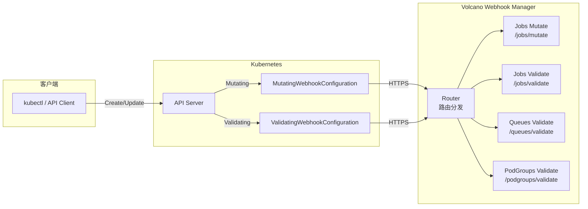
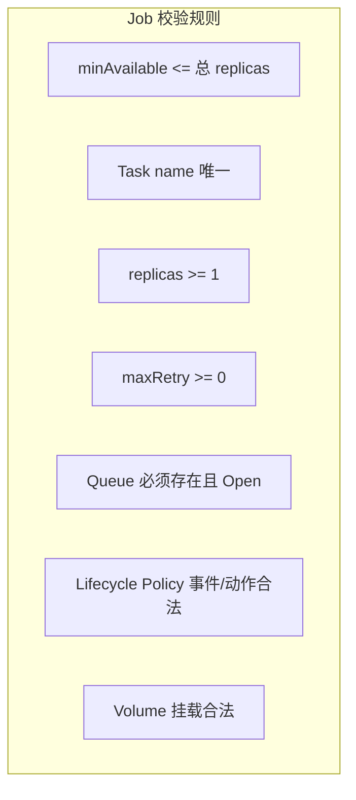
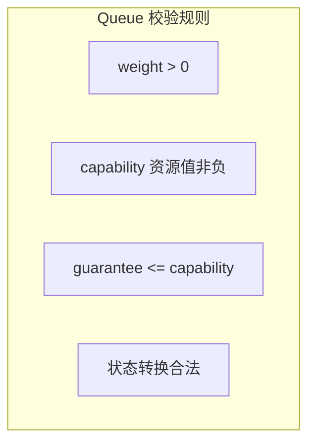

## 概述

Volcano 通过 Kubernetes Admission Webhook 机制对 CRD 资源进行校验（Validating）和变更（Mutating）。本文介绍如何基于 Volcano Webhook 框架扩展新的 Admission 规则。

---

## Webhook 架构



---

## Webhook Router

Webhook 通过 Router 注册和分发，核心结构定义在 `pkg/webhooks/router/`：

```go
// AdmissionService 定义一个 Webhook 处理器
type AdmissionService struct {
    // 路径（如 "/jobs/mutate"）
    Path    string

    // 处理函数
    Func    AdmitFunc

    // HTTP Handler
    Handler AdmissionHandler

    // Webhook 配置
    ValidatingConfig *whv1.ValidatingWebhookConfiguration
    MutatingConfig   *whv1.MutatingWebhookConfiguration

    Config  *AdmissionServiceConfig
}

// AdmitFunc 签名
type AdmitFunc func(admissionv1.AdmissionReview) *admissionv1.AdmissionResponse
```

### 注册方式

```go
// 注册 Admission Webhook
router.RegisterAdmission(service *AdmissionService) error

// 遍历已注册的 Webhook
router.ForEachAdmission(config, handlerFunc) error
```

---

## 内置 Webhook

| 路径 | 类型 | 资源 | 说明 |
|------|------|------|------|
| `/jobs/mutate` | Mutating | Volcano Job | 设置默认值（schedulerName、queue 等） |
| `/jobs/validate` | Validating | Volcano Job | 校验 Job Spec 合法性 |
| `/queues/mutate` | Mutating | Queue | 设置默认权重等 |
| `/queues/validate` | Validating | Queue | 校验 Queue 配置 |
| `/podgroups/validate` | Validating | PodGroup | 校验 PodGroup Spec |
| `/hypernodes/validate` | Validating | HyperNode | 校验 HyperNode 拓扑 |
| `/cronjobs/validate` | Validating | CronJob | 校验 CronJob Spec |

---

## 开发自定义 Webhook

### 步骤一：创建 Webhook 处理函数

```go
// pkg/webhooks/myresource/myresource_webhook.go
package myresource

import (
    "fmt"

    admissionv1 "k8s.io/api/admission/v1"
    metav1 "k8s.io/apimachinery/pkg/apis/meta/v1"
    "k8s.io/klog/v2"

    "volcano.sh/volcano/pkg/webhooks/router"
    "volcano.sh/volcano/pkg/webhooks/util"
)

func init() {
    // 注册 Validating Webhook
    router.RegisterAdmission(
        &router.AdmissionService{
            Path: "/myresource/validate",
            Func: validateMyResource,

            ValidatingConfig: &whv1.ValidatingWebhookConfiguration{
                Webhooks: []whv1.ValidatingWebhook{
                    {
                        Name: "myresource.validate.volcano.sh",
                        Rules: []whv1.RuleWithOperations{
                            {
                                Operations: []whv1.OperationType{
                                    whv1.Create,
                                    whv1.Update,
                                },
                                Rule: whv1.Rule{
                                    APIGroups:   []string{"batch.volcano.sh"},
                                    APIVersions: []string{"v1alpha1"},
                                    Resources:   []string{"myresources"},
                                },
                            },
                        },
                    },
                },
            },
        },
    )

    // 注册 Mutating Webhook
    router.RegisterAdmission(
        &router.AdmissionService{
            Path: "/myresource/mutate",
            Func: mutateMyResource,

            MutatingConfig: &whv1.MutatingWebhookConfiguration{
                Webhooks: []whv1.MutatingWebhook{
                    {
                        Name: "myresource.mutate.volcano.sh",
                        Rules: []whv1.RuleWithOperations{
                            {
                                Operations: []whv1.OperationType{
                                    whv1.Create,
                                },
                                Rule: whv1.Rule{
                                    APIGroups:   []string{"batch.volcano.sh"},
                                    APIVersions: []string{"v1alpha1"},
                                    Resources:   []string{"myresources"},
                                },
                            },
                        },
                    },
                },
            },
        },
    )
}
```

### 步骤二：实现校验逻辑

```go
func validateMyResource(review admissionv1.AdmissionReview) *admissionv1.AdmissionResponse {
    klog.V(3).Infof("Validating myresource %s/%s",
        review.Request.Namespace, review.Request.Name)

    switch review.Request.Operation {
    case admissionv1.Create:
        return validateCreate(review)
    case admissionv1.Update:
        return validateUpdate(review)
    default:
        return util.ToAdmissionResponse(nil)
    }
}

func validateCreate(review admissionv1.AdmissionReview) *admissionv1.AdmissionResponse {
    // 反序列化资源
    raw := review.Request.Object.Raw
    resource := &MyResource{}
    if err := json.Unmarshal(raw, resource); err != nil {
        return util.ToAdmissionResponse(err)
    }

    // 执行校验
    var errs []string

    if resource.Spec.Replicas < 1 {
        errs = append(errs, "spec.replicas must be >= 1")
    }

    if resource.Spec.Queue == "" {
        errs = append(errs, "spec.queue is required")
    }

    if len(errs) > 0 {
        return &admissionv1.AdmissionResponse{
            Allowed: false,
            Result: &metav1.Status{
                Message: fmt.Sprintf("validation failed: %s",
                    strings.Join(errs, "; ")),
                Reason: metav1.StatusReasonForbidden,
            },
        }
    }

    return &admissionv1.AdmissionResponse{Allowed: true}
}
```

### 步骤三：实现变更逻辑

```go
func mutateMyResource(review admissionv1.AdmissionReview) *admissionv1.AdmissionResponse {
    klog.V(3).Infof("Mutating myresource %s/%s",
        review.Request.Namespace, review.Request.Name)

    raw := review.Request.Object.Raw
    resource := &MyResource{}
    if err := json.Unmarshal(raw, resource); err != nil {
        return util.ToAdmissionResponse(err)
    }

    // 构造 JSON Patch
    var patches []PatchOperation

    // 设置默认调度器
    if resource.Spec.SchedulerName == "" {
        patches = append(patches, PatchOperation{
            Op:    "add",
            Path:  "/spec/schedulerName",
            Value: "volcano",
        })
    }

    // 设置默认队列
    if resource.Spec.Queue == "" {
        patches = append(patches, PatchOperation{
            Op:    "add",
            Path:  "/spec/queue",
            Value: "default",
        })
    }

    if len(patches) == 0 {
        return &admissionv1.AdmissionResponse{Allowed: true}
    }

    patchBytes, err := json.Marshal(patches)
    if err != nil {
        return util.ToAdmissionResponse(err)
    }

    patchType := admissionv1.PatchTypeJSONPatch
    return &admissionv1.AdmissionResponse{
        Allowed:   true,
        Patch:     patchBytes,
        PatchType: &patchType,
    }
}

type PatchOperation struct {
    Op    string      `json:"op"`
    Path  string      `json:"path"`
    Value interface{} `json:"value,omitempty"`
}
```

### 步骤四：启用 Webhook

在 Helm values.yaml 中添加路径：

```yaml
custom:
  enabled_admissions: >-
    /jobs/mutate,
    /jobs/validate,
    /queues/mutate,
    /queues/validate,
    /podgroups/validate,
    /myresource/mutate,
    /myresource/validate
```

---

## 校验模式参考

### Job 校验规则示例

Volcano 内置的 Job 校验覆盖以下方面：



### Queue 校验规则示例



---

## 测试 Webhook

### 单元测试

```go
func TestValidateMyResource(t *testing.T) {
    tests := []struct {
        name    string
        review  admissionv1.AdmissionReview
        allowed bool
    }{
        {
            name: "valid resource",
            review: admissionv1.AdmissionReview{
                Request: &admissionv1.AdmissionRequest{
                    Object: runtime.RawExtension{
                        Raw: marshalResource(validResource),
                    },
                    Operation: admissionv1.Create,
                },
            },
            allowed: true,
        },
        {
            name: "invalid replicas",
            review: admissionv1.AdmissionReview{
                Request: &admissionv1.AdmissionRequest{
                    Object: runtime.RawExtension{
                        Raw: marshalResource(invalidResource),
                    },
                    Operation: admissionv1.Create,
                },
            },
            allowed: false,
        },
    }

    for _, tt := range tests {
        t.Run(tt.name, func(t *testing.T) {
            resp := validateMyResource(tt.review)
            if resp.Allowed != tt.allowed {
                t.Errorf("expected allowed=%v, got %v", tt.allowed, resp.Allowed)
            }
        })
    }
}
```

### 集成测试

```bash
# 部署后测试
kubectl apply -f invalid-resource.yaml
# 预期: Error from server (Forbidden): admission webhook "myresource.validate.volcano.sh" denied the request
```

---

## 最佳实践

1. **校验优先**：Validating Webhook 在 Mutating 之后执行，确保最终状态合法
2. **幂等变更**：Mutating Webhook 必须幂等，多次调用结果一致
3. **快速返回**：Webhook 延迟直接影响 API Server 响应时间，控制在 100ms 内
4. **失败策略**：设置 `failurePolicy: Ignore` 避免 Webhook 故障阻塞集群
5. **最小权限**：只监听必要的 Operation 和 Resource

---

## 参考文件

| 文件 | 说明 |
|------|------|
| `pkg/webhooks/router/admission.go` | Webhook 路由和注册 |
| `pkg/webhooks/admission/jobs/` | Job Webhook 参考 |
| `pkg/webhooks/admission/queues/` | Queue Webhook 参考 |
| `pkg/webhooks/util/util.go` | Webhook 工具函数 |
