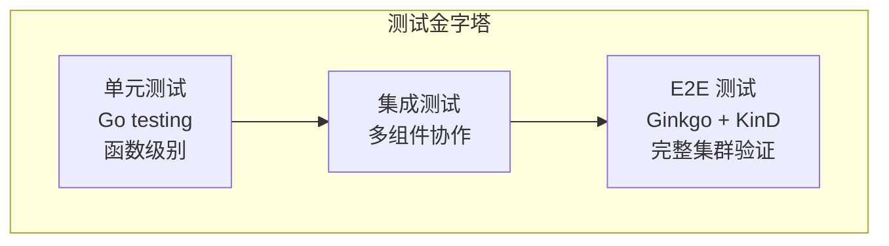
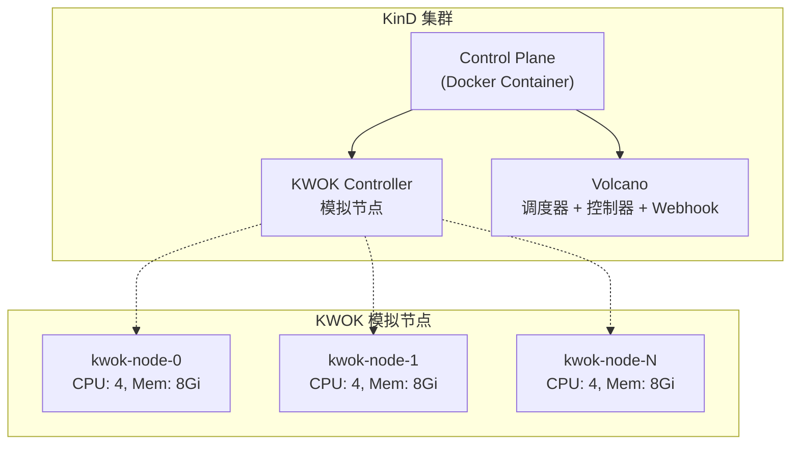

## 概述

Volcano 的测试体系包含单元测试、E2E（端到端）测试和集成测试。本文介绍各层测试的编写方法、工具链使用和最佳实践。

---

## 测试体系



| 层级 | 框架 | 运行方式 | 覆盖范围 |
|------|------|---------|---------|
| 单元测试 | Go `testing` | `make unit-test` | 单个函数/方法 |
| E2E 测试 | Ginkgo v2 + Gomega | `make e2e` | 完整调度流程 |

---

## 单元测试

### 运行方式

```bash
# 运行所有单元测试
make unit-test

# 运行特定包
go test ./pkg/scheduler/plugins/gang/...
go test ./pkg/scheduler/actions/allocate/...

# 运行特定测试函数
go test -run TestGangScheduling ./pkg/scheduler/plugins/gang/...

# 带详细输出
go test -v ./pkg/scheduler/plugins/gang/...

# 带覆盖率
go test -cover ./pkg/scheduler/plugins/gang/...
go test -coverprofile=coverage.out ./pkg/scheduler/...
go tool cover -html=coverage.out

# 带 Race 检测
go test -race ./pkg/scheduler/plugins/gang/...
```

### 调度器插件测试

Volcano 提供 `uthelper` 测试辅助库：

```go
// pkg/scheduler/plugins/gang/gang_test.go
package gang

import (
    "testing"

    "volcano.sh/volcano/pkg/scheduler/api"
    "volcano.sh/volcano/pkg/scheduler/framework"
    "volcano.sh/volcano/pkg/scheduler/uthelper"
)

func TestGangScheduling(t *testing.T) {
    tests := []struct {
        name     string
        jobs     []*api.JobInfo
        nodes    []*api.NodeInfo
        queues   []*api.QueueInfo
        expected map[string]string  // task -> node
    }{
        {
            name: "gang all-or-nothing",
            // 构造测试场景
        },
    }

    for _, tt := range tests {
        t.Run(tt.name, func(t *testing.T) {
            // 执行测试
        })
    }
}
```

### Controller 测试

```go
func TestJobController(t *testing.T) {
    // 使用 fake client
    kubeClient := fake.NewSimpleClientset()
    vcClient := vcfake.NewSimpleClientset()

    // 创建 Controller
    ctrl := &jobController{
        kubeClient: kubeClient,
        vcClient:   vcClient,
    }

    // 创建测试资源
    job := &vcbatch.Job{
        ObjectMeta: metav1.ObjectMeta{
            Name:      "test-job",
            Namespace: "default",
        },
        Spec: vcbatch.JobSpec{
            MinAvailable: 2,
        },
    }

    vcClient.BatchV1alpha1().Jobs("default").Create(
        context.TODO(), job, metav1.CreateOptions{})

    // 执行 Reconcile
    err := ctrl.reconcile("default/test-job")
    if err != nil {
        t.Errorf("reconcile failed: %v", err)
    }

    // 验证结果
}
```

### Webhook 测试

```go
func TestJobValidation(t *testing.T) {
    tests := []struct {
        name    string
        job     *vcbatch.Job
        allowed bool
    }{
        {
            name: "valid job",
            job: &vcbatch.Job{
                Spec: vcbatch.JobSpec{
                    MinAvailable: 2,
                    Tasks: []vcbatch.TaskSpec{
                        {Replicas: 2, Name: "worker"},
                    },
                },
            },
            allowed: true,
        },
        {
            name: "minAvailable exceeds replicas",
            job: &vcbatch.Job{
                Spec: vcbatch.JobSpec{
                    MinAvailable: 5,
                    Tasks: []vcbatch.TaskSpec{
                        {Replicas: 2, Name: "worker"},
                    },
                },
            },
            allowed: false,
        },
    }

    for _, tt := range tests {
        t.Run(tt.name, func(t *testing.T) {
            raw, _ := json.Marshal(tt.job)
            review := admissionv1.AdmissionReview{
                Request: &admissionv1.AdmissionRequest{
                    Object:    runtime.RawExtension{Raw: raw},
                    Operation: admissionv1.Create,
                },
            }

            resp := validateJob(review)
            if resp.Allowed != tt.allowed {
                t.Errorf("expected allowed=%v, got %v", tt.allowed, resp.Allowed)
            }
        })
    }
}
```

---

## E2E 测试

### 框架：Ginkgo v2 + Gomega

E2E 测试位于 `test/e2e/`，按功能分目录：

```
test/e2e/
├── jobp/                # Job 模式测试
├── jobseq/              # Job 序列测试
├── schedulingbase/      # 基础调度测试
├── schedulingaction/     # 调度 Action 测试
├── vcctl/               # CLI 工具测试
├── cronjob/             # CronJob 测试
├── hypernode/           # HyperNode 测试
├── admission/           # Webhook 测试
└── util/                # 测试工具库
```

### 运行 E2E

```bash
# 完整 E2E（构建镜像 + KinD 集群 + 测试）
make e2e

# 运行特定 E2E 子集
make e2e-test-schedulingbase
make e2e-test-jobp
make e2e-test-hypernode

# 手动运行指定测试
cd test/e2e
ginkgo --focus="gang scheduling" ./jobp/
```

### E2E 测试结构

```go
// test/e2e/jobp/main_test.go
package jobp

import (
    "os"
    "testing"

    "volcano.sh/volcano/test/e2e/util"
)

func TestMain(m *testing.M) {
    // 初始化客户端
    home := util.HomeDir()
    configPath := util.KubeconfigPath(home)
    config, _ := clientcmd.BuildConfigFromFlags(util.MasterURL(), configPath)
    util.VcClient = vcclient.NewForConfigOrDie(config)
    util.KubeClient = kubernetes.NewForConfigOrDie(config)

    os.Exit(m.Run())
}

func TestE2E(t *testing.T) {
    RegisterFailHandler(Fail)
    RunSpecs(t, "Volcano Job Test Suite")
}
```

### E2E 测试用例

```go
// test/e2e/jobp/job_test.go
var _ = ginkgo.Describe("Job E2E Test", func() {

    ginkgo.It("should schedule job when resources are sufficient", func() {
        // 1. 初始化测试上下文
        ctx := e2eutil.InitTestContext(e2eutil.Options{
            NodesNumLimit: 3,
            NodesResourceLimit: corev1.ResourceList{
                corev1.ResourceCPU:    resource.MustParse("2000m"),
                corev1.ResourceMemory: resource.MustParse("2048Mi"),
            },
        })
        defer e2eutil.CleanupTestContext(ctx)

        // 2. 创建 Job
        job := &e2eutil.JobSpec{
            Name:      "test-job",
            Queue:     "default",
            Min:       2,
            Tasks: []e2eutil.TaskSpec{
                {
                    Name: "worker",
                    Img:  e2eutil.DefaultNginxImage,
                    Min:  2,
                    Rep:  2,
                    Req: corev1.ResourceList{
                        corev1.ResourceCPU: resource.MustParse("500m"),
                    },
                },
            },
        }
        createdJob := e2eutil.CreateJob(ctx, job)

        // 3. 等待并验证
        err := e2eutil.WaitJobReady(ctx, createdJob)
        gomega.Expect(err).NotTo(gomega.HaveOccurred())

        // 4. 验证 Pod 数量
        pods := e2eutil.GetJobPods(ctx, createdJob)
        gomega.Expect(len(pods)).To(gomega.Equal(2))
    })

    ginkgo.It("should handle gang scheduling timeout", func() {
        ctx := e2eutil.InitTestContext(e2eutil.Options{
            NodesNumLimit: 1,
            NodesResourceLimit: corev1.ResourceList{
                corev1.ResourceCPU: resource.MustParse("1000m"),
            },
        })
        defer e2eutil.CleanupTestContext(ctx)

        // 创建需要 4 CPU 但集群只有 1 CPU 的 Job
        job := &e2eutil.JobSpec{
            Name: "gang-timeout",
            Min:  2,
            Tasks: []e2eutil.TaskSpec{
                {
                    Name: "worker",
                    Img:  e2eutil.DefaultNginxImage,
                    Min:  2,
                    Rep:  2,
                    Req: corev1.ResourceList{
                        corev1.ResourceCPU: resource.MustParse("2000m"),
                    },
                },
            },
        }
        createdJob := e2eutil.CreateJob(ctx, job)

        // 验证 Job 保持 Pending
        err := e2eutil.WaitJobPending(ctx, createdJob)
        gomega.Expect(err).NotTo(gomega.HaveOccurred())
    })
})
```

### E2E 工具函数

`test/e2e/util/` 提供丰富的测试工具：

| 函数 | 说明 |
|------|------|
| `InitTestContext(opts)` | 初始化测试上下文（创建 KWOK 节点） |
| `CleanupTestContext(ctx)` | 清理测试资源 |
| `CreateJob(ctx, spec)` | 创建 Volcano Job |
| `WaitJobReady(ctx, job)` | 等待 Job 进入 Running |
| `WaitJobPending(ctx, job)` | 等待 Job 保持 Pending |
| `WaitJobCompleted(ctx, job)` | 等待 Job 完成 |
| `GetJobPods(ctx, job)` | 获取 Job 的所有 Pod |
| `CreateQueue(ctx, spec)` | 创建 Queue |
| `DeleteQueue(ctx, name)` | 删除 Queue |

---

## KinD + KWOK 测试环境

E2E 测试使用 KinD（Kubernetes in Docker）+ KWOK（模拟节点）：



KWOK 节点是轻量级模拟节点，不需要真实容器运行时，适合大规模调度测试。

---

## 测试覆盖率

```bash
# 生成覆盖率报告
go test -coverprofile=coverage.out ./pkg/scheduler/...

# HTML 报告
go tool cover -html=coverage.out -o coverage.html

# 查看函数级覆盖率
go tool cover -func=coverage.out
```

---

## 最佳实践

### 单元测试

1. **表驱动测试**：使用 `[]struct{name, input, expected}` 模式
2. **Mock 外部依赖**：使用 `fake.NewSimpleClientset()` 模拟 K8s 客户端
3. **隔离测试**：每个测试独立，不依赖其他测试的执行顺序
4. **测试边界条件**：空输入、零值、最大值、错误路径

### E2E 测试

1. **资源清理**：使用 `defer CleanupTestContext(ctx)` 确保清理
2. **超时设置**：合理设置等待超时，避免测试卡住
3. **资源隔离**：每个测试使用独立的队列和命名空间
4. **可重复运行**：测试之间无依赖，可随机顺序执行

---

## 参考文件

| 文件 | 说明 |
|------|------|
| `test/e2e/util/` | E2E 测试工具库 |
| `test/e2e/jobp/` | Job 模式 E2E 测试 |
| `test/e2e/schedulingbase/` | 基础调度 E2E 测试 |
| `hack/run-e2e-kind.sh` | KinD E2E 运行脚本 |
| `Makefile` | 测试相关 Make 目标 |
