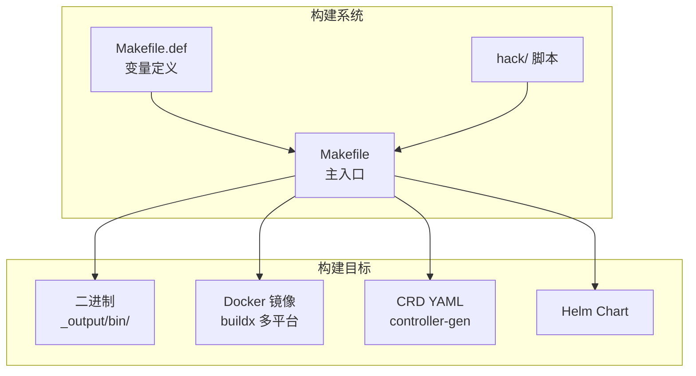
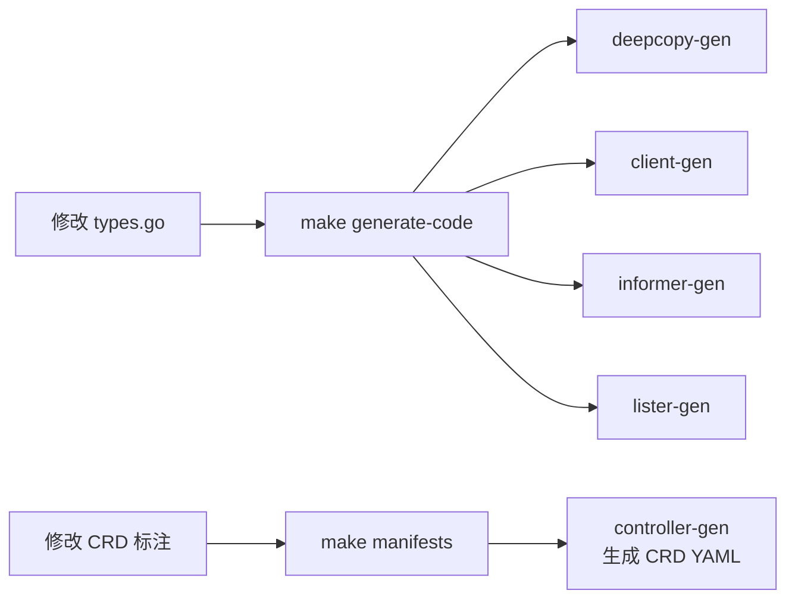
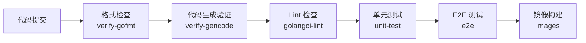
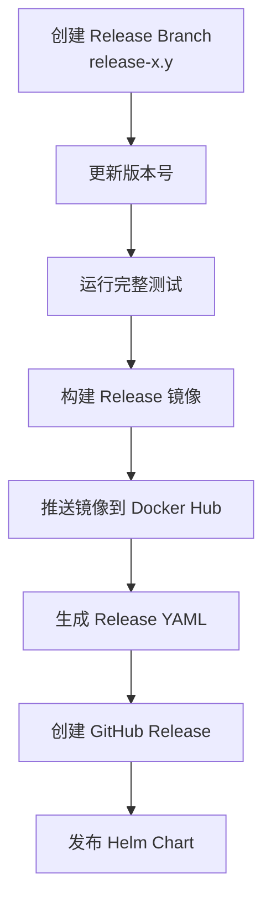

## 概述

本文档介绍 Volcano 的完整构建流程，包括本地构建、Docker 镜像构建、跨平台编译以及发布流程。

---

## 构建系统架构



---

## 本地构建

### 构建所有二进制

```bash
# 构建所有组件到 _output/bin/
make all

# 输出目录结构：
# _output/bin/
# ├── vc-scheduler
# ├── vc-controller-manager
# ├── vc-webhook-manager
# ├── vc-agent
# ├── network-qos
# └── vcctl
```

### 构建单个组件

```bash
make vc-scheduler              # 调度器
make vc-controller-manager     # 控制器
make vc-webhook-manager        # Webhook
make vc-agent                  # Agent + network-qos
make vcctl                     # CLI 工具（当前 OS）
make command-lines             # CLI 工具集：vcancel, vresume 等
```

### 构建参数

```bash
# 指定目标 OS 和架构
GOOS=linux GOARCH=amd64 make vc-scheduler

# 启用 CGO 插件支持
SUPPORT_PLUGINS=yes make vc-scheduler

# 指定版本号
TAG=v1.10.0 make all

# Debug 构建（关闭优化）
GOLDFLAGS="" make vc-scheduler
```

### 构建变量

主要变量定义在 `Makefile.def`：

| 变量 | 说明 | 默认值 |
|------|------|--------|
| `BIN_DIR` | 输出目录 | `_output/bin` |
| `GOOS` | 目标操作系统 | 当前系统 |
| `GOARCH` | 目标架构 | 当前架构 |
| `TAG` | 版本标签 | Git SHA |
| `SUPPORT_PLUGINS` | CGO 插件支持 | 否 |

---

## Docker 镜像构建

### 构建所有镜像

```bash
# 构建全部镜像
make images

# 镜像列表：
# volcanosh/vc-scheduler:<tag>
# volcanosh/vc-controller-manager:<tag>
# volcanosh/vc-webhook-manager:<tag>
# volcanosh/vc-agent:<tag>
```

### 多平台构建

```bash
# 使用 buildx 构建多平台镜像
docker buildx create --use --name volcano-builder
make images DOCKER_PLATFORMS="linux/amd64,linux/arm64"
```

### 自定义镜像仓库

```bash
# 推送到自定义仓库
REGISTRY=my-registry.example.com make images
docker push my-registry.example.com/volcanosh/vc-scheduler:<tag>
```

---

## 代码生成

### API 类型变更后

修改 `staging/src/volcano.sh/apis/` 下的类型定义后：

```bash
# 1. 重新生成 deepcopy、client、informer、lister
make generate-code

# 2. 重新生成 CRD YAML
make manifests

# 3. 重新生成部署 YAML
make generate-yaml

# 4. 验证生成的代码是否最新
make verify
```

### 代码生成流程



### 生成的文件

| 命令 | 生成文件 |
|------|---------|
| `generate-code` | `zz_generated.deepcopy.go`、`client/clientset/`、`client/informers/`、`client/listers/` |
| `manifests` | `config/crd/volcano/bases/*.yaml`、`config/crd/jobflow/bases/*.yaml` |
| `generate-yaml` | `installer/` 下的部署 YAML |

---

## 质量检查

### 格式化和 Lint

```bash
# 代码格式化
hack/update-gofmt.sh

# 格式检查
hack/verify-gofmt.sh

# Lint 检查（golangci-lint）
make lint

# 验证生成的代码
make verify
```

### CI 检查流程



---

## Helm Chart 管理

### 更新 Chart

```bash
# 生成 Helm Chart
hack/generate-charts.sh

# Chart 位置
# installer/helm/chart/volcano/
```

### Chart 结构

```
installer/helm/chart/volcano/
├── Chart.yaml                    # Chart 元信息
├── values.yaml                   # 默认配置
├── templates/                    # 模板文件
│   ├── scheduler.yaml
│   ├── controllers.yaml
│   ├── admission.yaml
│   └── ...
├── config/                       # 配置文件
│   ├── volcano-scheduler.conf
│   └── volcano-admission.conf
└── crd/bases/                    # CRD 定义
```

---

## 发布流程

### 版本号规范

Volcano 遵循语义化版本（Semantic Versioning）：

```
v<major>.<minor>.<patch>
```

- **major**：不兼容的 API 变更
- **minor**：向后兼容的功能新增
- **patch**：向后兼容的问题修复

### 发布步骤



### 构建 Release

```bash
# 设置版本号
export TAG=v1.10.0

# 构建 Release 镜像
TAG=$TAG make images

# 推送镜像
docker push volcanosh/vc-scheduler:$TAG
docker push volcanosh/vc-controller-manager:$TAG
docker push volcanosh/vc-webhook-manager:$TAG

# 生成 Release YAML
TAG=$TAG make generate-yaml
```

### 发布清单

| 产物 | 说明 |
|------|------|
| Docker 镜像 | `volcanosh/*:<version>` 推送到 Docker Hub |
| YAML Manifest | `volcano-<version>.yaml` 单文件部署 |
| Helm Chart | 发布到 Helm 仓库 |
| GitHub Release | 含 Release Notes 和二进制 |

---

## 开发者工具

### Hack 脚本

| 脚本 | 说明 |
|------|------|
| `hack/update-gencode.sh` | 重新生成代码 |
| `hack/verify-gencode.sh` | 验证生成代码 |
| `hack/update-gofmt.sh` | 格式化代码 |
| `hack/verify-gofmt.sh` | 检查格式 |
| `hack/run-e2e-kind.sh` | 运行 KinD E2E |
| `hack/generate-yaml.sh` | 生成部署 YAML |
| `hack/generate-charts.sh` | 生成 Helm Chart |
| `hack/publish.sh` | 发布脚本 |

---

## 常见问题

| 问题 | 原因 | 解决方案 |
|------|------|---------|
| 构建失败: module not found | Go 模块未下载 | `go mod download` |
| CGO 编译错误 | 缺少 C 编译器 | 安装 `gcc` / `musl-gcc` |
| 镜像构建失败 | Docker buildx 未配置 | `docker buildx create --use` |
| CRD 生成失败 | controller-gen 未安装 | `go install sigs.k8s.io/controller-tools/cmd/controller-gen` |
| verify 失败 | 生成代码不是最新 | `make generate-code && make manifests` |

---

## 参考文件

| 文件 | 说明 |
|------|------|
| `Makefile` | 主构建文件 |
| `Makefile.def` | 构建变量 |
| `hack/` | 构建和验证脚本 |
| `installer/helm/chart/volcano/` | Helm Chart |
