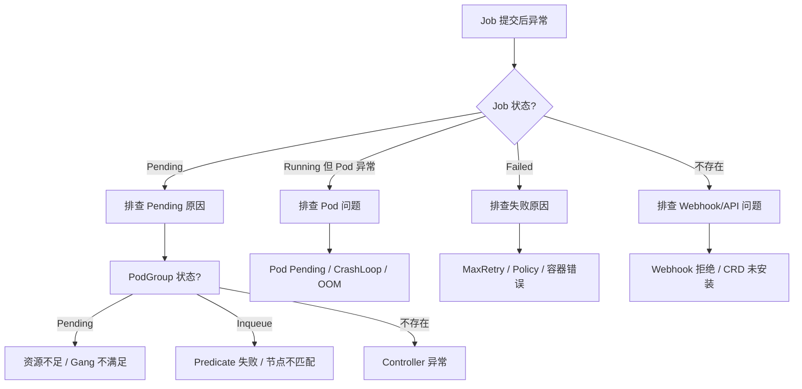
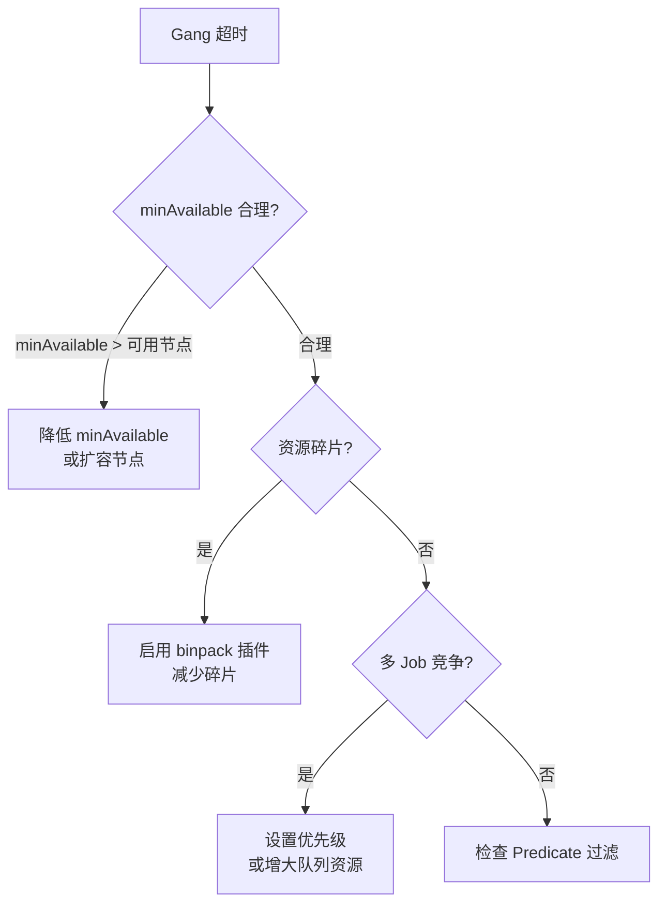

## 概述

本文档汇总 Volcano 使用中最常见的问题及排查方法，覆盖 Job Pending、PodGroup 未创建、队列不分配、Gang 超时等高频场景。

---

## 排查总览



---

## 问题一：Job 一直 Pending

### 症状

```bash
kubectl get vcjob my-job
# NAME     STATUS    AGE
# my-job   Pending   10m
```

### 排查步骤

#### 1. 检查 PodGroup 状态

```bash
kubectl get podgroup -l volcano.sh/job-name=my-job
```

| PodGroup 状态 | 含义 | 下一步 |
|--------------|------|--------|
| `Pending` | 资源不足或 Gang 不满足 | 检查集群资源 |
| `Inqueue` | 已入队但分配失败 | 检查 Predicate |
| 不存在 | Controller 未创建 | 检查 Controller |

#### 2. 检查集群资源

```bash
# 查看节点资源
kubectl describe nodes | grep -A 5 "Allocated resources"

# 查看队列资源
kubectl get queues -o wide
```

#### 3. 检查调度器日志

```bash
kubectl logs -n volcano-system -l app=volcano-scheduler --tail=100 | grep -i "my-job"
```

### 常见原因

| 原因 | 日志关键词 | 解决方案 |
|------|-----------|---------|
| 资源不足 | `insufficient resources` | 扩容或降低资源请求 |
| Gang 不满足 | `bindable job is not ready` | 检查 minAvailable 和节点容量 |
| 队列超出 Capability | `exceed capability` | 增大队列 Capability |
| 队列 Closed | `queue is not open` | 开放队列 `spec.state: Open` |
| 未指定 schedulerName | Pod 被默认调度器处理 | 添加 `schedulerName: volcano` |
| Predicate 失败 | `predicate failed` | 检查 NodeAffinity/Taints |

---

## 问题二：PodGroup 未创建

### 症状

```bash
kubectl get podgroup -n default
# 无对应 PodGroup
```

### 排查步骤

```bash
# 1. 检查 Controller Manager 是否运行
kubectl get pods -n volcano-system -l app=volcano-controller-manager

# 2. 检查 Controller 日志
kubectl logs -n volcano-system -l app=volcano-controller-manager --tail=50

# 3. 检查 Job 是否被 Webhook 修改
kubectl get vcjob my-job -o yaml | grep schedulerName
```

### 常见原因

| 原因 | 解决方案 |
|------|---------|
| Controller Manager 未运行 | 检查 Pod 状态和重启原因 |
| RBAC 权限不足 | 检查 ClusterRole/ClusterRoleBinding |
| CRD 未注册 | `kubectl get crd podgroups.scheduling.volcano.sh` |
| Job Spec 不合法 | 检查 Webhook 是否拒绝 |

---

## 问题三：队列资源不分配

### 症状

Job 在队列中，但队列的 Allocated 始终为 0。

### 排查步骤

```bash
# 1. 查看队列状态
kubectl describe queue my-queue

# 2. 检查调度器配置是否包含 proportion/capacity
kubectl get configmap volcano-scheduler-configmap -n volcano-system -o yaml

# 3. 检查调度器日志
kubectl logs -n volcano-system -l app=volcano-scheduler | grep -i "proportion\|capacity\|queue"
```

### 常见原因

| 原因 | 解决方案 |
|------|---------|
| proportion 插件未启用 | 在调度器配置中添加 proportion 插件 |
| 队列 Weight 为 0 | 设置 `spec.weight > 0` |
| 队列 Capability 为 0 | 增大或移除 Capability 限制 |
| capacity 和 proportion 同时启用 | 只保留一个队列管理插件 |

---

## 问题四：Gang 调度超时

### 症状

Job 的 minAvailable 满足，但 Pod 一直无法全部调度。

### 排查步骤

```bash
# 1. 检查 PodGroup 的 minMember 和当前成员数
kubectl get podgroup -l volcano.sh/job-name=my-job -o yaml

# 2. 查看调度器日志
kubectl logs -n volcano-system -l app=volcano-scheduler | grep -i "gang\|ready\|discard"

# 3. 检查 Statement Commit/Discard
kubectl logs -n volcano-system -l app=volcano-scheduler | grep -i "commit\|discard"
```

### 常见原因



---

## 问题五：Webhook 拒绝请求

### 症状

```
Error from server (Forbidden): admission webhook "jobs.validate.volcano.sh" denied the request: ...
```

### 排查步骤

```bash
# 1. 查看 Webhook 配置
kubectl get validatingwebhookconfiguration
kubectl get mutatingwebhookconfiguration

# 2. 检查 Webhook Pod 状态
kubectl get pods -n volcano-system -l app=volcano-admission

# 3. 查看 Webhook 日志
kubectl logs -n volcano-system -l app=volcano-admission --tail=50
```

### 常见原因

| 原因 | 解决方案 |
|------|---------|
| Job minAvailable > 总 replicas | 调整 minAvailable 不超过 replicas 之和 |
| Task name 重复 | 确保每个 Task 的 name 唯一 |
| Queue 不存在 | 先创建 Queue |
| 资源值格式错误 | 检查 CPU/Memory 格式 |

---

## 问题六：Pod 调度到错误节点

### 排查步骤

```bash
# 1. 查看 Pod 所在节点
kubectl get pods -o wide -l volcano.sh/job-name=my-job

# 2. 查看调度器 NodeOrder 评分
kubectl logs -n volcano-system -l app=volcano-scheduler -v=5 | grep -i "nodeorder\|score"

# 3. 检查 NodeAffinity 和 Taints
kubectl describe node <node-name>
```

### 常见原因

| 原因 | 解决方案 |
|------|---------|
| binpack 权重过高 | 调整 binpack.weight |
| NodeAffinity 配置错误 | 检查 Pod Spec 的 affinity |
| Taint 未设置 Toleration | 添加对应的 toleration |

---

## 问题七：多调度器冲突

### 症状

同一个 Pod 被 Volcano 和默认调度器同时处理。

### 排查步骤

```bash
# 检查 Pod 的 schedulerName
kubectl get pod <pod-name> -o jsonpath='{.spec.schedulerName}'
```

### 解决方案

- Volcano Job 自动设置 `schedulerName: volcano`
- 普通 Deployment/Pod 需手动指定 `schedulerName: volcano`
- 确保不同调度器管理不同 Pod 集合

---

## 快速诊断命令

```bash
# 组件健康检查
kubectl get pods -n volcano-system

# CRD 状态
kubectl get crd | grep volcano

# Job 状态
kubectl get vcjob -A

# Queue 状态
kubectl get queues

# PodGroup 状态
kubectl get podgroup -A

# 调度器日志（最近 100 行）
kubectl logs -n volcano-system -l app=volcano-scheduler --tail=100

# Controller 日志
kubectl logs -n volcano-system -l app=volcano-controller-manager --tail=100

# Webhook 日志
kubectl logs -n volcano-system -l app=volcano-admission --tail=100

# 事件
kubectl get events --sort-by='.lastTimestamp' | grep -i volcano
```

---

## 参考文件

| 文件 | 说明 |
|------|------|
| `pkg/scheduler/scheduler.go` | 调度器主循环 |
| `pkg/controllers/job/job_controller.go` | Job Controller |
| `pkg/webhooks/` | Webhook 校验逻辑 |
