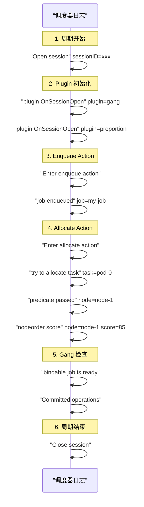

## 概述

本文档介绍 Volcano 调度器的调试方法，包括日志级别配置、关键日志分析、Prometheus 指标调试和 Cache Dump 等手段。

---

## 日志级别配置

Volcano 使用 klog（Kubernetes 日志库），通过 `-v` 参数控制日志级别：

| 级别 | 说明 | 适用场景 |
|------|------|---------|
| `-v=0` | 仅错误和警告 | 生产环境 |
| `-v=2` | 基础操作信息 | 生产监控 |
| `-v=3` | 调度摘要（Session Open/Close、Action 执行） | 问题排查 |
| `-v=4` | 详细调度过程（每个 Job/Task 的决策） | 深度调试 |
| `-v=5` | Debug（Predicate 细节、评分细节） | 开发调试 |

### 调整日志级别

```bash
# 方式一：修改 Deployment
kubectl edit deployment volcano-scheduler -n volcano-system
# 在 args 中添加或修改 -v=4

# 方式二：Helm 安装时设置
helm install volcano volcano-sh/volcano \
  --set custom.scheduler_log_level=4
```

---

## 关键日志模式

### 调度周期日志

```
# 周期开始
I0101 12:00:00.000000 scheduler.go:xxx] "Open session" sessionID=xxx

# Action 执行
I0101 12:00:00.010000 enqueue.go:xxx] "Enter enqueue action"
I0101 12:00:00.020000 allocate.go:xxx] "Enter allocate action"
I0101 12:00:00.050000 backfill.go:xxx] "Enter backfill action"

# 周期结束
I0101 12:00:00.060000 scheduler.go:xxx] "Close session" sessionID=xxx
```

### 分配决策日志

```
# 成功分配
I0101 12:00:00.030000 allocate.go:xxx] "bindTask" task=ns/pod-0 node=node-1

# 分配回滚
I0101 12:00:00.040000 statement.go:xxx] "Discard operations for job" job=ns/my-job

# 分配提交
I0101 12:00:00.040000 statement.go:xxx] "Committed operations for job" job=ns/my-job
```

### Gang 相关日志

```
# Gang 检查
I0101 12:00:00.035000 gang.go:xxx] "Bindable job is not ready" job=ns/my-job ready=2 minAvailable=4

# Gang 满足
I0101 12:00:00.035000 gang.go:xxx] "bindable job is ready" job=ns/my-job
```

### Predicate 失败日志

```
# 节点过滤
I0101 12:00:00.032000 predicates.go:xxx] "predicate failed" task=ns/pod-0 node=node-2 reason="Insufficient cpu"
```

---

## 常用调试命令

### 查看调度周期

```bash
# 调度周期开始和结束
kubectl logs -n volcano-system -l app=volcano-scheduler | grep -E "Open session|Close session"

# 统计调度周期频率
kubectl logs -n volcano-system -l app=volcano-scheduler | grep "Open session" | wc -l
```

### 追踪特定 Job

```bash
# 追踪 Job 的所有调度日志
JOB_NAME="my-job"
kubectl logs -n volcano-system -l app=volcano-scheduler | grep -i "$JOB_NAME"
```

### 追踪特定 Task/Pod

```bash
# 追踪 Pod 的分配过程
POD_NAME="my-job-worker-0"
kubectl logs -n volcano-system -l app=volcano-scheduler | grep "$POD_NAME"
```

### 查看 Predicate 过滤

```bash
# 所有 Predicate 失败
kubectl logs -n volcano-system -l app=volcano-scheduler | grep "predicate failed"

# 特定任务的 Predicate
kubectl logs -n volcano-system -l app=volcano-scheduler | grep "predicate failed.*my-job"
```

### 查看 Commit/Discard

```bash
# 所有 Commit（成功分配）
kubectl logs -n volcano-system -l app=volcano-scheduler | grep "Committed"

# 所有 Discard（分配回滚）
kubectl logs -n volcano-system -l app=volcano-scheduler | grep "Discard"
```

---

## Prometheus 指标调试

### 关键调试指标

```bash
# 端到端延迟
curl -s http://localhost:8080/metrics | grep volcano_e2e_scheduling_latency

# Action 延迟（识别慢 Action）
curl -s http://localhost:8080/metrics | grep volcano_action_scheduling_latency

# Plugin 延迟（识别慢 Plugin）
curl -s http://localhost:8080/metrics | grep volcano_plugin_scheduling_latency

# 不可调度任务
curl -s http://localhost:8080/metrics | grep volcano_unschedule

# 调度尝试统计
curl -s http://localhost:8080/metrics | grep volcano_schedule_attempts
```

### 性能分析 PromQL

```promql
# 识别最慢的 Action
topk(3, histogram_quantile(0.99,
  sum(rate(volcano_action_scheduling_latency_milliseconds_bucket[5m])) by (le, action)
))

# 识别最慢的 Plugin
topk(5, histogram_quantile(0.99,
  sum(rate(volcano_plugin_scheduling_latency_milliseconds_bucket[5m])) by (le, plugin)
))

# 调度成功 vs 失败
sum(rate(volcano_schedule_attempts_total[5m])) by (result)
```

---

## pprof 性能分析

### 启用 pprof

```yaml
custom:
  scheduler_pprof_enable: true
```

### 使用 pprof

```bash
# CPU Profile
go tool pprof http://localhost:8080/debug/pprof/profile?seconds=30

# 内存 Profile
go tool pprof http://localhost:8080/debug/pprof/heap

# Goroutine 分析
go tool pprof http://localhost:8080/debug/pprof/goroutine

# 火焰图
go tool pprof -http=:8081 http://localhost:8080/debug/pprof/profile?seconds=30
```

---

## 调度决策追踪

### 完整追踪一次调度



### 日志级别建议

| 排查场景 | 建议级别 | 原因 |
|---------|---------|------|
| 为什么 Job Pending | `-v=3` | 看 Enqueue 和 Gang 检查 |
| 为什么选了这个节点 | `-v=4` | 看 NodeOrder 评分 |
| Predicate 为什么失败 | `-v=5` | 看每个节点的 Predicate 细节 |
| 抢占为什么不触发 | `-v=4` | 看 Preempt Action 日志 |
| 性能瓶颈在哪 | Metrics | 看 Plugin/Action 延迟 |

---

## 常见日志错误

| 日志错误 | 含义 | 解决方案 |
|---------|------|---------|
| `insufficient resources` | 节点资源不足 | 扩容或减小请求 |
| `bindable job is not ready` | Gang 不满足 | 检查 minAvailable 和可用节点 |
| `queue is overused` | 队列超出 Deserved | 等待回收或增大权重 |
| `bindErr` | Bind 到 API Server 失败 | 检查 RBAC 和网络 |
| `predicate failed: node taint` | 节点有 Taint | 添加 Toleration |
| `predicate failed: node affinity` | 不满足亲和性 | 检查 NodeAffinity 配置 |

---

## 参考文件

| 文件 | 说明 |
|------|------|
| `pkg/scheduler/scheduler.go` | 调度器主循环和日志 |
| `pkg/scheduler/metrics/metrics.go` | Prometheus 指标定义 |
| `pkg/scheduler/framework/session.go` | Session 日志 |
