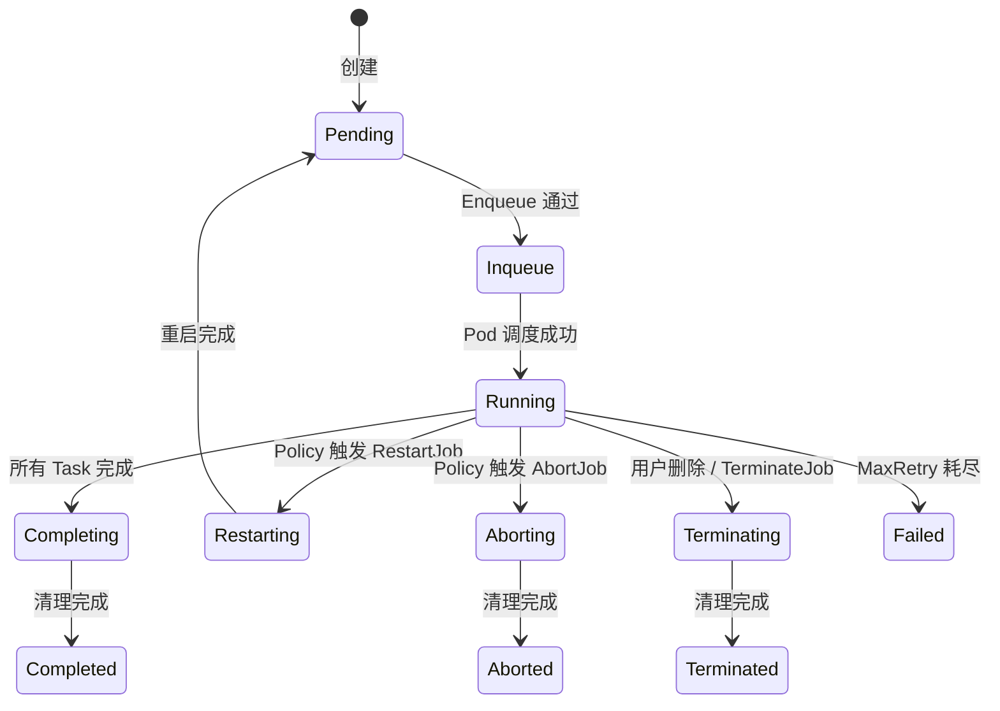

## 概述

本文档针对 Volcano Job 在各生命周期阶段可能出现的问题进行排查，包括 Job 状态异常、Pod 重启、MaxRetry 耗尽、生命周期策略不生效等。

---

## Job 状态机



---

## 问题一：Job 状态卡在 Pending

### 排查步骤

```bash
# 1. 检查 PodGroup
kubectl get podgroup -l volcano.sh/job-name=my-job -o yaml

# 2. 检查 Pod 是否已创建
kubectl get pods -l volcano.sh/job-name=my-job

# 3. 检查 Job events
kubectl describe vcjob my-job
```

### 原因分析

| 症状 | 可能原因 | 解决方案 |
|------|---------|---------|
| PodGroup Pending, Pod 不存在 | Controller 未创建 Pod | 检查 Controller 日志 |
| PodGroup Pending, Pod 存在但 Pending | 资源不足 | 扩容或降低请求 |
| PodGroup Inqueue, Pod Pending | Predicate 过滤 | 检查调度器日志 |
| 无 PodGroup | Controller 异常 | 检查 Controller |

---

## 问题二：Pod 反复重启（CrashLoopBackOff）

### 排查步骤

```bash
# 1. 检查 Pod 状态和重启次数
kubectl get pods -l volcano.sh/job-name=my-job

# 2. 查看 Pod 详情
kubectl describe pod <pod-name>

# 3. 查看容器日志
kubectl logs <pod-name> --previous    # 上一次崩溃的日志
kubectl logs <pod-name>               # 当前日志
```

### 常见原因

| 原因 | 排查方法 | 解决方案 |
|------|---------|---------|
| 容器启动命令错误 | 查看容器日志 | 修正 command/args |
| 缺少依赖（文件/网络） | 查看容器日志 | 检查 Volume 挂载和网络 |
| OOM Killed | `kubectl describe pod` 看 `OOMKilled` | 增大 memory limits |
| Liveness Probe 失败 | 查看 events | 调整 probe 参数 |
| 权限不足 | 查看容器日志 | 检查 SecurityContext |

---

## 问题三：MaxRetry 耗尽

### 症状

```bash
kubectl get vcjob my-job
# STATUS: Failed
```

Job events 显示：`Job failed as maximum retry reached`。

### 排查步骤

```bash
# 1. 查看 Job 的重试历史
kubectl describe vcjob my-job | grep -A 10 "Events"

# 2. 查看 MaxRetry 设置
kubectl get vcjob my-job -o jsonpath='{.spec.maxRetry}'

# 3. 分析重试原因
kubectl logs -n volcano-system -l app=volcano-controller-manager | grep "my-job"
```

### 解决方案

```yaml
spec:
  maxRetry: 5                     # 增大重试次数
  policies:
    - event: PodFailed
      action: RestartTask          # 只重启失败的 Task（而非整个 Job）
```

---

## 问题四：生命周期策略不生效

### 排查步骤

```bash
# 1. 确认策略配置
kubectl get vcjob my-job -o yaml | grep -A 10 "policies"

# 2. 检查事件是否触发
kubectl describe vcjob my-job

# 3. 检查 Controller 日志
kubectl logs -n volcano-system -l app=volcano-controller-manager | grep "policy\|action"
```

### 策略配置检查

```yaml
# 正确配置示例
spec:
  policies:
    # Job 级别策略
    - event: PodEvicted          # 事件类型
      action: RestartJob         # 执行动作
    - event: TaskCompleted
      action: CompleteJob

  tasks:
    - replicas: 4
      name: worker
      policies:
        # Task 级别策略
        - event: PodFailed
          action: RestartTask
```

### 常见错误

| 错误 | 说明 | 修正 |
|------|------|------|
| event 拼写错误 | 不会触发任何策略 | 使用正确的 event 名称 |
| Task 策略放在 Job 级别 | 作用范围不对 | 放在 `tasks[].policies` |
| 超时策略无 timeout | 不会触发超时 | 添加 `timeout: "600s"` |

---

## 问题五：Job 完成但 Pod 未清理

### 排查步骤

```bash
# 1. 检查 Job 状态
kubectl get vcjob my-job -o jsonpath='{.status.state.phase}'

# 2. 检查 Pod 状态
kubectl get pods -l volcano.sh/job-name=my-job

# 3. 检查 GC Controller
kubectl logs -n volcano-system -l app=volcano-controller-manager | grep -i "gc\|garbage"
```

### 原因

| 原因 | 解决方案 |
|------|---------|
| Pod 的 restartPolicy 不正确 | 设置 `restartPolicy: OnFailure` 或 `Never` |
| Owner Reference 缺失 | 检查 Pod 的 ownerReferences |
| GC Controller 异常 | 检查 Controller 日志 |

---

## 问题六：Job Running 但无进展

### 排查步骤

```bash
# 1. 检查各 Task 的 Pod 状态
kubectl get pods -l volcano.sh/job-name=my-job -o wide

# 2. 检查 Pod 是否健康
for pod in $(kubectl get pods -l volcano.sh/job-name=my-job -o name); do
  echo "=== $pod ==="
  kubectl exec $pod -- ps aux 2>/dev/null || echo "exec failed"
done

# 3. 检查网络连通性（分布式训练）
kubectl exec <pod-name> -- ping <other-pod-ip>
```

### 分布式训练常见问题

| 问题 | 原因 | 解决方案 |
|------|------|---------|
| Worker 等待 Master | Master 未就绪 | 检查 Master Pod 状态 |
| NCCL 通信超时 | 网络不通或配置错误 | 检查 NCCL 环境变量和网络策略 |
| SSH 连接失败 | SSH 插件未启用 | Job 配置中添加 `plugins.ssh: []` |
| 环境变量缺失 | env 插件未启用 | Job 配置中添加 `plugins.env: []` |

---

## 诊断命令速查

```bash
# Job 状态
kubectl get vcjob -A -o wide

# Job 详情
kubectl describe vcjob <name>

# PodGroup 状态
kubectl get podgroup -l volcano.sh/job-name=<name>

# Job 的所有 Pod
kubectl get pods -l volcano.sh/job-name=<name> -o wide

# Pod 容器日志
kubectl logs <pod-name> -c <container-name>

# Pod 上一次日志（CrashLoop 时）
kubectl logs <pod-name> --previous

# Job 事件
kubectl get events --field-selector involvedObject.name=<name>

# Controller 日志
kubectl logs -n volcano-system -l app=volcano-controller-manager | grep <name>
```

---

## 参考文件

| 文件 | 说明 |
|------|------|
| `pkg/controllers/job/job_controller_actions.go` | Job 状态转换逻辑 |
| `pkg/controllers/job/job_controller_handler.go` | Job 事件处理 |
| `staging/src/volcano.sh/apis/pkg/apis/batch/v1alpha1/types.go` | Job 状态定义 |
