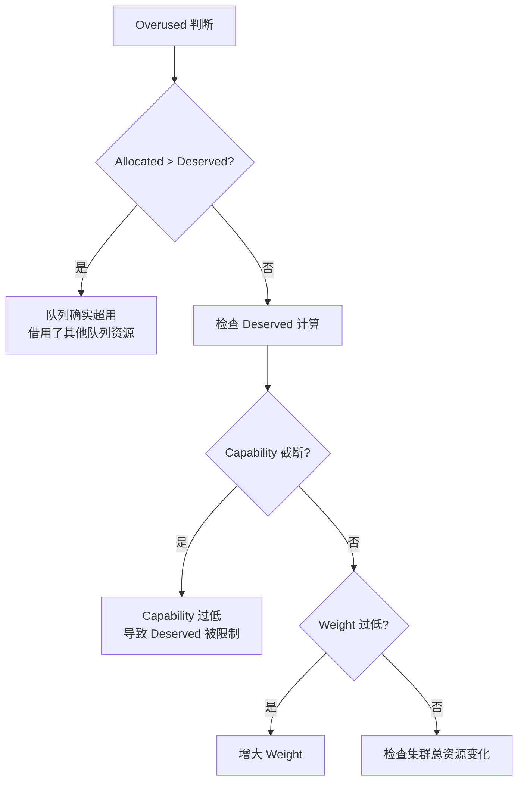

## 概述

本文档针对 Volcano 队列管理中的常见问题进行排查，包括资源不均、Overused 误判、层级队列配置错误、Reclaim 不生效等。

---

## 队列状态检查

```bash
# 查看所有队列
kubectl get queues -o wide

# 队列详细信息
kubectl describe queue <queue-name>

# 队列 YAML
kubectl get queue <queue-name> -o yaml
```

---

## 问题一：队列资源分配不均

### 症状

高权重队列分到的资源与低权重队列差不多。

### 排查步骤

```bash
# 1. 查看各队列 Weight
kubectl get queues -o custom-columns=NAME:.metadata.name,WEIGHT:.spec.weight

# 2. 查看调度器配置是否启用 proportion
kubectl get configmap volcano-scheduler-configmap -n volcano-system -o yaml

# 3. 检查 Capability 限制
kubectl get queues -o custom-columns=NAME:.metadata.name,CAPABILITY:.spec.capability
```

### 常见原因

| 原因 | 解决方案 |
|------|---------|
| proportion 插件未启用 | 在调度器配置的 tiers 中添加 proportion |
| Capability 设置过低 | Deserved 受 Capability 截断，增大或移除 |
| Guarantee 过大 | Guarantee 预留资源，减少可分配量 |
| 队列无 Job 提交 | 空闲队列不消耗 Deserved，资源被其他队列借用 |

---

## 问题二：Overused 误判

### 症状

队列显示 Overused，但实际 Allocated 并未超出预期。

### 排查步骤

```bash
# 1. 查看队列的 Deserved vs Allocated
kubectl logs -n volcano-system -l app=volcano-scheduler | grep -i "proportion\|deserved\|allocated"

# 2. 检查 Deserved 计算
# Deserved = min(Weight/TotalWeight × ClusterResource, Capability)
```

### 原因分析



---

## 问题三：Reclaim 不生效

### 症状

队列 A 资源不足，队列 B 有超额使用，但 Reclaim 不触发。

### 排查步骤

```bash
# 1. 确认 reclaim action 已启用
kubectl get configmap volcano-scheduler-configmap -n volcano-system -o yaml | grep reclaim

# 2. 检查队列 reclaimable 设置
kubectl get queue <queue-b> -o jsonpath='{.spec.reclaimable}'

# 3. 查看 Reclaim 日志
kubectl logs -n volcano-system -l app=volcano-scheduler | grep -i "reclaim"
```

### 常见原因

| 原因 | 解决方案 |
|------|---------|
| actions 未包含 `reclaim` | 添加 `reclaim` 到 actions 列表 |
| 目标队列 `reclaimable: false` | 设置为 `true` 允许回收 |
| 被回收队列无可驱逐的 Pod | 检查 Pod 的 Preemptable 设置 |
| Queue A 的 Allocated >= Deserved | A 已达到份额，不会触发回收 |

---

## 问题四：层级队列配置错误

### 排查步骤

```bash
# 1. 检查层级注解格式
kubectl get queues -o custom-columns=\
NAME:.metadata.name,\
HIERARCHY:.metadata.annotations.volcano\.sh/hierarchy,\
WEIGHTS:.metadata.annotations.volcano\.sh/hierarchy-weights

# 2. 确认使用 capacity 插件（非 proportion）
kubectl get configmap volcano-scheduler-configmap -n volcano-system -o yaml
```

### 常见错误

| 错误 | 说明 | 修正 |
|------|------|------|
| 路径不以 `root/` 开头 | 层级路径必须从 root 开始 | `volcano.sh/hierarchy: "root/eng/prod"` |
| 权重数与层级不一致 | 权重数必须等于路径层级数 | `root/eng/prod` 对应 `1/6/8`（3 个值） |
| 同时启用 capacity 和 proportion | 互斥插件 | 只保留一个 |
| Job 提交到非叶子队列 | capacity 只允许叶子队列接收 Job | 提交到叶子队列 |
| 子队列 Weight 全为 0 | 除零错误 | 设置 Weight > 0 |

---

## 问题五：队列状态异常

### 症状

队列状态为 `Unknown` 或 `Closing` 长时间不变。

### 排查步骤

```bash
# 1. 查看队列状态
kubectl get queue <name> -o yaml

# 2. 检查队列下是否有运行中的 Job
kubectl get vcjob -A --field-selector spec.queue=<name>

# 3. 检查 Queue Controller 日志
kubectl logs -n volcano-system -l app=volcano-controller-manager | grep -i "queue"
```

### 解决方案

| 状态 | 原因 | 解决方案 |
|------|------|---------|
| `Closing` 不变 | 队列下仍有 Job | 等待 Job 完成或手动删除 |
| `Unknown` | Controller 异常 | 重启 Controller Manager |
| `Closed` 无法重新开放 | 状态更新失败 | `kubectl patch queue <name> --type merge -p '{"spec":{"state":"Open"}}'` |

---

## 问题六：队列 Capability 生效但限制过严

### 排查步骤

```bash
# 查看队列 Capability 设置
kubectl get queue <name> -o jsonpath='{.spec.capability}'

# 对比 Job 资源请求总量
kubectl get vcjob -A --field-selector spec.queue=<name> -o json | \
  jq '.items[].spec.tasks[].replicas'
```

### 解决方案

- 增大 Capability 上限
- 设置 Capability 只限制关键资源（如 GPU），不限制 CPU/Memory
- 移除 Capability（无上限）

```yaml
spec:
  capability:
    nvidia.com/gpu: "16"       # 只限制 GPU
    # 不设置 cpu 和 memory，表示无限制
```

---

## 诊断命令速查

```bash
# 队列列表及状态
kubectl get queues

# 队列详情
kubectl describe queue <name>

# 队列的 Job
kubectl get vcjob -A --field-selector spec.queue=<name>

# 调度器中的队列日志
kubectl logs -n volcano-system -l app=volcano-scheduler | grep -i "queue\|proportion\|capacity"

# Controller 中的队列日志
kubectl logs -n volcano-system -l app=volcano-controller-manager | grep -i "queue"
```

---

## 参考文件

| 文件 | 说明 |
|------|------|
| `pkg/scheduler/plugins/proportion/proportion.go` | Proportion 插件（Deserved 计算） |
| `pkg/scheduler/plugins/capacity/capacity.go` | Capacity 插件（层级队列） |
| `pkg/controllers/queue/queue_controller.go` | Queue Controller |
| `staging/src/volcano.sh/apis/pkg/apis/scheduling/v1beta1/types.go` | Queue 类型定义 |
