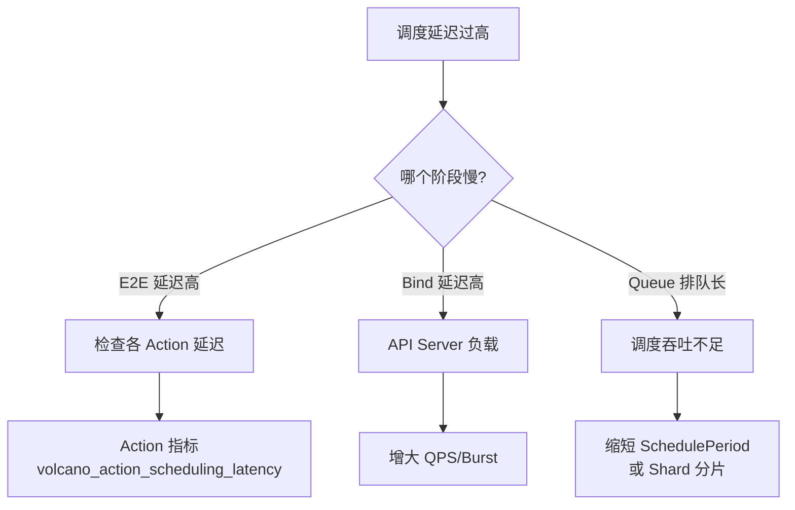
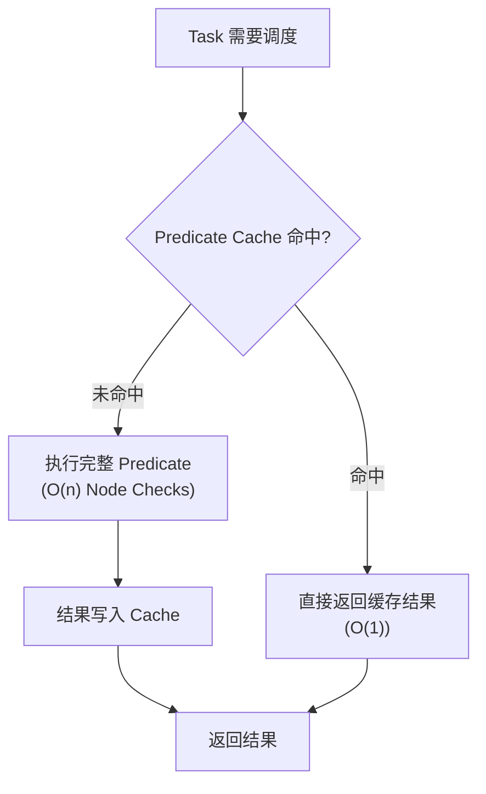
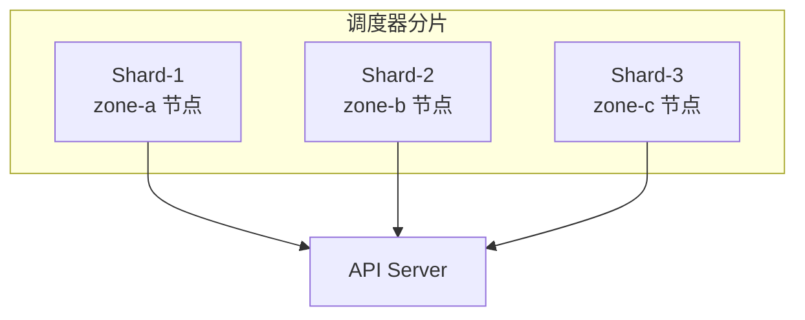

## 概述

本文档介绍 Volcano 在大规模集群中的性能调优方法，包括调度周期优化、Predicate 缓存、API Server 限流调整和 Shard 扩展等。

---

## 性能瓶颈识别



### 关键指标基线

| 指标 | 小集群 (<100) | 中集群 (100-1000) | 大集群 (>1000) |
|------|-------------|-----------------|--------------|
| E2E P99 延迟 | < 100ms | < 500ms | < 2s |
| 每秒调度 Pod | > 100 | > 50 | > 20 |
| 调度周期 | 50-200ms | 200-500ms | 500ms-2s |

---

## 调度周期优化

### SchedulePeriod 调整

```yaml
custom:
  scheduler_schedule_period: 500ms    # 默认 1s，大集群可缩短
```

| 场景 | 推荐值 | 说明 |
|------|--------|------|
| 小集群 (<100 节点) | `1s` | 默认值即可 |
| 中集群 (100-500 节点) | `500ms` | 加快调度响应 |
| 大集群 (>500 节点) | `1s-2s` | 避免周期内处理不完 |
| 延迟敏感场景 | `200ms` | 快速响应，但增加 API 压力 |

### 优化建议

- **SchedulePeriod 过短**：增加 API Server 负载，可能导致调度周期重叠
- **SchedulePeriod 过长**：Job 等待时间增加
- **最佳实践**：先测量当前调度周期实际耗时，SchedulePeriod 设为实际耗时的 2-3 倍

---

## Predicate 缓存

### 启用缓存

```yaml
- name: predicates
  arguments:
    predicate.CacheEnable: "true"       # 启用 Predicate 缓存
```

### 原理



### 效果

- 同一调度周期内，相同 Task 类型的 Predicate 结果被缓存
- 对于大量相同规格的 Task（如分布式训练的 Worker），效果显著
- 缓存每个调度周期重置，保证新鲜度

---

## API Server 限流

### QPS 和 Burst 调整

```yaml
custom:
  # 调度器
  scheduler_kube_api_qps: 2000         # 默认 2000
  scheduler_kube_api_burst: 2000       # 默认 2000

  # 控制器
  controller_kube_api_qps: 50          # 默认 50
  controller_kube_api_burst: 100       # 默认 100
```

### 调优建议

| 组件 | 小集群 | 中集群 | 大集群 |
|------|--------|--------|--------|
| scheduler QPS | 500 | 2000 | 5000 |
| scheduler Burst | 500 | 2000 | 5000 |
| controller QPS | 50 | 100 | 200 |
| controller Burst | 100 | 200 | 400 |

> **注意**：增大 QPS/Burst 会增加 API Server 负载，需同时确保 API Server 有足够处理能力。

---

## Worker 线程调优

### 调度器 Worker

```yaml
custom:
  scheduler_node_worker_threads: 20      # 节点 Worker 线程
```

### 控制器 Worker

```yaml
custom:
  controller_worker_threads: 3            # 通用 Worker
  controller_worker_threads_for_gc: 5     # GC Worker
  controller_worker_threads_for_podgroup: 5  # PodGroup Worker
```

### 调优建议

| 参数 | 建议 |
|------|------|
| `scheduler_node_worker_threads` | 节点数 / 50，最小 10 |
| `controller_worker_threads` | 3-10，按 Job 数调整 |
| `controller_worker_threads_for_gc` | 3-10 |
| `controller_worker_threads_for_podgroup` | 3-10 |

---

## 插件优化

### 精简插件列表

只启用需要的插件，减少每个调度周期的处理时间：

```yaml
# 最小化配置（基础调度）
tiers:
- plugins:
  - name: gang
  - name: conformance
- plugins:
  - name: predicates
  - name: proportion
  - name: nodeorder

# 完整配置（全功能）
tiers:
- plugins:
  - name: priority
  - name: gang
  - name: conformance
- plugins:
  - name: overcommit
  - name: drf
  - name: predicates
  - name: proportion
  - name: nodeorder
  - name: binpack
```

### 禁用不需要的扩展点

```yaml
- name: gang
  enablePreemptable: false     # 不参与抢占评估（减少计算）
  enableNodeOrder: false       # 不参与节点评分
```

---

## 大规模集群优化

### Shard 分片调度

对于超大集群（>2000 节点），可以将调度器按节点分片：



每个 Shard 只处理一部分节点，减少每个调度周期的节点扫描范围。

### Go 内存限制

```yaml
custom:
  go_memlimit_enable: true     # 启用 Go MEMLIMIT
```

避免调度器因 GC 压力导致延迟波动。

---

## 性能监控

### 关键监控指标

```promql
# 调度周期耗时趋势
histogram_quantile(0.99,
  sum(rate(volcano_e2e_scheduling_latency_milliseconds_bucket[5m])) by (le)
)

# 最耗时的 Action
topk(3, histogram_quantile(0.99,
  sum(rate(volcano_action_scheduling_latency_milliseconds_bucket[5m])) by (le, action)
))

# 最耗时的 Plugin
topk(5, histogram_quantile(0.99,
  sum(rate(volcano_plugin_scheduling_latency_milliseconds_bucket[5m])) by (le, plugin)
))

# 调度吞吐量
sum(rate(volcano_schedule_attempts_total{result="Success"}[5m]))
```

### 性能告警

```yaml
# 调度延迟告警
- alert: VolcanoSchedulingLatencyHigh
  expr: |
    histogram_quantile(0.99,
      sum(rate(volcano_e2e_scheduling_latency_milliseconds_bucket[5m])) by (le)
    ) > 5000
  for: 5m
  annotations:
    summary: "调度 P99 延迟超过 5s"
```

---

## 调优检查清单

| 项目 | 检查内容 | 建议 |
|------|---------|------|
| SchedulePeriod | 是否匹配集群规模 | 见上文调优表 |
| Predicate 缓存 | 大集群是否启用 | 启用 `predicate.CacheEnable` |
| API QPS/Burst | 是否足够 | 按集群规模调整 |
| 插件数量 | 是否有不需要的插件 | 精简配置 |
| Worker 线程 | 是否足够 | 按负载调整 |
| 日志级别 | 生产环境是否过高 | 生产用 `-v=2` |
| pprof | 是否需要性能分析 | 调试时临时启用 |

---

## 参考文件

| 文件 | 说明 |
|------|------|
| `installer/helm/chart/volcano/values.yaml` | 性能参数配置 |
| `pkg/scheduler/metrics/metrics.go` | 性能指标定义 |
| `pkg/scheduler/conf/scheduler_conf.go` | 配置结构 |
