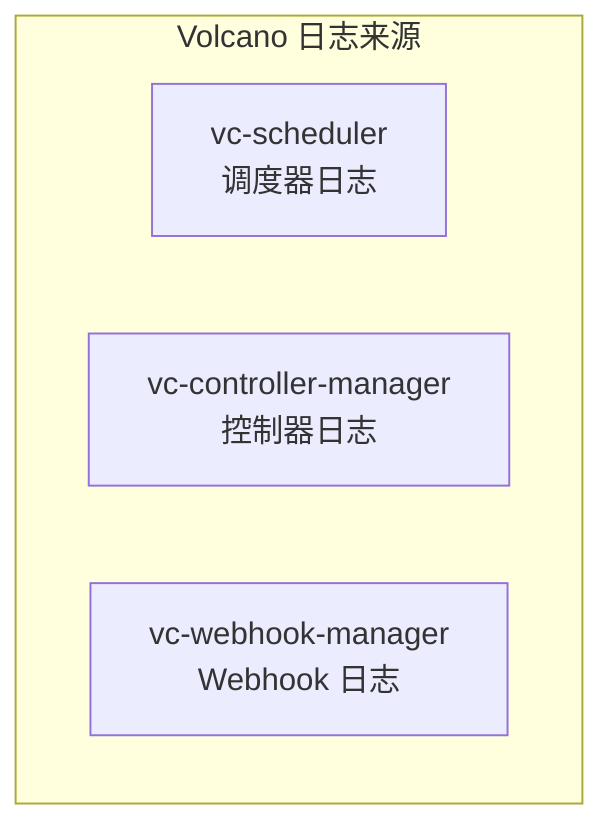

## 概述

本文档整理 Volcano 各组件的关键日志模式、常见错误消息的含义和解读方法，帮助运维人员快速定位问题。

---

## 日志来源



```bash
# 获取各组件日志
kubectl logs -n volcano-system -l app=volcano-scheduler
kubectl logs -n volcano-system -l app=volcano-controller-manager
kubectl logs -n volcano-system -l app=volcano-admission
```

---

## 调度器关键日志

### 调度周期

| 日志模式 | 含义 | 级别 |
|---------|------|------|
| `"Open session"` | 调度周期开始 | V(3) |
| `"Close session"` | 调度周期结束 | V(3) |
| `"Enter xxx action"` | Action 开始执行 | V(3) |
| `"Leaving xxx action"` | Action 执行结束 | V(3) |

### 分配相关

| 日志模式 | 含义 | 级别 |
|---------|------|------|
| `"bindTask"` | Task 成功绑定到 Node | V(3) |
| `"bindErr"` | 绑定 API 失败 | Error |
| `"Committed operations for job"` | 调度决策提交成功 | V(3) |
| `"Discard operations for job"` | 调度决策回滚（Gang 不满足） | V(3) |
| `"try to allocate task"` | 尝试分配 Task | V(4) |

### Gang 调度

| 日志模式 | 含义 | 级别 |
|---------|------|------|
| `"bindable job is ready"` | Job 满足 Gang 条件 | V(4) |
| `"Bindable job is not ready"` | Job 不满足 Gang 条件 | V(4) |
| `"job is not ready, valid is false"` | Job 无效 | V(4) |

### 队列和资源

| 日志模式 | 含义 | 级别 |
|---------|------|------|
| `"queue is overused"` | 队列超出 Deserved | V(4) |
| `"deserved"` | 队列 Deserved 计算结果 | V(4) |
| `"reclaim"` | 资源回收操作 | V(3) |
| `"preempt"` | 抢占操作 | V(3) |

### Predicate 过滤

| 日志模式 | 含义 | 级别 |
|---------|------|------|
| `"predicate failed"` | 节点被过滤 | V(4) |
| `"Insufficient cpu"` | CPU 不足 | V(4) |
| `"Insufficient memory"` | 内存不足 | V(4) |
| `"node taint"` | 节点 Taint 不匹配 | V(4) |
| `"node affinity"` | 节点亲和性不匹配 | V(4) |

---

## 控制器关键日志

### Job Controller

| 日志模式 | 含义 | 级别 |
|---------|------|------|
| `"execute action"` | 执行 Job 状态转换 | V(3) |
| `"sync job"` | 同步 Job 状态 | V(3) |
| `"create pod group"` | 创建 PodGroup | V(3) |
| `"create pod"` | 创建 Pod | V(3) |
| `"job completed"` | Job 完成 | V(2) |
| `"job failed"` | Job 失败 | Warning |
| `"maximum retry reached"` | MaxRetry 耗尽 | Warning |

### Queue Controller

| 日志模式 | 含义 | 级别 |
|---------|------|------|
| `"sync queue"` | 同步 Queue 状态 | V(3) |
| `"queue state changed"` | Queue 状态变更 | V(2) |

### PodGroup Controller

| 日志模式 | 含义 | 级别 |
|---------|------|------|
| `"sync podgroup"` | 同步 PodGroup | V(3) |
| `"podgroup phase changed"` | PodGroup 状态变更 | V(2) |

---

## 常见错误消息解读

### 调度器错误

| 错误消息 | 含义 | 解决方案 |
|---------|------|---------|
| `"insufficient resources on node"` | 节点资源不足 | 扩容或减小 Pod 请求 |
| `"bindable job is not ready, bindable:X, bindableTasks:Y"` | Gang 检查：已分配 Y 个 Task，需要 X 个 | 增加节点或降低 minAvailable |
| `"bindErr: bindVolumes: bindclaim failed"` | PVC 绑定失败 | 检查 StorageClass 和 PV |
| `"predicate failed on node xxx: Insufficient cpu"` | 节点 CPU 不足 | 减少请求或使用其他节点 |
| `"job xxx queue xxx is overused"` | Job 所在队列已超出份额 | 等待其他队列释放或增大 Weight |
| `"plugin xxx panic"` | 插件内部错误 | 检查插件配置和输入数据 |

### 控制器错误

| 错误消息 | 含义 | 解决方案 |
|---------|------|---------|
| `"failed to create pod"` | Pod 创建失败 | 检查 RBAC、ResourceQuota |
| `"failed to create podgroup"` | PodGroup 创建失败 | 检查 CRD 是否注册 |
| `"maximum retry reached, job failed"` | 重试次数耗尽 | 增大 maxRetry 或修复 Pod 错误 |
| `"job sync error"` | Job 状态同步失败 | 检查 API Server 连通性 |

### Webhook 错误

| 错误消息 | 含义 | 解决方案 |
|---------|------|---------|
| `"minAvailable should not exceed total replicas"` | minAvailable 超出总副本数 | 调整 minAvailable |
| `"task name must be unique"` | Task 名称重复 | 修改 Task 名称 |
| `"queue not found"` | 指定的队列不存在 | 先创建 Queue |
| `"queue is not open"` | 队列已关闭 | 开放队列 |

---

## 日志分析工具

### 实时日志追踪

```bash
# 实时追踪调度器日志
kubectl logs -f -n volcano-system -l app=volcano-scheduler

# 只看错误
kubectl logs -n volcano-system -l app=volcano-scheduler | grep -E "Error|error|ERR"

# 追踪特定 Job
kubectl logs -f -n volcano-system -l app=volcano-scheduler | grep "my-job"
```

### 日志统计

```bash
# 统计调度周期数
kubectl logs -n volcano-system -l app=volcano-scheduler | grep "Open session" | wc -l

# 统计 Predicate 失败
kubectl logs -n volcano-system -l app=volcano-scheduler | grep "predicate failed" | wc -l

# 统计 Commit vs Discard
echo "Commits:"
kubectl logs -n volcano-system -l app=volcano-scheduler | grep "Committed" | wc -l
echo "Discards:"
kubectl logs -n volcano-system -l app=volcano-scheduler | grep "Discard" | wc -l

# 统计错误类型
kubectl logs -n volcano-system -l app=volcano-scheduler | grep "Error\|error" | \
  awk '{for(i=1;i<=NF;i++) if($i ~ /Error|error/) print $0}' | sort | uniq -c | sort -rn
```

### 时间线分析

```bash
# 追踪一个 Job 的完整时间线
JOB="my-job"
echo "=== Controller ==="
kubectl logs -n volcano-system -l app=volcano-controller-manager | grep "$JOB" | head -20
echo "=== Scheduler ==="
kubectl logs -n volcano-system -l app=volcano-scheduler | grep "$JOB" | head -20
echo "=== Events ==="
kubectl get events --sort-by='.lastTimestamp' | grep "$JOB"
```

---

## 日志级别速查

| 组件 | 级别 | 输出内容 |
|------|------|---------|
| Scheduler | V(0) | 错误和致命 |
| Scheduler | V(2) | 基本信息、组件启停 |
| Scheduler | V(3) | 调度周期、Action 进出、分配结果 |
| Scheduler | V(4) | Job/Task 级别的详细决策 |
| Scheduler | V(5) | 每个节点的 Predicate/Score 细节 |
| Controller | V(0) | 错误和警告 |
| Controller | V(2) | 状态变更 |
| Controller | V(3) | 同步操作、Pod/PodGroup 创建 |
| Controller | V(4) | 事件处理细节 |

---

## 日志配置最佳实践

| 环境 | 调度器级别 | 控制器级别 | 日志保留 |
|------|-----------|-----------|---------|
| 生产 | `-v=2` | `-v=2` | 7 天 |
| 预发布 | `-v=3` | `-v=3` | 3 天 |
| 测试 | `-v=4` | `-v=3` | 1 天 |
| 开发调试 | `-v=5` | `-v=4` | 实时 |

---

## 参考文件

| 文件 | 说明 |
|------|------|
| `pkg/scheduler/scheduler.go` | 调度器主循环日志 |
| `pkg/scheduler/framework/session.go` | Session 操作日志 |
| `pkg/controllers/job/job_controller.go` | Job Controller 日志 |
| `pkg/webhooks/` | Webhook 日志 |
